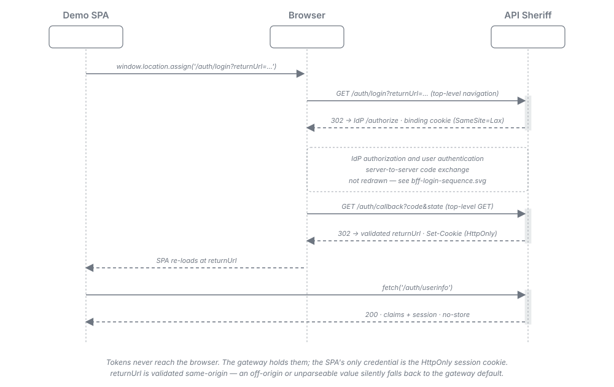
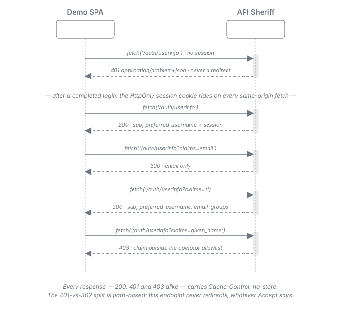

= API Sheriff -- Demo Client: the BFF Integration Sample
:toc:
:toclevels: 2
:sectnums:

The *integrator* view of the demo client -- the copy-this sample for putting a browser application
behind an API Sheriff BFF gateway. It documents the browser-facing contract the gateway offers, the
four identity-disclosure states an application can reach, the redirect rules the gateway enforces on
your behalf, and the `gateway.yaml` a deployment needs so the gateway serves the application itself.

The runnable sample lives in `demo-client/` (see
link:../README.adoc[`demo-client/README.adoc`] for the quickstart). How that module is
built, and why its test suite is shaped as it is, is the contributor concern documented in
link:playwright-suite.adoc[Demo Client and the Playwright End-to-End Suite].

The field-level contract for every key named here is
link:../../doc/configuration.adoc[Configuration Reference]; the setup guides for the two session variants are
link:../../doc/user/bff-session.adoc[Server-Session BFF -- Operator Setup] and
link:../../doc/user/bff-cookie.adoc[Cookie-Based BFF -- Operator Setup]. This document is the *sample*, not a second
copy of either.

== The Browser-Facing Contract

Everything below is observable from a browser against a gateway configured as this sample is. The
sample application is served *by the gateway*, same-origin with the reserved `/auth` paths, which is
what makes the whole contract reachable with a plain same-origin `fetch`.

[cols="3,1,3"]
|===
| Request | Result | Notes

| `GET /assets/demo/index.html`
| `200`
| `text/html` through the gateway-owned asset envelope, with
  `X-Content-Type-Options: nosniff`.

| `fetch /auth/userinfo` -- no session
| `401`
| `application/problem+json`, `Cache-Control: no-store`. *Never a redirect.*

| navigate `/auth/login?returnUrl=...`
| `302`
| Into the OIDC authorization endpoint. This is a *top-level navigation*, never a `fetch`.

| `/auth/callback?code&state`
| `302`
| The IdP `302`s the browser here as a *top-level GET*, with `code` and `state` in the query
  string. The gateway exchanges the code, then redirects back to the validated `returnUrl` with the
  session cookie set. Your application never sees this leg -- the browser performs it.

| `fetch /auth/userinfo` -- live session
| `200`
| `application/json`: `claims` (the curated default view) plus `session` metadata.

| `fetch /auth/userinfo?claims=email`
| `200`
| Only the named claims, provided each is inside the operator allowlist.

| `fetch /auth/userinfo?claims=*`
| `200`
| The full allowlisted view.

| `fetch /auth/userinfo?claims=given_name`
| `403`
| `application/problem+json` -- the claim is outside the operator allowlist.

| navigate `/auth/login` -- live session
| `302`
| Straight to the validated `returnUrl`. No fresh authorization flow is started.

| navigate `/auth/logout`
| `302`
| To the IdP end-session endpoint, then to `/auth/logout/return`, then to `final_redirect`.

| `fetch /auth/userinfo` -- after logout
| `401`
| The authoritative proof the session is gone.
|===

Two properties of this table are worth stating explicitly, because assuming otherwise is the most
common way to mis-integrate:

[#_the_401_versus_302_split]
* *The `401`-versus-`302` split is PATH-based, not `Accept`-based.* Both reserved endpoints are
  blind to the request's `Accept` header. `/auth/userinfo` is an XHR probe and answers
  `401 application/problem+json` without a session -- it never redirects, whatever you send. Do not
  write a client that sends `Accept: text/html` to the info endpoint expecting a redirect, and do
  not write one that treats a `302` from the info endpoint as reachable. It is not.
* *Login is a navigation, logout is a navigation.* `/auth/login` and `/auth/logout` answer `302`
  into the identity provider. A `fetch` cannot follow that meaningfully -- the browser must own the
  navigation. Use `window.location.assign(...)`, never `fetch`.

=== The login round-trip, end to end

The whole leg is navigations the browser performs; your application starts it and reads the result.

. The application navigates to `/auth/login?returnUrl=/some/page`. The gateway sets a short-lived,
  `HttpOnly` browser-binding cookie and `302`s to the identity provider.
. The user authenticates at the identity provider.
. The identity provider `302`s the browser back to `/auth/callback` *as a top-level GET*, with
  `code` and `state` in the query string.
. The gateway validates the binding cookie and the `state`, exchanges the code for tokens over its
  own back channel, sets the session cookie, and `302`s to the validated same-origin `returnUrl`.

Tokens never reach the browser at any point: the gateway holds them, and the application's only
credential is the `HttpOnly` session cookie it cannot read.

The diagram draws only the legs your application participates in. The identity-provider interior --
the authorization request, the user authenticating, and the gateway's back-channel code exchange --
is deliberately not redrawn here; it is the same handshake both BFF variants perform, drawn once in
link:../../doc/resources/diagrams/bff-login-sequence.svg[the BFF login handshake diagram].

[NOTE]
.What you must configure at the identity provider
====
Register the gateway's `redirect_uri` as an ordinary redirect target reached by a `GET`. The
gateway drives the authorization request with `response_mode=query`, so the identity provider must
be free to answer with a `302` carrying `code` and `state` in the query string. *An IdP client
pinned to force `form_post` will break the login.* The mode is fixed in the gateway and is not an
operator setting -- there is no knob to look for.
====

[WARNING]
.A tradeoff you should know about: the authorization code appears in a URL
====
Because the callback is a `GET`, the one-time authorization `code` travels in the callback URL
rather than in a request body. It is consequently visible to the `Referer` header, to any proxy /
CDN and server access log on the path, and in browser history. This is a *deliberate, accepted*
tradeoff: it is what makes the browser-facing login work at all, because the gateway's browser-
binding cookie is `SameSite=Lax` and is only sent on a top-level `GET` navigation.

The exposure is *bounded, not eliminated*:

* *PKCE is always in force*, so a code observed in a log is not redeemable without the verifier,
  which never leaves the gateway.
* *The code is single-use and short-lived* -- redeemed once at the token endpoint; a replay fails.
* *The binding cookie and `state` are double-checked* at the callback, so a code replayed from a
  different browser is rejected `403` even while it is still live.

What this means for you as an integrator: *treat access logs and `Referer`-bearing telemetry on the
callback path as sensitive*, and do not add third-party analytics or error reporting that captures
full URLs on `/auth/callback`. Nothing else in your application is affected -- the code never
reaches your code. The full statement is in
link:../../doc/architecture.adoc#_oidc_callback_response_mode[Architecture -- OIDC callback response mode].
====

== The Four Identity-Disclosure States

The `claims` query parameter on the info endpoint selects what is disclosed. There are exactly four
outcomes, and the sample application exposes all four as reachable UI states so none is an invisible
edge case.

Against the sample's `allowed_claims: ["sub", "preferred_username", "email", "groups"]` and
`default_view: ["sub", "preferred_username"]`:

[cols="2,2,3"]
|===
| Request | Outcome | What it demonstrates

| `/auth/userinfo`
| `200` -- `sub`, `preferred_username`
| The *curated default view*. The operator decides what an application sees when it asks for
  nothing in particular.

| `/auth/userinfo?claims=email`
| `200` -- `email` only
| *Explicit selection*. A comma-separated list narrows the disclosure to exactly those claims.

| `/auth/userinfo?claims=*`
| `200` -- `sub`, `preferred_username`, `email`, `groups`
| The *full allowlisted view*. `*` is the widest disclosure that exists -- and it is still capped by
  the allowlist, not by the client.

| `/auth/userinfo?claims=given_name`
| `403` `application/problem+json`
| The *allowlist cap*. `given_name` is present in the validated ID token, and is still refused,
  because the operator did not allow it.
|===

The last row is the one to internalise. *The operator -- never the browser -- widens disclosure.* A
claim outside `allowed_claims` can never be disclosed even when the identity provider issued it, and
naming one explicitly is rejected `403` before any disclosure happens. An empty allowlist discloses
nothing. Design your application against the claims your operator grants, and treat a `403` as a
configuration answer rather than a bug.

Alongside `claims`, every `200` carries a `session` member with the gateway's own bookkeeping --
`expires_at`, and `auth_time` and `acr` when the identity provider supplied them.

*No token material is ever disclosed.* Access, refresh and ID tokens never appear in any view. The
session cookie is `HttpOnly`, so the application cannot read it either, and it does not need to: a
same-origin `fetch` attaches it automatically. Do not build a place in your client to hold a token.

== Every Info Response Is Uncacheable

*Every* response from the info endpoint -- `200`, `401` and `403` alike -- carries
`Cache-Control: no-store`. An identity view is never cached by the browser or by any intermediary.

This is a guarantee you can rely on, not a hint: it means an application does not have to defeat
caching itself with cache-busting query parameters or `no-cache` request headers, and it means a
shared proxy in front of the gateway cannot serve one user's identity view to another.

== The Return-URL Rule: `/auth/login` Is Not an Open Redirect

`/auth/login` accepts a `returnUrl` parameter naming where the browser should land after login. The
gateway validates it as *same-origin with the gateway's own origin* -- the origin of the configured
`redirect_uri`.

A `returnUrl` that is off-origin, schema-relative (`//attacker.example`), blank, or unparseable is
*not* rejected with an error -- it *falls back to the gateway's default return URL*. That holds on
both paths: on a fresh login, and on the already-authenticated short-circuit.

Two consequences for an integrator:

* You cannot use `/auth/login?returnUrl=...` to bounce a browser to another origin. The
  login-initiation URL is not an open redirect, by construction.
* Because the failure mode is a *silent fallback* rather than an error, a mistyped or cross-origin
  `returnUrl` looks like "login worked but landed on the wrong page". If that is what you see, check
  the origin of the value you passed first.

The sample passes `window.location.href` -- always same-origin, because the application is served by
the gateway.

An already-authenticated caller is never re-driven through a fresh authorization flow: `/auth/login`
with a live session redirects straight to the validated return URL. No new login transaction is
started and no binding cookie is set. An application may therefore link to `/auth/login`
unconditionally without worrying about spurious re-authentication.

[#_serving_your_application_from_the_gateway]
== Serving Your Application from the Gateway

The sample is served through the asset terminal action
(link:../../doc/adr/0014-asset-serving-terminal-action.adoc[ADR-0014]) under a `type: asset` /
`access: public` anchor (link:../../doc/adr/0013-anchor-type-access-axes.adoc[ADR-0013]). The route is one
block:

[source,yaml]
----
- id: assets-demo
  anchor: assets-public
  match:
    path_prefix: /assets/demo
  asset:
    source: directory
    directory: /app/demo
----

Three things a deployment needs, and one it does not:

* The anchor must carry `type: asset` and `access: public` -- a public web bundle is not
  authenticated content, and the anchor's audience is boot-enforced.
* `source: directory` serves from a mounted directory; `directory` names the *container* path the
  bundle is mounted at.
* The gateway owns the response envelope. It sets `Content-Type` from the file extension, adds
  `X-Content-Type-Options: nosniff`, strips any `Set-Cookie`, and permits only `GET` and `HEAD`. You
  do not configure any of that, and you cannot override it from the served content.
* You do *not* need a new anchor per bundle. Reusing an existing `access: public` asset anchor keeps
  the anchor set -- which must stay pairwise prefix-disjoint -- unchanged.

[IMPORTANT#_no_directory_index]
====
*There is no directory index.* A request for `/assets/demo/` without a filename returns `404`. Every
entry point must name a concrete file: `/assets/demo/index.html`, not `/assets/demo/`. This applies
to your links, your bookmarks, your `returnUrl` values and your `final_redirect` alike.
====

Serving the application from the gateway is what makes it *same-origin* with the reserved `/auth`
paths. That is not a convenience -- it is what lets a plain `fetch('/auth/userinfo')` carry the
`HttpOnly` session cookie without any cross-origin cookie configuration, and what keeps the login
navigation inside one origin. A bundle served from a separate static host is a materially different
integration with materially more configuration.

== The Post-Logout Landing Page

RP-initiated logout ends by redirecting the browser to `oidc.logout.final_redirect`. The sample
points it at a concrete public page:

[source,yaml]
----
oidc:
  logout:
    path: /auth/logout
    post_logout_redirect_uri: https://localhost:10443/auth/logout/return
    final_redirect: /assets/demo/landing.html
----

`landing.html` is a trivial public static page -- a sentence saying the session has ended and a link
back to the application. It is served by the *same* asset route as the rest of the bundle, so it
needs no second route, no second anchor and no second mount.

=== Why `final_redirect` cannot simply be `/`

This is the most transferable constraint in the whole sample, and it has *two independent, each
individually fatal* reasons.

. *A `path_prefix: /` anchor is structurally illegal.* Anchor prefixes must be pairwise disjoint,
  and the containment check treats a container prefix that normalizes to `/` as containing
  *everything*. A root anchor therefore overlaps every other anchor already declared, and the
  gateway *fails to boot* -- fail-closed, on each overlapping pair. You cannot declare a root anchor
  to serve a landing page from `/`.
. *Even if it were routable, there is no directory index.* A bare `/` yields an empty remainder that
  resolves to the directory root, which is not a regular file, so the asset source returns `404`.

So the landing page is addressed as a concrete file under an anchor that already exists. Do not
spend time trying to route `/`; it cannot be done, and the two reasons above are both in the
gateway's boot and serving paths rather than in configuration you can adjust.

`final_redirect` is a *per-instance* value in the same class as `redirect_uri` and
`post_logout_redirect_uri` -- each gateway instance carries its own. Setting it on one instance says
nothing about any other.

=== Logging out is authoritative locally, immediately

The gateway destroys the server-side session and clears the session cookie as the *authoritative*
step; the identity-provider round-trip is layered on top. Two consequences worth knowing:

* A logout request that carries no live session is already logged out. The gateway clears any stale
  cookie and lands the browser on `final_redirect` directly, skipping the IdP leg.
* If the end-session redirect cannot be built at all, the local session is destroyed anyway and the
  browser still lands on `final_redirect`. There is no failure mode in which a logout leaves the
  local session usable.

The return leg is `state`-verified against a single-use cookie; a missing or mismatched `state` is
rejected `400`, so a forged logout-return cannot land the browser anywhere.

*Treat the `401` re-probe as the proof of logout, not the landing page.* After the round-trip,
`fetch('/auth/userinfo')` returning `401` is what demonstrates the session is genuinely destroyed. A
landing page rendering successfully proves only that a static file was served.

== Session Mode Is Invisible to the Application

The sample runs unchanged against both session variants -- `session.mode: server` and
`session.mode: cookie`. Nothing above changes between them: same paths, same status codes, same
`claims` semantics, same `Cache-Control: no-store`, same logout round-trip.

That is the intended property. An application is written against the reserved-path contract, and the
operator chooses the session variant on operational grounds
(link:../../doc/user/bff-session.adoc[server-session setup], link:../../doc/user/bff-cookie.adoc[cookie setup]) without the
application knowing which was chosen.

You are not asked to take that on trust: the Playwright suite runs the same specs against both
variants, which is what makes "browser-observably identical" an executable assertion rather than a
claim. link:playwright-suite.adoc#_why_the_demo_exists[Why the Demo Exists] records the mechanism.
