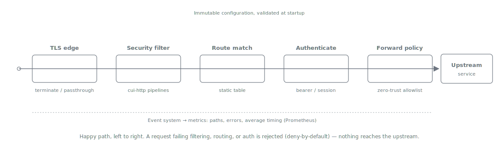

= API Sheriff -- Architecture
:toc:
:toclevels: 3
:sectnums:

== Overview

API Sheriff is a single Quarkus process that terminates (or passes through) inbound
connections, applies security filtering, optionally establishes and mediates an OIDC
session, and forwards permitted requests to a statically configured upstream. It holds no
mandatory external dependency: configuration is a set of immutable files read at startup,
and the only optional state (a server-side session store) exists solely in the
link:variants/02-bff-session.adoc[session-based BFF variant].

The runtime is the same binary for all three link:README.adoc#_deployment_variants[variants];
the active mode is a function of configuration.

== Component Model

An inbound request flows left to right through a fixed pipeline. The TLS edge terminates
(or passes through) the connection; a *security-headers/CORS stage* prepares the response
headers applied to *every* response -- including rejections -- and answers CORS preflight
`OPTIONS` requests before authentication (preflights carry no credentials by spec; see
link:configuration.adoc#_security_headers[Configuration -- `security_headers`]); then the
security filter, route matcher, authentication layer, and zero-trust forward policy each act
in turn; a request that fails any stage is rejected before it reaches the upstream. The event
system and metrics observe every stage.

The authentication stage is where the three variants differ: offline bearer validation
(link:variants/01-base-gateway.adoc[Variant 1]), OIDC session mediation
(link:variants/02-bff-session.adoc[Variant 2]), or OIDC encrypted-cookie mediation
(link:variants/03-bff-cookie.adoc[Variant 3]). Everything else in the pipeline is shared.

=== Configuration Subsystem

Configuration is loaded once at startup from static files (see link:configuration.adoc[Configuration Model]),
validated in full, and then frozen into immutable value objects. The gateway *refuses to
start* on invalid configuration -- it never serves traffic against a partially valid route
table. Only *Static mode* is supported initially (link:adr/0002-initial-scope.adoc[ADR-0002]);
the manifest's dynamic `/api/gateway-config.json` discovery pattern is deferred.

Configuration is layered: a global `gateway.yaml` (including the namespace-scoped `anchors`
policy, link:adr/0007-anchor-scoped-policy.adoc[ADR-0007]), one *portable* `endpoints/*.yaml`
file per service that references an abstract `base_url` alias, and a `topology.properties`
that binds each alias to a concrete location (environment overrides are visible in-file
`${VAR:-default}` placeholders, link:adr/0004-topology-indirection.adoc[ADR-0004] +
Amendment A1). Endpoint files carry no real host, so a deployment is relocated by changing
only the topology.

Immutability is a security property: a running node's behaviour is fully determined by an
auditable, reproducible artifact. Changes are rolled out by restarting nodes (rolling
update), not by mutating a live process.

=== Inbound Security Filter

The inbound filter is the "basic HTTP security filtering -- not a WAF" layer, delivered by
`cui-http`'s security module. It runs as cheap, in-CPU, synchronous work (< 1 ms target, no
I/O) and is therefore safe to run inline on the request's virtual thread.

Wiring (see link:technical_aspects.adoc[Technical Aspects] for the full API):

* `PipelineFactory.createCommonPipelines(config, counter)` yields the path, parameter,
  header-name and header-value pipelines.
* `RequestCollectionValidator` enforces collection-count limits (parameter/header/cookie
  counts) -- the DoS guard a per-value pipeline cannot express.
* A shared, immutable `SecurityConfiguration` (`defaults()` / `strict()` / `lenient()`, or a
  builder) supplies the tunable limits.
* A single `de.cuioss.http.security.monitoring.SecurityEventCounter` is passed into every
  pipeline; it auto-increments on each violation, and its counts feed the gateway metrics.

Path/parameter *whitelisting* that `cui-http` does not express natively (it has no path
allow-list knob) is enforced at the gateway layer from the route's `allowed_paths` and the
forward-policy allowlists. See link:configuration.adoc#_security_filtering[Security Filtering].

=== Routing / Matching

A static, immutable route table maps inbound requests to exactly one upstream. Matchers are
bounded and composable with AND semantics (path prefix, HTTP method, host, header
presence/value). The most specific matching route wins; a request that matches no route is rejected
with `404` (deny-by-default). Routes from all endpoint files form one table ordered
most-specific-first; see link:configuration.adoc#_route_ordering[Configuration -- Route ordering]. Routing
carries no dynamic rule language.

Only routes of *enabled* endpoints enter the table: an endpoint switched off by its resolved
`enabled` value (file literal or `${ENDPOINT_<ID>_ENABLED:-...}` placeholder, ADR-0004 A1)
contributes nothing (its paths fall through to `404`), which
lets one config set be shipped across environments and toggled per environment (see
link:configuration.adoc#_endpoint_identity[Configuration -- `endpoint`]). Orthogonally, a coarse
*positive verb allowlist* -- `allowed_methods`, global with wholesale per-anchor and
per-endpoint replacement and no inheritance -- gates which HTTP methods an endpoint serves at
all: a routed request whose
method is outside the matched route's effective set is rejected `405` with an `Allow` header,
above and beyond the per-route `match.methods` matcher (see
link:configuration.adoc#_allowed_methods[Configuration -- `allowed_methods`]).

=== Authentication Layer

The active authentication strategy depends on the variant:

[cols="1,2"]
|===
| Variant | Strategy

| link:variants/01-base-gateway.adoc[Base gateway]
| Offline bearer-token validation via `token-sheriff-validation` `TokenValidator`. The
  client presents its own `Authorization: Bearer`; the gateway validates it offline and
  enforces required scopes.

| link:variants/02-bff-session.adoc[BFF session]
| The gateway is the OIDC confidential client. Tokens live server-side; the browser holds an
  opaque session-id cookie. The gateway injects the stored access token upstream.

| link:variants/03-bff-cookie.adoc[BFF cookie]
| The gateway is the OIDC confidential client. The tokens (access, refresh, and ID token plus
  minimal metadata) travel only inside an AES-256-GCM-encrypted `HttpOnly` cookie, decrypted
  per request before upstream injection.
|===

[IMPORTANT]
====
For everything BFF-related, the authoritative specification is `TokenSheriff/doc/client` (the
`CLIENT-1..22` contract). *Where it and the archived manifest (`doc/archive/manifest.adoc`)
differ, `doc/client` governs.* This block is the canonical statement of that seam; the variant
documents reference it rather than restating it.

That specification defines a strict seam. The confidential-client *engine* owns retrieval and
flow (auth-code + PKCE, `state` / `nonce` / exact `redirect_uri`, mix-up `iss` defence, PAR,
sender-constraint requests, step-up, RP-initiated logout) and the server-side token lifecycle
(validate -> hold -> refresh with rotation -> revoke), and it must keep *both* token-binding
shapes viable without forcing either (`CLIENT-19`). The *BFF* -- API Sheriff's job -- owns the
browser-facing part: the session cookie, symmetric-key management (stateless variant),
backend-API CSRF, request proxying, logout receivers, and RFC 9457 rendering at the edge.

That seam is realized directly: *API Sheriff depends on the engine module
`token-sheriff-client`* -- purpose-built for this gateway and implemented upstream -- for the
entire confidential-client flow and server-side token lifecycle, and implements *only the BFF
side* itself (session/cookie handling, CSRF, proxying, logout receivers, and RFC 9457
rendering for *gateway-raised* errors -- *engine-raised* failures are mapped to
`application/problem+json` by `token-sheriff-client-quarkus`'s exception mapper; both conform
to the same RFC 9457 contract).
Where the variant sections say the gateway "exchanges the code", "refreshes", or "revokes",
the engine performs the OAuth legs and the gateway drives it. `token-sheriff-validation`
validates every retrieved token (`CLIENT-15` / `CLIENT-16`) before it is trusted or stored;
the engine wires it internally. The engine's API surface is specified in
`TokenSheriff/doc/client`.
====

=== Forward Policy (Zero-Trust)

Nothing crosses to the upstream unless it is explicitly allowed. The forward policy defines
an allowlist of request headers and query parameters plus optional static `set_headers`; two
injections happen *automatically*, outside the policy -- the mediated `Authorization:
Bearer` on session routes and the regenerated
link:configuration.adoc#_forwarded_headers[forwarding-header set]. Forwarded-header handling
is delivered by `cui-http`'s `de.cuioss.http.forwarded` resolver: both `Forwarded` (RFC 7239)
and `X-Forwarded-*` (plus NiFi `X-Proxy*`) are resolved per field into one sanitized,
immutable result -- the client IP behind the trusted-proxy allowlist plus a gateway-side
TCP-peer gate, scheme/host/port/prefix only when `trust_scheme_host` opts in -- and the
gateway emits *freshly regenerated* canonical output from it: `X-Forwarded-*` by default,
RFC 7239 opt-in and additive
(link:adr/0003-forwarded-headers.adoc[ADR-0003]); inbound chains are never propagated.
Everything else is stripped. This deny-by-default posture is the security default throughout.

=== Downstream Client

The upstream client is split by plane
(link:adr/0008-data-plane-transport.adoc[ADR-0008]):

* *Data plane -- Vert.x `HttpClient`.* Proxied traffic is dispatched on the Vert.x client
  that already runs the edge: request and response bodies are piped as streams in both
  directions, and the transport natively provides what the later protocol plans need --
  HTTP trailers (gRPC), raw upgrade streams (WebSocket), upstream h2. One shared client and
  connection pool per *distinct upstream target tuple* (resolved host + connect/read timeouts
  + TLS context), options assembled once at boot; timeouts are millisecond-precision client
  options.
* *Resilience -- SmallRye Fault Tolerance, programmatic.* One guard per route, built at boot
  from `upstream.retry` / `upstream.circuit_breaker` and invoked around the dispatch call in
  the framework-bound edge layer (no annotations, no CDI interception on the hot path; the
  framework-agnostic core carries only the resolved policy values, per
  link:adr/0005-module-structure.adoc[ADR-0005]). Retry is *stream-aware*: an attempt is
  retried only for an idempotent method *and only when zero request-body bytes have been sent
  upstream* -- there is no replay buffer. The breaker is stateless per node: opens after the
  configured consecutive failures, half-opens after `reset_ms`; state transitions surface as
  WARN LogRecords and metrics.
* *Control plane -- `cui-http`.* The gateway's own small, bounded JSON calls (OIDC discovery,
  JWKS, token exchange, revocation -- made chiefly inside the token-sheriff libraries) use
  `HttpHandler` (immutable, thread-safe, HTTPS-by-default), `ResilientHttpAdapter`
  (idempotency-aware retry), `ETagAwareHttpAdapter` (ETag/304 caching of the gateway's *own*
  control resources), and `HttpResult<T>` (sealed `Success`/`Failure` with `HttpErrorCategory`
  and fallback content).
* *No gateway response cache.* Response caching of proxied traffic -- including serving a
  cached body on an upstream `304` -- is rejected by design: a shared cache keyed by less
  than the full authorization context is a cross-user data leak, and any variant materializes
  proxied bodies (the ADR-0006 anti-pattern). Conditional requests instead pass through
  end-to-end, governed per route by `upstream_defaults.not_modified.enabled`: enabled relays
  `If-None-Match`/`If-Modified-Since` and the upstream's `304`/`ETag`/`Last-Modified`
  untouched (a `304` has no body -- streaming-compatible, zero gateway state); disabled
  strips the validators in both directions.

*Two planes, two body shapes* (link:adr/0006-body-streaming-vs-httpresult.adoc[ADR-0006]). The
`HttpResult<T>` *materialize-the-body* pattern is used on the *control plane* only -- the small,
bounded JSON calls the gateway itself makes (OIDC discovery, JWKS, token exchange, revocation),
where a deserialized object, ETag/304 caching, a typed error category, and fallback content are
exactly what is wanted. On the *data plane* -- proxying arbitrary client traffic, including large
responses, downloads, SSE, chunked and long-lived streams -- the gateway *streams* request and
response bodies with backpressure (Vert.x `ReadStream.pipeTo`/`Pipe`, pausing the source when
the sink's write queue is full) and *never* materializes the proxied body into
`HttpResult<byte[]>`/`HttpResult<String>`. Buffering a proxied body is the documented OOM /
broken-SSE / lost-backpressure anti-pattern every mainstream proxy avoids by default; the
`security_filter.max_body_bytes` cap is enforced as a *streaming byte counter*, not by holding
the body. The `502`/`503`/`504` failure mapping is driven by the gateway's own event types
from the Vert.x client / fault-tolerance guard outcomes
(link:adr/0008-data-plane-transport.adoc[ADR-0008]) -- `HttpResult` does not appear on the
data plane.

[[_event_system]]
== Event System

API Sheriff tracks general and security-relevant events with an in-process counter modelled
on `token-sheriff`'s `de.cuioss.sheriff.token.commons.events.SecurityEventCounter`. It is a
thread-safe, lock-free counter -- *not* a CDI observer bus -- designed to feed metrics and
error-mapping without pulling in a broker or an Elasticsearch dependency.

Design (to be built as a low, framework-agnostic base package):

* An `EventCategory` enum groups *failure* events by impact -- e.g. `INPUT_VALIDATION`,
  `AUTHENTICATION`, `AUTHORIZATION`, `UPSTREAM`, `CONFIGURATION`. The HTTP status is mapped
  per *event type* (two events in one category may map to different statuses); the category
  names the RFC 9457 problem type and keys the error metrics. `CONFIGURATION` events occur at
  boot only -- the gateway refuses to start -- and never surface as an HTTP response.
* A `GatewayEventCounter` holds a `ConcurrentHashMap<EventType, AtomicLong>` and exposes
  `increment(EventType)`, `getCount(EventType)`, an unmodifiable `getCounters()` snapshot,
  and `reset()`, using `computeIfAbsent` + `incrementAndGet` (lock-free).
* Each `EventType` carries its `EventCategory`. *Success/informational events carry a `null`
  category* (per CUI logging convention) and are metric counters only -- e.g.
  `REQUEST_FORWARDED`, `TOKEN_REFRESHED`, `CONFIG_LOADED`.
* Failure event types carry a category -- e.g. `PATH_NOT_ALLOWED` / `SECURITY_FILTER_VIOLATION`
  / `PARAMETER_LIMIT_EXCEEDED` (`INPUT_VALIDATION`), `TOKEN_MISSING` / `TOKEN_INVALID`
  (`AUTHENTICATION`), `SCOPE_MISSING` / `CSRF_REJECTED` (`AUTHORIZATION`),
  `UPSTREAM_ERROR` / `UPSTREAM_TIMEOUT` (`UPSTREAM`).
* Typed gateway exceptions carry their `EventType`, so the HTTP edge maps
  event -> status (with the category naming the problem type), and renders
  `application/problem+json` (RFC 9457) without leaking internal detail.

The counter is intentionally micrometer-ready without depending on micrometer; the metrics
edge (below) reads its snapshots. The `cui-http` filter contributes its own
`SecurityEventCounter`; both are surfaced together.

[[_error_contract]]
=== Error Contract

Every gateway-generated rejection is an `application/problem+json` (RFC 9457) response that
names the category but leaks no internal detail. The consolidated status mapping:

[cols="1,2,2"]
|===
| Status | Cause | EventCategory

| `400` | Security-filter violation (path/parameter/header pipeline, collection limits, body size) | `INPUT_VALIDATION`
| `401` | Missing/invalid bearer token; invalid or expired session on a non-navigation request. Unauthenticated *navigation* requests (those accepting `text/html`) on `session` routes are redirected into the login flow instead -- content negotiation, not configuration (see link:configuration.adoc#_auth[Configuration -- `auth`]). Gateway `401`s carry `WWW-Authenticate` (`Bearer` per RFC 6750 on bearer routes). | `AUTHENTICATION`
| `403` | Valid credentials lacking a required scope; failed CSRF origin check | `AUTHORIZATION`
| `404` | No route matched (deny-by-default routing); reserved-for-passthrough `Host` on a terminated connection; disabled endpoint (e.g. back-channel logout in cookie mode) | `INPUT_VALIDATION`
| `405` | Request method not in the matched route's *effective* `allowed_methods` verb allowlist (global default, or anchor/endpoint replacement); the response carries an `Allow` header listing the permitted set | `INPUT_VALIDATION`
| `429` | Rate limit exceeded -- *reserved*; the feature is out of scope | --
| `502` | Upstream connection failure / invalid upstream response | `UPSTREAM`
| `503` | Circuit breaker open -- the upstream was not called (`Retry-After` hints at `reset_ms`) | `UPSTREAM`
| `504` | Upstream timeout (`connect_timeout_ms` / `read_timeout_ms`) | `UPSTREAM`
|===

[[_metrics]]
== Metrics

Metrics are exposed as Prometheus data via Quarkus Micrometer on the *management port*
(`quarkus.management.enabled=true`, port `9000`), keeping the operational surface off the
public data-plane port (the Keycloak pattern already used in `application.properties`).

The manifest requires *paths, errors, and average timing*. These map to:

[cols="1,2"]
|===
| Metric | Meaning

| `sheriff_requests_total{route,method,status_family}`
| Counter of requests per route, method, and status family -- the "paths" view. Because
  `status_family` labels each count (`2xx`/`3xx`/`4xx`/`5xx`), *how often each resource was
  called successfully* is a direct query: `sheriff_requests_total{status_family="2xx"}` per
  `route` (and, if wanted, a `sum by (route)` for a total-calls-per-resource view). The
  `REQUEST_FORWARDED` success event in the link:#_event_system[event system] is the same signal
  at the counter layer. Route cardinality is bounded (route id is a config-fixed label;
  unmatched requests share the fixed `"<no-route>"` value), so this is safe to keep always on.

| `sheriff_request_duration_seconds{route}` (timer)
| Latency distribution per route; the timer's mean gives "average timing", and quantiles/
  histogram buckets give tail latency.

| `sheriff_errors_total{route,category}`
| Counter of rejected/failed requests keyed by `EventCategory` (input-validation, auth,
  authorization, upstream) -- the "errors" view, sourced from the event system.

| `sheriff_security_events_total{failure_type}`
| The `cui-http` `SecurityEventCounter` counts, exposed per `UrlSecurityFailureType`.

| `sheriff_upstream_duration_seconds{route}`
| Time spent in the downstream call specifically, to separate gateway overhead from upstream cost.
|===

OpenTelemetry tracing is a planned (post-MVP) hook per the manifest and is not part of the
initial metrics surface.

*Health.* SmallRye Health serves liveness/readiness (`/q/health/live`, `/q/health/ready`) on
the same management port. Readiness reflects the loaded-and-validated configuration and, for
the BFF variants, the ability to reach the configured issuer at startup. The management port
is not exposed publicly, so health and metrics endpoints carry no authentication of their own;
data-plane routes such as a public `/health` proxy are ordinary routes and need an explicit
`auth: { require: none }`.

[[_protocol_support]]
== Protocol Support

The following are supported *from the start* (link:adr/0002-initial-scope.adoc[ADR-0002]);
HTTP/3 / QUIC is deferred.

[cols="1,3"]
|===
| Protocol | Handling

| HTTP/1.1, HTTP/2
| Core request/response. HTTP/2 is negotiated via ALPN (`h2`) on terminated TLS.

| WebSocket
| Proxied bidirectionally (Quarkus/Vert.x). Authentication is enforced on the handshake; the
  established stream is relayed. A differentiator against the evaluated competitors (see
  link:features-analysis.adoc[Feature Analysis]).

| gRPC (incl. gRPCS)
| gRPC rides on HTTP/2, so it is largely covered by the standard HTTP/2 path: the gateway
  proxies the `h2`/`h2c` stream and applies auth + header injection to the request. "gRPCS" is
  gRPC over terminated TLS. Body-level (protobuf frame) inspection is out of scope -- the
  security filter operates on HTTP metadata only.

| GraphQL
| A single POST endpoint over standard HTTP; routed and forwarded like any HTTP route. The
  basic filter does not parse GraphQL query ASTs (it is not a WAF) and therefore does not
  enforce query depth/cost -- it caps body size and applies path/header checks. Query-cost
  limiting is a possible future addition.
|===

Because gRPC and GraphQL both ride on the standard HTTP/2 (or HTTP/1.1) transport, they need
no separate proxy engine; the per-route `protocol` field (see
link:configuration.adoc#_protocols[Configuration -- Protocols]) selects handshake/streaming
behaviour where it differs (WebSocket upgrade, gRPC streaming). Connections whose SNI is
listed in `tls.passthrough_sni` are relayed at L4 and never reach the route table, so no L7
behaviour applies to them.

== Threading Model

The gateway targets a virtual-thread-per-request model:

* Inbound security validation is synchronous CPU work and runs inline on the request thread.
* Data-plane downstream I/O is the shared Vert.x client's event-loop streaming
  (link:adr/0008-data-plane-transport.adoc[ADR-0008]) -- the virtual thread coordinates the
  request but never blocks on proxied body bytes. Control-plane calls (inside the
  token-sheriff libraries) use the `cui-http` async `CompletableFuture` adapters or blocking
  JDK `HttpClient.send()` from a virtual-thread worker -- both virtual-thread-friendly.
* Offline token validation (`TokenValidator`) is thread-safe and cache-backed; a single
  instance is created at startup and shared.

To get the full benefit -- specifically JEP 491 (JDK 24+), which removes carrier-thread
pinning on `synchronized` blocks -- API Sheriff *compiles and runs on Java 25* (the LTS),
per link:adr/0001-java25-runtime-baseline.adoc[ADR-0001] (`maven.compiler.release=25`; the
container/native runtime is the JDK 25 line). The CI build/test matrix additionally exercises
the next GA release (Java 26, then 27 at GA) as a forward-compatibility guard. Java 21 is not a
target for this project.

[[_performance_object_reuse]]
== Performance: Boot-Time Assembly and Object Reuse

The gateway is on a hot path -- every request pays for whatever it constructs. The design rule
is therefore *assemble the expensive objects once at boot and share the immutable instances
across all requests*; request-time work allocates as little as possible and touches no shared
mutable state. This is where the throughput comes from, and it is safe precisely *because* the
shared objects are immutable.

*Reused, shared, immutable (constructed once at startup):*

[cols="1,3"]
|===
| Object | Reuse rule

| Inbound security pipelines + `SecurityConfiguration`
| Immutable and thread-safe once built. One `SecurityConfiguration` and its pipeline set per
  *distinct profile / `security_filter` shape* -- *deduplicated*, so the many routes that share
  a profile share one pipeline instance rather than each compiling its own. Built at boot,
  referenced by every matching route's `RouteRuntime`.

| Data-plane Vert.x `HttpClient` + its connection pool
| Immutable options, thread-safe client. One Vert.x client per *distinct upstream target
  tuple* (resolved host + connect/read timeouts + TLS context) -- *deduplicated across routes*,
  so N routes to the same backend with the same options share one client and one connection
  pool, rather than opening N pools (link:adr/0008-data-plane-transport.adoc[ADR-0008]). This
  is the single biggest "reuse a large object" lever. Per-route resilience guards (SmallRye FT)
  are built once at boot and wrap the shared client per route.

| `TokenValidator`
| A single shared, cache-backed, thread-safe instance created at startup (already the rule --
  see Threading Model); never per-request.

| `ForwardedHeaderResolver`
| Immutable, thread-safe, transport-agnostic; one instance wired from the `forwarded` config,
  reused for every request.

| `RouteTable` / per-route `RouteRuntime`
| Assembled once at boot (matchers, effective auth, effective `allowed_methods`, filter
  pipelines, forward sets, shared upstream client reference, resilience guard, protocol
  processor) -- with any anchor policy already resolved into these effective values
  (link:adr/0007-anchor-scoped-policy.adoc[ADR-0007]); the runtime never consults an anchor.
  The request path *looks up* an immutable `RouteRuntime`; it compiles nothing.

| Event counters (`GatewayEventCounter`, cui-http `SecurityEventCounter`)
| Shared, lock-free (`ConcurrentHashMap` + `AtomicLong`); safe to increment concurrently.
|===

*Per-request, never shared (lives on the request's virtual-thread stack):* the resolved
forwarding result (`ResolvedForwarding`), the validated token (`AccessTokenContent`), the
matched route reference, and the streamed request/response bodies. None of this is stored back
into a shared object.

*Why reuse does not compromise security.* The shared objects carry *configuration*, not
*request state*: they are immutable and hold nothing derived from a specific client, token, or
body. Because there is no shared mutable per-request state, there is no cross-request bleed --
one request can never observe or inherit another's identity, headers, or body through a reused
pipeline, handler, or resolver. The circuit breaker is the one shared object with mutable state,
and it is deliberately *per-node, per-route* aggregate health only (failure counts/timers), never
per-client data. Reuse is thus a throughput win with no confidentiality or integrity cost -- the
immutability that makes the objects shareable is the same property that makes them safe to share.

== Library Dependencies (Design Intent)

These are the libraries the design assumes; adding them to the build is a separate, approved
step. As a Quarkus application, API Sheriff's *direct* dependencies for the token-sheriff stack
are the Quarkus extension modules (`token-sheriff-validation-quarkus`,
`token-sheriff-client-quarkus`); the core jars listed alongside them arrive transitively.

[cols="2,2,2"]
|===
| Concern | Library | Coordinates

| Inbound security filtering + downstream calls
| cui-http (client + security, one jar)
| `de.cuioss:cui-http` (2.x)

| Offline JWT validation
| token-sheriff-validation
| `de.cuioss.sheriff.token:token-sheriff-validation`

| Offline validation -- Quarkus integration
| token-sheriff-validation-quarkus
| `de.cuioss.sheriff.token:token-sheriff-validation-quarkus`

| OIDC confidential-client engine (BFF variants only)
| token-sheriff-client
| `de.cuioss.sheriff.token:token-sheriff-client`

| Engine -- Quarkus integration (RFC 9457 exception mapping)
| token-sheriff-client-quarkus
| `de.cuioss.sheriff.token:token-sheriff-client-quarkus`

| Logging
| cui-java-tools (`CuiLogger` / `LogRecord`)
| `de.cuioss:cui-java-tools`

| Runtime / DI / HTTP / metrics
| Quarkus
| `io.quarkus:*` (resteasy, arc, micrometer, smallrye-health)
|===

NOTE: The engine dependencies (`token-sheriff-client`, `-quarkus`) are needed by the BFF
variants only; a pure base-gateway deployment needs just the validation stack (direct
dependency `token-sheriff-validation-quarkus`, core transitive). See the Authentication Layer
note above for the engine/BFF responsibility split.
