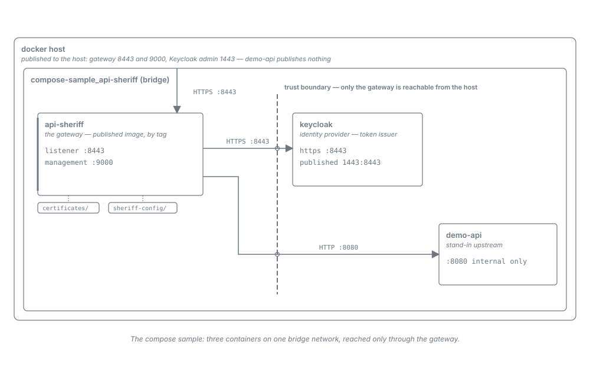

= Compose Sample -- Contributor Guide
:toc:
:toclevels: 3
:sectnums:

The `deployment` module owns one subtree, `compose-sample/`, holding a production-shaped Docker
Compose stack. This document covers why it exists as a separate stack, the decisions inside it that
look arbitrary until you know the constraint behind them, and the build mechanism that keeps it out
of the default lane. The link:../user/compose-sample.adoc[operator guide] covers running it.

== Topology

Three containers on one bridge network. `api-sheriff` is the only one an operator can reach for
traffic; `demo-api` publishes no host port at all, which is what makes "the gateway is the only way
in" a property of the stack rather than a claim in prose. Keycloak's admin console is published
because a sample is worth inspecting, and the gateway reaches it container-internally regardless.

== Why this is not the integration-test stack

`integration-tests/docker-compose.yml` already brings up a gateway, an identity provider and a set
of upstreams. The sample deliberately does not reuse it, and equally deliberately does not trim it.

The integration stack exists to *exercise tests*. It carries toxiproxy for fault injection, a
TLS passthrough backend, an asset origin, a gRPC echo service and go-httpbin, plus six gateway
instances differing only by overlaid configuration. Every one of those exists to make an assertion
possible. None of them shows an operator how the gateway is deployed, and several would actively
mislead -- a reader who copies a fault-injection proxy into a production topology has been
misinformed by the documentation.

`demo-client` faced a related problem and solved it differently: it needs a *subset* of the
integration stack, so it uses explicit service selection against that same compose file rather than
declaring a second stack. That is the right call there, because the demo drives the same gateway
configuration the integration suite does. It is the wrong call here, because the sample's gateway
configuration is deliberately *different* -- a small, readable `gateway.yaml` with one public proxy
namespace, rather than the integration suite's much larger document. A trimmed bring-up would have
forced the sample's configuration into a file whose job is to serve the tests, and the two would
have drifted.

The cost of a second stack is that the two files can diverge. That is accepted: they are answering
different questions, and the sample's value is precisely that it contains nothing you would have to
explain away.

== Runtime hardening and what it costs

All three services carry `security_opt: [no-new-privileges:true]`, `cap_drop: [ALL]` and
`read_only: true`, and none of them runs as root. The hardening is the substance of the sample --
that posture is what a production deployment should set, and setting it explicitly rather than
inheriting a default is the whole point.

`read_only: true` is the expensive one, and each service pays differently. These are the three
findings, each of which was a crash loop before it was a line of configuration:

`demo-api` (nginx):: Runs as `user: "101:101"` and writes to three paths. A tmpfs is created
root-owned and mode 755, so the unprivileged process cannot create `/var/cache/nginx/client_temp`
and nginx dies at startup with `mkdir() ... failed (13: Permission denied)`. Each tmpfs therefore
carries `uid=101,gid=101`. The service also sets `entrypoint: ["nginx", "-g", "daemon off;"]`,
bypassing `docker-entrypoint.sh` -- whose `10-listen-on-ipv6-only.sh` step rewrites
`/etc/nginx/conf.d/default.conf` in place and fails under a read-only root.

`keycloak`:: `start-dev` re-augments Quarkus on every boot and writes the rebuilt runner into
`/opt/keycloak/lib/quarkus`. Under `read_only: true` that write raises
`ReadOnlyFileSystemException` and the server never starts. The fix is a *named volume* at that path,
not a tmpfs: Docker seeds a named volume from the image's content at that path on first use, whereas
a tmpfs would mask the shipped libraries with an empty directory and break the augmentation a
different way. `/opt/keycloak/data` gets its own named volume for the realm import.

`api-sheriff`:: Needs only a tmpfs at `/tmp`. It declares no `user:` key because its image already
declares `USER nonroot` (uid 65532); restating the uid here would only risk drifting from it.

=== The certificate permission trap

The certificate material is generated, never committed, and the generator writes the private key
world-readable. That is a deliberate inversion of the usual rule, and the reason is structural: the
two containers that mount the directory run as *different* non-root uids -- the gateway as 65532 and
Keycloak as 1000 -- while the files are owned by whichever host user ran the script. Neither uid can
be matched from the host without root, so mode 600 makes the key unreadable inside the container and
the gateway dies with `AccessDeniedException: /app/certificates/localhost.key`.

`integration-tests/src/main/docker/certificates/generate-certificates.sh` still chmods its key to
600, and that stack works -- but the mode there is nominal. Those certificates are *committed*, and
git records only the executable bit, so a fresh checkout materialises them world-readable anyway.
The sample commits no key material, so the mode it is created with is the mode the container
actually sees. Do not "restore" the 600 here by analogy with that script.

== Probes: three different answers to the same question

The stack contains three readiness-shaped mechanisms, and they are not interchangeable.

The gateway carries *no* `healthcheck:` key. Its image is distroless -- no shell, no curl, no wget --
so every in-container probe form is unavailable by construction, and a healthcheck declared here
could only ever fail. Readiness is asserted host-side instead.

Keycloak carries a TCP-accept probe, `bash -c 'echo -n > /dev/tcp/127.0.0.1/9000'`, and the form is
forced: the Keycloak image ships neither curl nor wget, so a probe naming either would fail
permanently and be indistinguishable from a service that never came up. `bash` is present, so
`/dev/tcp` is the available primitive. It is deliberately *accept-level only* -- it proves the
management listener is bound, not that the realm finished importing. That is sufficient for its one
job, which is ordering the gateway's start behind the identity provider's; the gateway's own eager
key-set load at boot is what makes that ordering load-bearing rather than cosmetic.

`scripts/wait-for-ready.sh` is the actual readiness gate, and it is bound by
link:../adr/0031-Host-side_readiness_gates_derive_the_probe_URL_from_the_resolved_Compose_model_and_assert_readiness.adoc[ADR-0031].
It derives its whole probe target from `docker compose config --format json`:

* *which services to probe* -- those carrying the `de.cuioss.sheriff.management-scheme` label;
* *which scheme to speak* -- that label's value;
* *which host port to hit* -- the port published against the container-port selector 9000.

The only literal is the container-side management port, and deliberately so: it is a stable
platform-level fact used as the *selector* that picks the management binding out of a service's port
list, not a per-deployment value. Renumbering the published port, or adding a second gateway
instance, therefore needs no edit to the script.

ADR-0031's negative list is binding here, and each item is a real failure mode:

* *No restated host port and no restated scheme.* A list in the script mirroring the compose file
  becomes a defect the moment either changes.
* *No liveness probe standing in for readiness.* `/q/health/live` answers as soon as the process is
  up, which is strictly earlier than the point at which the gateway can serve a request. Gating on
  it would clear the wait before the stack is usable -- the exact race the gate exists to remove.
  `curl -sf` is equally load-bearing: without `-f`, curl exits 0 on the 503 the readiness endpoint
  returns while starting, and the wait would clear as soon as the port *accepted*.
* *One retry-budget constant, with a recorded origin.* `READY_ATTEMPTS=60` is read by the loop bound,
  the last-attempt comparison and the progress message; three literals would drift apart. Sixty
  attempts at one second is roughly 5x headroom over the measured worst case on a loaded machine.
  Re-measure before shrinking it -- a budget that is too small turns a slow machine into a spurious
  failure, which is worse than waiting.
* *An empty target set is a hard failure.* Discovering no labelled service exits non-zero rather
  than passing, because a gate that probes nothing and reports success is a vacuous green.

`-k` is applied only when the derived scheme is `https`, so a plain-HTTP management interface is
probed without it and no branch on the service name is needed.

== The opt-in build mechanism

`deployment/pom.xml` carries a single `compose-sample` profile with three `exec-maven-plugin`
executions: teardown at `pre-clean` (accepting exit codes 0 and 1, because nothing running is the
normal case), `start-sample.sh` at `pre-integration-test`, and teardown again at
`post-integration-test`.

The skip is *two layers*, matching the convention `demo-client` establishes: the profile means a
default build has no executions to skip at all, and `skipComposeSample` -- defaulting to `true` at
module level and flipped to `false` inside the profile -- means an accidentally activated profile
still needs a deliberate override to start containers. A plain `verify` leaves the `deployment`
module at a few milliseconds and starts nothing.

Note that this profile needs no `<skipTests>false</skipTests>`, and that is not an oversight.
`demo-client`'s `e2e-demo` profile requires that flip because `frontend-maven-plugin`'s test
execution binds to a testing phase and therefore honours the inherited `skipTests`, which would
otherwise hollow the profile into a vacuous green. `exec-maven-plugin`'s `exec` goal honours only
its own `<skip>`, so the module-level `skipTests=true` that keeps inherited surefire off this
Java-free module cannot silently disable this gate.

Only the *success* path tears the stack down. Maven offers no always-runs hook, so a failing gate
leaves the containers up -- which is wanted, because they hold the logs explaining the failure being
diagnosed. The `pre-clean` teardown is the remedy, and it fires on any subsequent `clean` build.

== Standing constraints

* *The sample never builds an image.* It demonstrates deploying a released artifact, which is what
  an operator does. `start-sample.sh` preflights the reference and attempts exactly one pull; if
  that fails it exits non-zero naming both documented routes rather than falling through to
  `compose up` and surfacing the same failure later as a less legible error.
* *`deployment/compose-sample/` is self-contained.* Nothing in it reaches into `integration-tests/`
  or the `api-sheriff` module -- not even for shell helpers, which is why the compose-command
  resolution is repeated inline in each script rather than sourced from
  `integration-tests/scripts/lib-docker-compose.sh`. The directory is meant to be copied wholesale.
* *No comments in `sample-realm.json`.* JSON has no comment syntax, and Keycloak's
  `RealmRepresentation` rejects unrecognised fields outright -- a `_comment` key fails the import
  with `Unrecognized field`. Rationale belongs in this document and the operator guide; the only
  in-file markers are the `CHANGE-ME-BEFORE-PRODUCTION` values themselves, which are loud by
  construction and trip secret scanners on purpose.
* *The gateway's `gateway.yaml` stays small.* Everything the integration suite needs and an operator
  does not -- passthrough SNI, BFF sessions, asset anchors, mTLS -- is *absent* rather than
  present-and-disabled. A disabled block still has to be read and understood.
