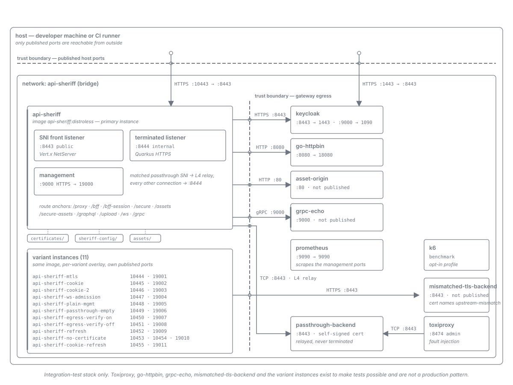

= API Sheriff -- Integration-Test Topology
:toc:
:toclevels: 2
:sectnums:

The *contributor* view of the stack `integration-tests` brings up: which containers run, which
ports each one publishes, what talks to what, and where trust changes. It exists so a contributor
reading a failing integration test can see the shape of the thing under test without
reverse-engineering `integration-tests/docker-compose.yml`.

[IMPORTANT]
====
This is the *integration-test* topology. It is not a production deployment and not a recommended
one. Toxiproxy, go-httpbin, grpc-echo, the passthrough backend and the five variant gateway
instances exist to make specific tests possible. Production and Kubernetes topologies are defined by
PLAN-27 and are deliberately not drawn here or anywhere else yet.
====

== The Topology

The diagram is drawn to the link:diagram-type-deployment.md[deployment diagram-type standard]. Every
port, protocol and service name in it traces to a line in `integration-tests/docker-compose.yml` or
the mounted `integration-tests/src/main/docker/sheriff-config/gateway.yaml` -- nothing is inferred
and nothing is invented. Those two files are the authoritative sources; when they change, the
diagram is stale and gets redrawn rather than annotated.

== Reading the Diagram

=== Trust boundaries

Two boundaries are drawn, both as heavy dashed lines with a small open circle at each crossing:

* *Published host ports* -- the only surface reachable from outside the Compose network. Everything
  below the line is internal, addressed by Compose service name.
* *Gateway egress* -- every outbound leg the gateway makes. The JWKS fetches are constrained by a
  host-exact SSRF allowlist (`allowed_egress_hosts: ["keycloak"]`) and verified against a named TLS
  trust profile rather than the JVM default store, because Keycloak serves a self-signed certificate
  here.

=== The primary gateway instance

The `api-sheriff` container is drawn in full because it is the one instance that exercises the
accept-time SNI split:

* the *SNI front listener* -- a plain-TCP Vert.x `NetServer` -- owns the public port `8443`;
* a matched passthrough SNI is relayed opaquely at L4 to `passthrough-backend` and is *never
  terminated*, which is why `TlsPassthroughIT` observes the backend's own certificate through the
  relay;
* every other connection is handed to the internal terminating Quarkus HTTPS listener on `8444`;
* the management interface is HTTPS-only on `9000`, published as `19000`.

The front-listener architecture itself -- the ClientHello reassembly, the fail-closed selection
rule, and the internal-handoff loopback -- is documented in
link:tls-edge.adoc[TLS Edge -- Front Listener and the Accept-Time SNI Split].

=== The collapsed variant group

Five further gateway instances run the *same* `api-sheriff:distroless` image and differ only by an
overlaid `gateway.yaml` -- or, for the last one, by a single environment variable -- and their
published ports. Drawing all six in full would bury the affordances the diagram exists to show, so
they are collapsed into one annotated group that still names every instance and every port pair:

[cols="2,1,1,3"]
|===
| Instance | App port | Mgmt port | Why it is separate

| `api-sheriff-mtls`
| 10444
| 19001
| mTLS is a property of the single terminated listener, so it cannot coexist with the primary
  instance's non-client-cert path.

| `api-sheriff-cookie`
| 10445
| 19002
| Session mode is a property of the whole gateway; this instance runs the stateless sealed-cookie
  mode.

| `api-sheriff-cookie-2`
| 10446
| 19003
| A peer sharing nothing with `api-sheriff-cookie` but the sealing key, so cookie portability is
  proved as a two-instance fact rather than an inference.

| `api-sheriff-ws-admission`
| 10447
| 19004
| The admission budget is process-wide; this instance shrinks the caps to single digits so
  permit exhaustion is reachable in a handful of connections.

| `api-sheriff-plain-mgmt`
| 10448
| 19005
| The one instance whose *management* interface serves plain HTTP, proving the supported downgrade
  path. It overlays no `gateway.yaml` at all -- the opt-out is a single environment variable -- so
  the management scheme is the only variable under test. See <<readiness-contract>>.
|===

=== Mounted material

Three read-only volumes are mounted into every gateway instance and are drawn as pills rather than
boxes, because they are inert material rather than components: `certificates/`, `sheriff-config/`
and `assets/`. The variant instances additionally overlay a single file --
`sheriff-config-<variant>/gateway.yaml` on top of the shared `sheriff-config/` mount -- which is the
whole mechanism by which they differ.

[#readiness-contract]
== The Readiness Contract

Bringing the stack up is not the same as being able to drive it. This section records what the
bring-up script waits for, what that wait actually proves, and where its retry budget came from.

=== The gate asserts readiness, not liveness

`integration-tests/scripts/start-integration-container.sh` waits on `/q/health/ready` for every
discovered gateway instance, in the single Compose-model-derived wait loop. It is one loop for all
six instances: the service set, each instance's published management port, and the scheme its
management interface speaks are read from the resolved Compose model, so adding, removing or
renumbering an instance needs no edit to the script.

`/q/health/live` is deliberately *not* the gate. Liveness answers as soon as the process is up,
which is strictly earlier than the point at which the suite may drive the instance -- an instance
that is live but not ready would serve the suite's first request against a validator that is not
yet bound.

The Keycloak wait is derived the same way, from the `keycloak` service's own
`de.cuioss.sheriff.management-scheme` label and its published management port, so no host and no
port number is restated in the script.

=== What `GatewayReadinessCheck` attests -- and what it does not

The probe reports two facts: the configuration document is bound (which proves the boot-time
load-and-validate pipeline succeeded, since an invalid configuration aborts startup), and -- when a
`token_validation` block is configured -- the `@GatewayValidator`-qualified `TokenValidator`
resolves.

Be precise about the second one, because it reads stronger than it is. It is a *boot-time
constructibility* fact, not a live JWKS signal. The validator is forced into existence at startup
and the probe afterwards reads the cached instance, so it performs no JWKS fetch per probe.

The consequence is worth stating plainly, because it is the thing most likely to be assumed wrong:

[IMPORTANT]
====
An IdP whose JWKS endpoint becomes unreachable *after* boot, a stalled key rotation, and an expired
signing key do *not* take readiness `DOWN`. They surface as `401`s on the request path and as fetch
errors in the container's stdout. Diagnose that class of failure from the container log, never from
a green readiness probe.
====

That narrowness is a known and accepted consequence of the exclusion decision recorded in
link:../adr/0027-The_token-validation_extensions_unqualified_health_probes_are_excluded_not_accommodated.adoc[ADR-0027]:
the token-validation extension's two unqualified health probes were removed from the bean set
rather than configured into a green state, because they observe an issuer namespace this gateway
never populates. The live per-issuer loader signal they would have carried is an open gap in the
gateway's own probe, not something the exclusion removed.

=== Where the retry budget came from

The gateway wait budget is `GATEWAY_READY_ATTEMPTS`, declared once in the script and read by the
loop bound, the last-attempt comparison and the progress echo -- one number rather than three
literals that can drift apart.

Its value was measured, not chosen. A sub-second prober (100 ms polling, started *before*
`docker compose up -d` so that it observes the live-to-ready transition rather than inferring it
from a loop that only begins once both are already true) ran against all six gateway instances
brought up concurrently with Keycloak, under CPU contention -- 24 busy workers on 16 cores:

[cols="2,1,1,1"]
|===
| Instance | First live | First ready | Delta

| `api-sheriff`             | 8.80s | 8.80s | 0.00s
| `api-sheriff-cookie`      | 9.14s | 9.14s | 0.00s
| `api-sheriff-cookie-2`    | 8.82s | 8.82s | 0.00s
| `api-sheriff-mtls`        | 8.16s | 8.16s | 0.00s
| `api-sheriff-plain-mgmt`  | 8.94s | 8.94s | 0.00s
| `api-sheriff-ws-admission`| 8.95s | 8.95s | 0.00s
|===

The live-to-ready delta is *0.00s on every instance* -- below the prober's own 100 ms resolution.
That is not luck; it is what the previous section describes. Because the `jwks` datum is settled at
boot and cached, readiness flips at the same moment liveness does. Switching the gate from liveness
to readiness therefore costs no additional wait, and the budget needed no increase to absorb it.

*The budget is 30 attempts at 1 s, retained on that evidence.* The headroom is stated as a factor
against the worst observed figure: the worst time-to-ready was 9.14s measured from the
`compose up -d` call, and the wait loop's own clock starts strictly later than that -- after compose
returns and after the go-httpbin wait -- so 30 attempts carry better than 3x headroom against that
stricter clock and roughly 30x against the loop's own. The factor is deliberately generous rather
than tight, because the budget is consumed only on failure: a large budget costs a healthy run
nothing and costs a broken run only the time until it gives up. It is *not* to be shrunk toward the
observed figures -- CI runners are slower than the machine measured here, and the measurement bounds
the live-to-ready delta, not the absolute container start.

=== The demo bring-up gates the same way

Everything above describes `integration-tests/scripts/start-integration-container.sh`. The parallel
developer bring-up, `demo-client/scripts/start-dev-environment.sh`, gates its gateway wait on
`/q/health/ready` against the same single-number retry budget, so the two scripts agree on the
readiness contract and the measured evidence above justifies both.

=== `-plain-mgmt` serves plain HTTP by design

`api-sheriff-plain-mgmt` is the one instance whose management interface is plain HTTP. That is the
supported downgrade path under
link:../adr/0025-The_whole_server-TLS_surface_is_neutral_in_gatewayyaml_and_bound_by_exactly_two_seams.adoc[ADR-0025],
selected by pointing the instance at a TLS bucket that carries no key material. *It is not a defect
to fix.*

It is handled structurally rather than as a special case: each service declares the scheme its
management interface speaks in a `de.cuioss.sheriff.management-scheme` label, and the wait loop adds
`-k` only when that label says `https`. The scheme difference is therefore data, not a branch on a
service name -- which is what lets one loop cover all six instances.

The corollary is a standing assertion: this instance must be probed over `http://` with *no* `-k`.
If it ever needs `-k`, the plain-HTTP opt-out has silently stopped working, and that is the bug --
not the probe.

== Keeping the Diagram Honest

The diagram is hand-authored SVG, so it does not regenerate itself and CI does not check it. Two
consequences:

* *When `docker-compose.yml` or the mounted `gateway.yaml` changes, redraw the diagram in the same
  change.* A stale topology diagram is worse than none, because it is believed.
* *Re-render and read back before committing.* The verification recipe -- including the two ways it
  is commonly got wrong -- is in the
  link:diagram-type-deployment.md[deployment diagram-type standard]. Rendered PNGs are verification
  artifacts and are never committed.

=== Diagram check for the readiness change

The readiness change recorded above was checked against the diagram, and the check is stated here
rather than left implicit. That change altered no service and no port -- it changed which health
path the wait loop probes, hoisted the retry budget into a named constant, and derived the Keycloak
probe URL from the Compose model. None of those is a fact the diagram depicts, so the diagram is not
made stale by it and is deliberately not redrawn.

The check did, however, surface a *pre-existing* gap that predates this change: the collapsed
variant group in the SVG is labelled `variant instances (4)` and names only `api-sheriff-mtls`,
`api-sheriff-cookie`, `api-sheriff-cookie-2` and `api-sheriff-ws-admission`. It omits
`api-sheriff-plain-mgmt` -- the same omission the table above previously carried and now fixes. The
diagram's `<desc>` accessibility text repeats the omission. Closing it means adding the fifth member
plus its `10448 · 19005` port pair, correcting the count label and the `<desc>`, and re-rendering
against both themes; that is diagram work rather than documentation work and is deliberately left to
a follow-up rather than folded in here.
