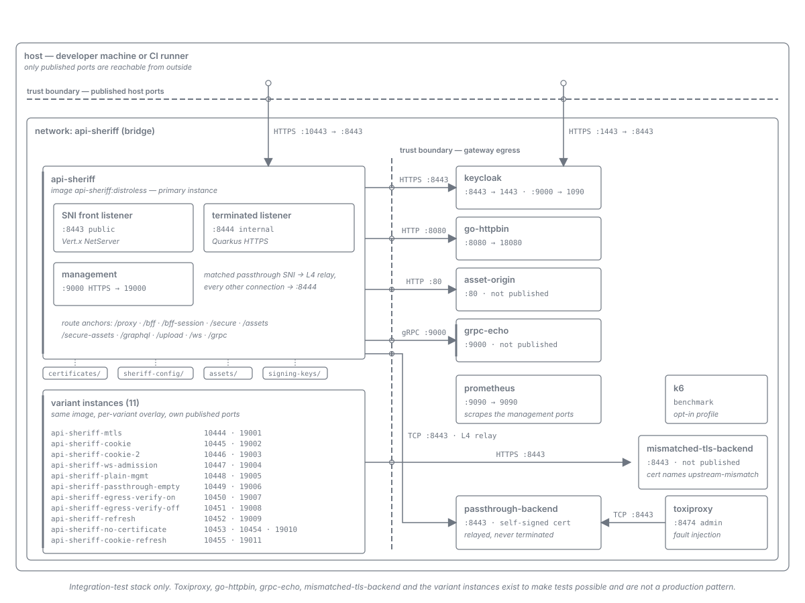

= API Sheriff -- Integration-Test Topology
:toc:
:toclevels: 2
:sectnums:

The *contributor* view of the stack `integration-tests` brings up: which containers run, which
ports each one publishes, what talks to what, and where trust changes. It exists so a contributor
reading a failing integration test can see the shape of the thing under test without
reverse-engineering `integration-tests/docker-compose.yml`.

[IMPORTANT]
====
This is the *integration-test* topology. It is not a production deployment and not a recommended
one. Toxiproxy, go-httpbin, grpc-echo, the passthrough backend, the deliberately
hostname-mismatched TLS backend and the variant gateway
instances exist to make specific tests possible. For a deployment-shaped stack, read
link:compose-sample.adoc[the Compose sample] instead -- it is drawn and documented separately for
exactly this reason. No Kubernetes topology is drawn.
====

== The Topology

The diagram is drawn to the deployment diagram-type standard in `pm-documents:ref-svg-diagrams/standards/diagram-type-deployment.md`. Every
port, protocol and service name in it traces to a line in `integration-tests/docker-compose.yml` or
the mounted `integration-tests/src/main/docker/sheriff-config/gateway.yaml` -- nothing is inferred
and nothing is invented. Those two files are the authoritative sources; when they change, the
diagram is stale and gets redrawn rather than annotated.

== Reading the Diagram

=== Trust boundaries

Two boundaries are drawn, both as heavy dashed lines with a small open circle at each crossing:

* *Published host ports* -- the only surface reachable from outside the Compose network. Everything
  below the line is internal, addressed by Compose service name.
* *Gateway egress* -- every outbound leg the gateway makes. The JWKS fetches pass token-sheriff's SSRF
  egress guard, which refuses the site-local address `keycloak` resolves to unless the host is
  allowed, and both of its forms are in use here: the `integration-keycloak` issuer declares no
  `allowed_egress_hosts` and reaches Keycloak through the allowance derived from its `jwks.url` host,
  while the `benchmark-keycloak` issuer keeps the explicit, authoritative `allowed_egress_hosts:
  ["keycloak"]` as the explicit-list control. Both are verified against a named TLS trust profile
  rather than the JVM default store, because Keycloak serves a self-signed certificate here.

Two *named egress trust profiles* are declared in this stack, across the egress legs ADR-0040
enumerates: one for the two legs that dial Keycloak, one for terminated upstream dials. Both follow
ADR-0011's boundary rule -- the gateway document names the logical profile, the deployment supplies
the anchors through `quarkus.tls.<name>.trust-store.*` -- and in both cases the material sits in the
already-mounted `certificates/` directory, so neither adds a volume:

* `benchmark-idp` binds both legs that dial Keycloak -- the *JWKS back-channel* and the *BFF OIDC
  back-channel* -- to `localhost-truststore.p12` (`benchmark-idp-trust.properties`). Every gateway
  instance in the stack loads it, because every one names it through both keys:
  `jwks.tls_profile: benchmark-idp` and `egress_tls.oidc_tls_profile: benchmark-idp`.
* `it-upstream` binds *terminated upstream dials* to `upstream-truststore.p12`
  (`it-upstream-trust.properties`). Only the two `api-sheriff-egress-verify-*` instances load it --
  they are the only ones naming `egress_tls.upstream_tls_profile`; no other instance names one, so
  they keep the JVM default trust store on that leg.

A named profile *replaces* a client's anchors rather than adding to them, which is why
`upstream-truststore.p12` holds only the mismatched upstream's own certificate: it is exactly the set
those two instances may verify terminated upstreams against.

=== The primary gateway instance

The `api-sheriff` container is drawn in full because it is the one instance that exercises the
accept-time SNI split:

* the *SNI front listener* -- a plain-TCP Vert.x `NetServer` -- owns the public port `8443`;
* a matched passthrough SNI is relayed opaquely at L4 to `passthrough-backend` and is *never
  terminated*, which is why `TlsPassthroughIT` observes the backend's own certificate through the
  relay;
* every other connection is handed to the internal terminating Quarkus HTTPS listener on `8444`;
* the management interface is HTTPS-only on `9000`, published as `19000`.

The front-listener architecture itself -- the ClientHello reassembly, the fail-closed selection
rule, and the internal-handoff loopback -- is documented in
link:tls-edge.adoc[TLS Edge -- Front Listener and the Accept-Time SNI Split].

=== The collapsed variant group

Eleven further gateway instances run the *same* `api-sheriff:distroless` image and differ only in
configuration: their published ports, an overlaid `gateway.yaml` *where one applies*, and -- for
some instances -- their environment. Neither lever is universal: `api-sheriff-plain-mgmt` overlays no
`gateway.yaml` at all and is configured by a single environment variable. The per-instance
differences are named where they matter below; do not read this sentence as an exhaustive list.
Drawing all twelve in full would bury the affordances the diagram exists to show, so they are
collapsed into one annotated group that names each of them with its port pair:

[cols="2,1,1,3"]
|===
| Instance | App port | Mgmt port | Why it is separate

| `api-sheriff-mtls`
| 10444
| 19001
| mTLS is a property of the single terminated listener, so it cannot coexist with the primary
  instance's non-client-cert path.

| `api-sheriff-cookie`
| 10445
| 19002
| Session mode is a property of the whole gateway; this instance runs the stateless sealed-cookie
  mode.

| `api-sheriff-cookie-2`
| 10446
| 19003
| A peer sharing nothing with `api-sheriff-cookie` but the sealing key, so cookie portability is
  proved as a two-instance fact rather than an inference.

| `api-sheriff-ws-admission`
| 10447
| 19004
| The admission budget is process-wide; this instance shrinks the caps to single digits so
  permit exhaustion is reachable in a handful of connections.

| `api-sheriff-plain-mgmt`
| 10448
| 19005
| The one instance whose *management* interface serves plain HTTP, proving the supported downgrade
  path. It overlays no `gateway.yaml` at all -- the opt-out is a single environment variable -- so
  the management scheme is the only variable under test. See <<readiness-contract>>.

| `api-sheriff-passthrough-empty`
| 10449
| 19006
| `tls.passthrough_sni` is process-wide, and the primary instance declares it non-empty for its whole
  lifetime -- so the benchmark's `passthroughRelayEmpty` arm, whose entire claim is that it measures
  the *zero-overhead default where no front listener is created*, cannot be run against the primary.
  This instance overlays a `gateway.yaml` that is the base document minus that one block, and is the
  only instance with no front listener at all: its terminated Quarkus HTTPS listener owns `8443`
  directly, so it sets no `QUARKUS_HTTP_SSL_PORT` relocation.

| `api-sheriff-egress-verify-on`
| 10450
| 19007
| `egress_tls.upstream_verify_hostname` is bound at Vert.x client construction and is therefore
  process-wide, so one instance can exhibit only one side of the control. This is the positive leg:
  it must *refuse* `mismatched-tls-backend`, whose certificate names `upstream-mismatch`.

| `api-sheriff-egress-verify-off`
| 10451
| 19008
| The negative leg of the same matched control, differing from its sibling in exactly one scalar
  (`upstream_verify_hostname: false`). Both bind the `it-upstream` trust profile, so chain trust
  succeeds on both and hostname matching is the only variable. Keeping the profile on *this* leg is
  load-bearing: the relaxation is hostname matching only, so dropping it would make this instance
  fail on chain trust and the knob under test would never be exercised.

| `api-sheriff-refresh`
| 10452
| 19009
| The access-token lifespan is a property of the *client* that mints the token, so it cannot be
  varied per request on an existing instance. The shared realm mints a 900s token, which puts the
  near-expiry refresh window 870s into a session -- unreachable in a test. This instance
  authenticates as `refresh-client`, whose client-level `access.token.lifespan` is 45, moving that
  window to 15s--45s so `BffTokenRefreshIT` can drive all three `RefreshOutcome.Kind` branches. It
  stays in server session mode. It is also *the one instance on client-secret authentication*: every
  other instance authenticates with `private_key_jwt`, and this one keeps `oidc.client_secret` so
  that the client-secret mode the gateway still supports is proven against a real identity provider
  rather than at unit level alone. Only the client authentication differs -- its requests are pushed
  and its access tokens are DPoP-bound like every other instance's. See <<realm-clients>>.

| `api-sheriff-no-certificate`
| 10453 (plain HTTP) +
  10454 (dead HTTPS)
| 19010
| The one instance that supplies *no* server key material for the terminated main listener, and that
  absence is half the configuration under test. The other half is `QUARKUS_HTTP_INSECURE_REQUESTS=enabled`:
  a certificate-less deployment that does not declare it is *refused at boot*, because absence cannot
  tell "deliberately behind a TLS terminator" apart from "the certificate failed to mount". It overlays
  the no-`passthrough_sni` document so no front listener answers on `8443` either, which is what makes
  the published `10454` genuinely dead rather than answered by a listener that terminates nothing --
  `NoCertificatePlainHttpOptInIT` asserts exactly that pair. It is the one row here with two app ports.

| `api-sheriff-cookie-refresh`
| 10455
| 19011
| Session mode, the refresh switch and the minting client are each process-wide, so the one
  combination that matters most to a cookie-mode operator -- a *stateless sealed-cookie session that
  also refreshes* -- fits on neither sibling: `api-sheriff-cookie` holds refresh off and
  `api-sheriff-refresh` stays in server mode. This instance is the proof rig for that combination.
  It overlays the cookie document with exactly
  three behavioural differences -- `cookie-refresh-client` as the minting client,
  `session.refresh.enabled: true`, and the 10455 gateway origin -- and declares *no*
  `max_cookie_size` override, so it runs on
  the lowered 4019-byte browser-safe default and the size question `BffCookieRefreshIT` exists to
  answer is measured rather than assumed.
|===

[NOTE]
====
*This table is not the port allocator; `docker-compose.yml` is.* The `api-sheriff-no-certificate` row
is a late addition, and the way it was found is the reason for this note. That service had run in the
stack enumerated by neither this table nor the diagram -- an omission of the same class as the
`api-sheriff-plain-mgmt` one the readiness-change diagram check below records -- and what surfaced it
was a collision, not a review: `api-sheriff-cookie-refresh` was planned for `10453 / 19010`, which the
runtime would have refused to bind, and was moved to `10455 / 19011`.

The table and the diagram are both complete against `docker-compose.yml` as of that addition, and
neither is *derived* from it, so both can silently fall behind it again. Allocate host ports by
reading `docker-compose.yml`, never by reading this page.
====

The two `api-sheriff-egress-verify-*` instances are one matched pair in this table that must be read
*together*. `api-sheriff-cookie` and `api-sheriff-cookie-2` are the other, and the two pairs are
matched controls of opposite shape:

* the *cookie-portability* pair shares only the sealing key and is otherwise unrelated, and its claim
  is that the two legs *agree* -- a cookie sealed by one instance is accepted by the other, which is a
  two-instance fact rather than an inference drawn from one process;
* the *egress hostname-verification* pair is identical apart from one scalar
  (`upstream_verify_hostname`), and its claim is that the two legs *disagree* -- verify-on refuses
  `mismatched-tls-backend`, verify-off admits it.

Every remaining row is separate only because some process-wide property makes it incompatible with
the primary instance. Both pairs draw their value from the relationship between their members, so a
change that touches one leg and not the other silently destroys the control while leaving both
instances booting.

=== The hostname-mismatched backend

`mismatched-tls-backend` is an nginx serving HTTPS on `8443` with *no published host port* -- it is
reached only by the two `api-sheriff-egress-verify-*` gateways on the Compose network. Its
certificate's only SAN is `upstream-mismatch`, while those gateways dial it as
`mismatched-tls-backend`. That non-overlap is the entire fixture.

It differs from `passthrough-backend` in where its key material comes from, and the difference is
deliberate rather than inconsistent. `passthrough-backend` generates a self-signed certificate at
container start, because its certificate only has to *exist*. This one *mounts* the committed
`upstream-mismatch.crt`/`.key` pair from `certificates/`, because its certificate must chain to the
anchors `upstream-truststore.p12` already holds -- a freshly generated one would be untrusted, both
legs of the control would then fail on chain trust, and the pair would prove nothing about hostname
matching.

=== The chain-trust control, and why `passthrough-backend` is reused for it

The two legs above establish that `upstream_verify_hostname` *changes the outcome*. On their own they
do not establish *what it relaxed*: a knob that had quietly disabled certificate verification
wholesale would produce the identical pair of observations -- a refusing verify-on leg and an
admitting verify-off leg. A third leg is what separates the two readings, and it is the one the
`UpstreamHostnameVerificationIT` suite drives against `api-sheriff-egress-verify-off` at
`/proxy/untrusted`: with hostname matching relaxed, that instance must *still* refuse an origin whose
certificate chains to nothing it trusts.

The origin is `passthrough-backend`, reached through the `UNTRUSTED_UPSTREAM` alias which both
instances pin with `TOPOLOGY_UNTRUSTED`. Reusing it rather than adding a tenth service is what makes
the control cheap *and* what makes it hard to break: that backend generates its own self-signed
certificate at container start, so it can never become an anchor of a committed truststore -- the
untrustedness is structural rather than a property that could drift. The other half is equally
load-bearing and runs the opposite way: its SAN *does* cover the dialled name
(`DNS:passthrough-backend`), so hostname matching succeeds and chain trust is the only thing left
that can fail. Point this leg at `mismatched-tls-backend` instead and it degenerates into a second
copy of the first leg while still going red on the verify-off instance, which is why
`EgressVerifyActivationWiringTest` asserts the two dial targets differ.

The route itself lives in the shared `sheriff-config/endpoints/untrusted.yaml` under the existing
`api` anchor rather than at a top-level `/untrusted`. A new top-level path would need a new anchor,
and ADR-0007 requires the anchor to be declared in every gateway document that resolves the route --
which would mean editing all nine, two of which are the matched pair whose entire value rests on
differing in exactly one scalar. Every other instance resolves the alias and simply never dials it.

[#realm-clients]
=== The realm clients and the signing keys

Every gateway instance pushes its authorization requests (RFC 9126) and binds its access tokens to a
DPoP proof key (RFC 9449). What differs between instances is how the gateway authenticates to Keycloak
(link:../adr/0058-The_BFF_pushes_every_authorization_request_and_binds_its_tokens_with_DPoP_and_authenticates_with_private_key_jwt_unless_a_client_secret_is_configured.adoc[ADR-0058]).
The `integration` realm declares five clients:

[cols="2,2,4"]
|===
| Client | Authentication | Who uses it

| `integration-client`
| `private_key_jwt`; Keycloak fetches the key from a JWKS URL
| The ten gateway instances other than `api-sheriff-refresh` and `api-sheriff-cookie-refresh`.

| `cookie-refresh-client`
| `private_key_jwt`; the same JWKS URL
| `api-sheriff-cookie-refresh`. It carries the 45-second `access.token.lifespan` that instance
  needs. It is a client of its own because `refresh-client` carries the same lifespan but stays on
  its secret, and a realm client has one authentication method.

| `generated-key-client`
| `private_key_jwt`; a JWKS URL of its own
| No compose instance. The one-off gateway `BffGeneratedKeysIT` starts, which generates its keys at
  boot. It carries the same 45-second lifespan. It is a client of its own because its key is
  fetched from that gateway and from no other. See <<generated-keys-gateway>>.

| `refresh-client`
| client secret (`client_secret_basic`)
| `api-sheriff-refresh`, the one instance kept on client-secret authentication. The realm registers
  no key and no JWKS URL for it, and still requires it to push its authorization requests and to
  have its access tokens bound to DPoP.

| `token-mint-client`
| client secret, direct access grants
| No gateway. A fixture that needs a bearer token straight from Keycloak mints it here with the
  password grant. The four gateway clients cannot serve that purpose any more: direct access grants
  are disabled on them, and a token request without a DPoP proof is refused.
|===

*The two endpoint scopes.* The realm defines two client scopes for the suites.
`sheriff_it_endpoint` is an *optional* client scope of all five clients, so Keycloak issues it only
when a request names it; `endpoints/bff-scoped.yaml` declares it. `sheriff_it_unassigned` exists in
the realm and is assigned to no client, so no client may request it; `endpoints/bff-unassigned-scope.yaml`
declares it, and `BffSessionScopeParityIT` drives the refusal. Both endpoint files sit in the shared
`endpoints/` directory, so every gateway instance loads their routes. `oidc.step_up.path` is declared
by the base document and its `passthrough-empty` mirror only; under every other overlay a session
route's `403` names the missing scopes and no `step_up_url`.

*Which instance publishes the key.* The two key-authenticated clients of the compose instances name
the same JWKS URL, `https://api-sheriff:8443/auth/jwks` -- the primary instance, under the name
Keycloak already dials for back-channel logout. All eleven key-authenticated instances mount the same client-authentication
key file, so the key the primary publishes is the key each of them signs with. The URL names the
primary and no other instance because the stack certificate's SAN list covers `api-sheriff` and no
other gateway service name (`certificates/generate-certificates.sh`), and Keycloak verifies the name
it dials. A consequence worth knowing when a variant instance's login fails: Keycloak verifies that
instance's client assertion with a key it fetches from the *primary* instance.

*The signing keys.* `integration-tests/src/main/docker/signing-keys/` holds three committed,
unencrypted key files -- test material, regenerated by `generate-signing-keys.sh` in the same
directory. Each holds one PKCS#8 private key followed by its public key; the gateway derives the
algorithm and the key id from the key.

[cols="2,2,4"]
|===
| File | Key | What it signs

| `client-auth-rsa.pem`
| RSA-2048
| The `private_key_jwt` client assertion of the eleven key-authenticated instances, with `PS256`.
  Named in the descriptors by a literal path.

| `dpop-ec.pem`
| EC P-256
| The DPoP proofs of the ten instances whose client is `integration-client`, with `ES256`.

| `dpop-rsa.pem`
| RSA-2048
| The DPoP proofs of `api-sheriff-refresh` and `api-sheriff-cookie-refresh`, with `PS256`.
|===

The DPoP key file is named in the descriptors through the variable `OIDC_DPOP_KEY_FILE`, which each
service sets, so both ways of naming a key file run in the native image. Regenerating any of the
three needs no realm change: the realm holds no copy of the client key, and a DPoP proof carries its
own public key.

*The realm settings, and what Keycloak does with them.* The three key-authenticated clients declare
`clientAuthenticatorType: client-jwt` and the attributes `use.jwks.url: "true"`, `jwks.url` and
`token.endpoint.auth.signing.alg`. The algorithm is `PS256` for the two clients of the compose
instances, whose client key is the committed RSA key, and `ES256` for `generated-key-client`, whose
client key is generated. All four gateway clients declare
`require.pushed.authorization.requests: "true"` and `dpop.bound.access.tokens: "true"`, and none of
them has direct access grants enabled.

These settings were established on the pinned image, Keycloak 26.5.7, on a throwaway container with
a scratch realm, before the stack was migrated:

* *They survive a realm import.* All five attributes, the two JWKS URL attributes included, read back
  unchanged after `--import-realm`.
* *Signed-JWT authentication through a JWKS URL works.* A pushed request authenticated by a `PS256`
  client assertion whose audience is the issuer was accepted (`201`), and Keycloak had fetched the
  JWKS URL. The same request signed with another key, and one presenting a Basic credential on that
  client, were refused (`401`).
* *The push requirement is enforced.* An authorization request with its parameters in the URL was
  refused with `invalid_request`, "Pushed Authorization Request is only allowed."; the same client
  presenting `client_id` and `request_uri` alone was redirected on into the login flow.
* *The binding requirement is enforced.* A token request without a proof was refused with "DPoP proof
  is missing"; with a proof the response is of type `DPoP` and the access token's `cnf.jkt` is the
  thumbprint of the proof key.
* *A secret-authenticated client can carry both requirements.* It pushed with `client_secret_basic`
  (`201`) and received DPoP-bound access tokens.
* *"Declares no secret" is a statement about the import file.* Keycloak generates a secret for a
  `client-jwt` client whose import declares none. The realm file registers no secret and no key for
  the three key-authenticated clients; what Keycloak stores beside them is not something the file
  controls. On the migrated stack that stored secret was read from the admin interface and presented
  at the token endpoint, and Keycloak refused it with `invalid_client`: the authenticator type admits
  a signed assertion only. No test asserts that last observation.

Two facts need the gateway and were therefore not part of that isolated check: that the stack's
Keycloak fetches the key over TLS from `https://api-sheriff:8443/auth/jwks`, and that the binding
holds on the authorization-code grant. Neither is asserted by this page. No key is registered
statically, so a login completed through a key-authenticated instance is itself the proof of the
fetch; the decision record carries the observation entries for both.

[#generated-keys-gateway]
=== The one-off generated-keys gateway

`BffGeneratedKeysIT` proves the *generated* key mode: a gateway with no signing key configured, which
generates one key per purpose at boot. The test restarts that gateway under a live session. A compose
service restarted under the suite would take every other suite's sessions with it, so the gateway is a
one-off container. The test starts it through the shared harness (`OneOffGatewayContainers`) on the
Compose network and removes it on every exit path. It is not a service of `docker-compose.yml`, and
it adds no row to the instance table and nothing to the diagram.

[cols="1,3"]
|===
| What | Value

| Container name and network alias
| `sheriff-generated-keys`

| Realm client
| `generated-key-client`, whose `jwks.url` is
  `https://sheriff-generated-keys:8443/auth/client-keys`

| Descriptor
| Derived at test time from the committed `sheriff-config-cookie-refresh/gateway.yaml`: both
  `key_file` entries removed, the client id replaced, a `client_authentication.jwks_path` of
  `/auth/client-keys` declared, and the gateway origin retargeted at the port below. It is written
  below `target/` and never committed.

| Server certificate
| `certificates/generated-keys-gateway.crt` and its key, presented by the application listener. Its
  subject alternative names are `sheriff-generated-keys`, `localhost` and `127.0.0.1`. The management
  listener keeps the stack certificate.

| Host ports
| The application listener on the fixed host port `10462`, published on every interface as the
  Compose stack publishes its own gateway ports; the management interface on a loopback port docker
  assigns.

| Mounts
| The certificates, the shared configuration with the derived descriptor laid over it, the assets and
  the demo directory. No signing-key directory is mounted.

| Sealing key
| Passed as `SESSION_ENCRYPTION_KEY`, so that the sealed session cookie stays readable after the
  restart.
|===

*Why this gateway has a certificate of its own.* Keycloak fetches the generated client key from the
gateway and verifies the name it dials. The stack certificate covers `api-sheriff` and no other
gateway name, so a gateway reached under another alias cannot present it. The pair is produced by
`certificates/generate-generated-keys-gateway-certificate.sh`, a script of its own, so that producing
it regenerates nothing else: `localhost.crt`, `localhost.key` and both trust stores stay
byte-identical. The Keycloak service trusts the certificate through a second entry in
`KC_TRUSTSTORE_PATHS`. That entry, with the comment above it, is the only change this gateway brought
to `docker-compose.yml`, and it is inert for every suite that starts no such gateway.

*The port is fixed, and `docker-compose.yml` does not show it.* The descriptor of a BFF names its own
origin and is read at boot, so the application port cannot be one docker assigns. This gateway takes
`10462`. <<test-started-host-ports>> lists every such port, says how each is published and why, and
records the port numbers that must not be handed out again.

*What guards the wiring.* The wiring is spread over the realm import, the compose file and the
certificate. `BffClientKeyWiringTest` reads all three without a container and asserts that:

* the JWKS URL of `generated-key-client` names the alias and the JWKS path the test uses;
* the client declares no secret and requires pushed requests and DPoP-bound access tokens;
* the Keycloak service trusts the certificate, and the certificate names the alias;
* every other realm client registered for a signed assertion is the client of a compose instance.

*What the test observed.* On Keycloak 26.5.7 and the native image, in this order:

. The gateway boots with no key configured. Its log carries the generated-key record once for client
  authentication and once for the sender constraint, and no member of the published key.
. `GET /auth/client-keys` answers one EC P-256 key with `use: sig`, `alg: ES256` and a `kid` equal to
  its RFC 7638 thumbprint. `/auth/jwks`, the default path the descriptor moved away from, answers
  `404`.
. A login completes. No key is registered at Keycloak, so Keycloak fetched the generated key from the
  gateway over TLS.
. The mediated token carries a `cnf.jkt` that differs from the published `kid`. The proof key is a
  second generated key.
. After `docker restart` the published `kid` differs from the one before.
. The session cookie from before the restart is replayed inside the near-expiry window. The refresh
  succeeds, the session continues, and the new access token is bound to the new proof key.

The last line is the restart verdict: a restart with newly generated keys does not end a live
session. The failure message of the test names the other possible verdict -- the refresh is refused
and the session ends through `oidc.session.refresh.on_failure` -- so a Keycloak upgrade that changes
the behaviour turns the test red. The decision record states the limits of this observation
(link:../adr/0058-The_BFF_pushes_every_authorization_request_and_binds_its_tokens_with_DPoP_and_authenticates_with_private_key_jwt_unless_a_client_secret_is_configured.adoc#observed-on-the-integration-stack[ADR-0058: Observed on the integration stack]).

[#test-started-host-ports]
=== The test-started containers and their host ports

Some suites start containers of their own instead of using a Compose service: a gateway whose
readiness is `DOWN` by design, a gateway with a lifetime or a restart of its own, a stub or a proxy
standing in for the identity provider. They are started through the shared harness
(`OneOffGatewayContainers`) and removed on every exit path. None is a service of
`docker-compose.yml`, and none adds a row to the instance table or anything to the diagram.

*The ports `docker-compose.yml` does not list.* The Compose stack publishes `10443` to `10455`. Every
test-started gateway publishes its application listener on a fixed host port above that range. The
note above says to allocate host ports by reading `docker-compose.yml`; these are the ports that file
does not show, and a Compose instance published on one of them would collide with the suite that uses
it.

The table below is enclosed in a `test-started-host-ports` tagged block, which
`OneOffGatewayContainersTest` reads at runtime and compares with the ports the integration-test
sources assign -- so the table is a test input, and a change to it is not a documentation-only commit.

// tag::test-started-host-ports[]
[cols="1,2,3"]
|===
| Host port | Gateway container | Suite

| `10459`
| `sheriff-absolute-ttl`
| `BffSessionAbsoluteTtlIT` -- see <<short-ttl-gateway>>

| `10462`
| `sheriff-generated-keys`
| `BffGeneratedKeysIT` -- see <<generated-keys-gateway>>

| `10463`
| `sheriff-tls-relaxation-gateway`
| `BffTlsRelaxationIT` -- see <<tls-relaxation-rig>>

| `10464`
| `sheriff-reserved-path-overlap`
| `BffReservedPathPrecedenceIT` -- see <<reserved-path-gateway>>

| `10465`
| `sheriff-stub-idp-gateway`
| `BffRefreshScopeWireIT`, `BffRefreshSingleFlightIT` and `BffRefreshTransientFailureIT`, through
  `StubIdentityProviderRig` -- see <<stub-idp-rig>>

| `10466`
| `late-idp-gateway-<suffix>`
| `JwksLateIdpReadinessIT`

| `10467`, `10468`
| `jwks-egress-mismatch-gateway-<suffix>` and its control, `jwks-egress-mismatch-control-<suffix>`
| `JwksEgressMismatchIT`, which runs the two side by side

| `10469`, `10470`
| `sheriff-idle-timeout-server` and `sheriff-idle-timeout-cookie`
| `BffSessionIdleTimeoutIT`, one gateway per test, each with the signing-key directory mounted
|===
// end::test-started-host-ports[]

*How they are published.* Every one of these gateways publishes two ports: the application listener
as `<port>:8443` on every interface (`OneOffGatewayContainers.applicationPortPublication`), the form
the Compose stack publishes its own gateway ports in, and the management interface as
`127.0.0.1::9000`, on a loopback port docker assigns and the suite reads back. The application port
of a BFF has to be known before the container exists, because the descriptor names the gateway's own
origin and is read at boot. The two bearer-only suites have no such constraint and take a fixed port
for the reason the next paragraphs give. The cost of the form is that a test's gateway is reachable
from the network the host is on while the test runs, as the Compose gateways are.

*The host constraint behind that form.* On Rancher Desktop under WSL 2 a host port number can be left
dead. A container that publishes a dead number afterwards starts normally and answers on its other
ports; a connection to the dead number is accepted and reset about five seconds later. The trigger was
established on 2026-10-07 with plain nginx containers and no gateway. A number goes dead when a
container is removed that had one of two shapes:

. two publications on a loopback address;
. one publication on a loopback address while it was attached to two networks.

A container with at most one loopback publication on a single network leaves nothing behind, and a
publication on every interface counts towards neither shape. A dead number stays dead however it is
published afterwards, on loopback or on every interface. What was not measured: whether restarting the
runtime clears a dead number, and whether any other container runtime behaves this way. The
constraint was observed on that host only.

*The rule the harness follows.* No container a test starts carries two loopback publications, or one
loopback publication while it is attached to two networks:

* a gateway publishes one port on every interface and one on loopback, and joins one network;
* the stub identity provider publishes its admin port on loopback and nothing else, and joins one
  network;
* the two containers that are attached to a second network -- the identity-provider proxy of
  `BffTlsRelaxationIT` and the late provider of `JwksLateIdpReadinessIT` -- publish no port at all.

`OneOffGatewayContainers.assertLeavesNoDeadHostPort` refuses both shapes in every argument builder of
the harness, before any docker call. `OneOffGatewayContainersTest` holds the rule without a docker
daemon: it runs each builder with the options the suites pass, and it scans the integration-test
sources so that a publish option, a raw `network connect` and a call of the harness's own network
attachment each occur in a named set of files and in no other. The echo container a rig borrows from
the Compose stack is attached to the rig's network and detached again; no test starts it, and the rule
does not cover it.

*The start check.* A gateway's readiness is polled on its management port, so readiness `UP` says
nothing about the application port, which is published over a different mapping. Each suite therefore
makes one request to the application port once the gateway answers
(`OneOffGatewayContainers.assertApplicationPortAnswers`). On a dead number that request fails the
suite's start with a message naming the port and the condition, instead of surfacing as a socket error
in whichever test request comes first. It is one request and not a wait.

*Retired port numbers.* `10456`, `10457`, `10458`, `10460` and `10461` are dead on that host and must
not be handed out again. Each was the fixed port of a test-started gateway at a time when such a
gateway published both of its ports on loopback: `10456` of `BffGeneratedKeysIT`, `10457` and later
`10461` of the stub identity-provider rig, `10458` of `BffTlsRelaxationIT`, `10460` of
`BffReservedPathPrecedenceIT`. The two bearer-only suites published both of their ports on loopback
ports docker assigned. By the measurement above each such gateway left its two numbers dead; those
lie in the range docker assigns from and are not recorded, which is why no test-started container
takes a port docker assigns on every interface.

[#stub-idp-rig]
=== The stub identity-provider rig

Three suites have to see, or to decide, what the identity provider is sent and what it answers: the
`scope` of a refresh grant (`BffRefreshScopeWireIT`), the number of refresh grants a burst of requests
causes (`BffRefreshSingleFlightIT`), and a token endpoint that fails once (`BffRefreshTransientFailureIT`).
The Compose Keycloak shows a test none of the three. The suites share one rig,
`StubIdentityProviderRig`, in which a WireMock container stands in for the identity provider. Each
test starts a rig of its own and closes it.

[cols="1,3"]
|===
| What | Value

| Stub image
| `wiremock/wiremock:3.13.1@sha256:d61e7720f89483fdef5366843b58d1dfd06bcce5828179c9f2f54de5c28354b0`
  -- an exact release tag together with the digest of its multi-platform index. It is the one
  container image the integration tests start that the Compose stack does not.

| Network
| A dedicated docker network, `sheriff-stub-idp`.

| Stub container
| `sheriff-stub-idp-wiremock`, under the network alias `keycloak` -- the host the descriptor's issuer
  and every `jwks.url` name. It serves HTTPS on `8443` from a PKCS12 key store the rig derives below
  `target/` from the committed `localhost.crt` and `localhost.key`. The subject alternative names of
  that certificate cover the alias, so the gateway keeps `egress_tls.oidc_tls_profile: benchmark-idp`,
  keeps hostname verification on and needs no new trust material. Its plain-HTTP admin port is its
  one published port, on a loopback port docker assigns; the rig scripts answers and reads the
  request journal there.

| Echo upstream
| The Compose `go-httpbin` container, connected to the rig's network under its service name for the
  life of the rig and disconnected on teardown, so the session route has its upstream.

| Gateway
| `sheriff-stub-idp-gateway`, on the rig's network and no other.

| Descriptor
| Derived at test time from the committed `sheriff-config-refresh/gateway.yaml`, with the gateway
  origin retargeted at the port below. It is written below `target/` and never committed.

| Mounts
| What every one-off BFF gateway mounts, and the signing-key directory, because the descriptor names a
  DPoP proof key.

| Host ports
| The application listener on the fixed host port `10465`, on every interface; the management
  interface on a loopback port docker assigns.
|===

*What the stub serves.* The provider metadata document below the issuer, the key set on every
`jwks.url` path the descriptor names, and the pushed-authorization-request, token and revocation
endpoints. Tokens are signed with an RSA key generated when the rig starts, and every access token
carries the thumbprint of the committed proof key as `cnf.jkt`, because the gateway refuses a token
response that is not bound to its own proof key. The stub validates nothing. Its token endpoint
refuses every grant a test did not script, so a refresh nobody expected ends the session instead of
passing unnoticed.

*What guards the image.* `StubIdentityProviderWiringTest` reads committed files only. It asserts that
the image reference has the shape `name:tag@sha256:<64 hex>`, and that the image name occurs in
neither `integration-tests/docker-compose.yml`, nor `api-sheriff/pom.xml`, nor any file below
`api-sheriff/src/main/docker/`.

[#tls-relaxation-rig]
=== The TLS-relaxation rig

`BffTlsRelaxationIT` pins what the two hostname relaxations of the back-channel to the identity
provider reach, and what neither reaches. It needs an identity provider whose certificate the test
chooses, so each of its three tests starts a rig of its own: a TLS proxy of the Compose Keycloak, and a
gateway that reaches Keycloak through that proxy only.

[cols="1,3"]
|===
| What | Value

| Network
| A dedicated docker network, `sheriff-tls-relaxation`.

| Proxy
| `sheriff-tls-relaxation-idp`, running
  `nginx:1.27-alpine@sha256:65645c7bb6a0661892a8b03b89d0743208a18dd2f3f17a54ef4b76fb8e2f2a10` -- a
  release-line tag together with the digest of its multi-platform index -- and rendered from
  `tls-relaxation-idp/default.conf.template`. On the rig's network it carries the alias
  `keycloak`. It is attached to the Compose network as well, where it dials the Keycloak container by
  its container name, and it forwards every path with `Host: keycloak:8443`. It publishes no host
  port.

| Echo upstream
| The Compose `go-httpbin` container, connected for the life of the rig as in <<stub-idp-rig>>.

| Gateway
| `sheriff-tls-relaxation-gateway`, on the rig's network and no other. It authenticates as
  `refresh-client`, with the secret the realm import registers.

| Descriptor
| The committed fixture `sheriff-config-tls-relaxation/gateway.yaml`, mounted over the shared
  configuration directory as a Compose instance mounts its overlay. It declares
  `egress_tls.oidc_verify_hostname: false` and `egress_tls.jwks_verify_hostname: false` and names no
  trust profile. No Compose service loads it.

| Trust
| Three process arguments after the image name: `-Djavax.net.ssl.trustStore`,
  `-Djavax.net.ssl.trustStorePassword` and `-Djavax.net.ssl.trustStoreType=PKCS12`. They put the
  gateway process on the committed `upstream-truststore.p12`, which holds one certificate. The path
  and the secret are read from `certificates/it-upstream-trust.properties`.

| Host ports
| The application listener on the fixed host port `10463`, on every interface; the management
  interface on a loopback port docker assigns.
|===

*The certificate and the descriptor of each leg.* A leg says something about hostname matching only
if the proxy's certificate is trusted and does not name the host, and something about chain trust
only if the certificate names the host and is not trusted. Each test asserts those two facts on the
committed certificate, against the committed trust store, before it starts its rig.

[cols="3,2,1,1,2"]
|===
| Test | Proxy certificate | In the trust store | Names `keycloak` | Descriptor

| `bothRelaxationsAdmitATrustedCertificateThatDoesNotNameTheHost`
| `upstream-mismatch.crt`
| yes
| no
| the fixture

| `theKeySetRelaxationAloneDoesNotAdmitTheBackChannel`
| `upstream-mismatch.crt`
| yes
| no
| the fixture without `oidc_verify_hostname`, written below `target/` and asserted to differ from the
  fixture in that key and in nothing else

| `neitherRelaxationReachesChainTrust`
| `localhost.crt`
| no
| yes
| the fixture
|===

*The serving control.* Before the gateway starts, the rig asserts that the proxy serves the realm's
metadata to a client that verifies nothing, so a refusal that follows is the gateway's verdict on the
certificate. The proxy is on two networks and therefore publishes no port
(<<test-started-host-ports>>), so that client is `curl` in a one-shot container of the proxy's own
image on the rig's network, which dials the proxy under the name the gateway dials it under.

*What guards the proxy image.* `StubIdentityProviderWiringTest` holds the proxy's reference to the
shape `name:tag@sha256:<64 hex>`, beside the stub image of <<stub-idp-rig>> and with the same
control. The shape is all it holds: that the pinned reference pulls is shown by this suite starting
the proxy.

*The JSSE arguments, and the exemption that covers them.* This is the one launch of the gateway
image in the module that passes JSSE trust-store system properties. The gateway refuses a hostname
relaxation together with a named trust profile at boot, so a descriptor that relaxes hostname matching
has to verify the chain against the JVM default trust store. `ItProfileConfigBindingWiringTest`
exempts exactly two files, each by its literal path: the fixture descriptor from its trust-profile
guard and `BffTlsRelaxationIT.java` from its launch-site guard. Neither exemption is unconditional;
link:declared-limit-assertion-coverage.adoc[the coverage note] states what each one asserts first.

[#short-ttl-gateway]
=== The short-lifetime gateway

`BffSessionAbsoluteTtlIT` pins that a server-mode session ends `ttl_seconds` after its login whatever
a refresh did in between. The lifetime is a property of the whole gateway, and no Compose instance
declares one short enough to wait out in a test, so the short lifetime needs an instance of its own.

[cols="1,3"]
|===
| What | Value

| Container name and network alias
| `sheriff-absolute-ttl`, on the Compose network, against the real Keycloak.

| Descriptor
| Derived at test time from the committed `sheriff-config-refresh/gateway.yaml`: `ttl_seconds` set to
  `40`, and the gateway origin retargeted at the port below. The two are asserted, on the parsed
  documents, to be the only differences. It is written below `target/` and never committed.

| Control
| The Compose instance `api-sheriff-refresh`, which runs the committed descriptor itself. Both
  instances authenticate as `refresh-client`.

| Mounts
| What every one-off BFF gateway mounts, and the signing-key directory.

| Host ports
| The application listener on the fixed host port `10459`, on every interface; the management
  interface on a loopback port docker assigns.
|===

[#reserved-path-gateway]
=== The reserved-path gateway

`BffReservedPathPrecedenceIT` pins that the gateway's reserved OIDC paths win over a proxy route whose
prefix contains them. No committed endpoint declares such a route, and none may: the route sits under
an anchor of its own, and an anchor has to be declared in every gateway document that resolves the
route. So the suite starts a gateway over a configuration of its own, once for the class.

[cols="1,3"]
|===
| What | Value

| Container name and network alias
| `sheriff-reserved-path-overlap`, on the Compose network.

| Fixture
| `reserved-path-overlap/auth-overlap.yaml`: one endpoint with one route, `path_prefix: /auth`, to the
  echo upstream, with `allowed_methods: ["POST"]`. It lives outside every `sheriff-config*` directory.

| Configuration directory
| Assembled below `target/` by `OneOffGatewayContainers.assembleConfigurationDirectory`: a copy of the
  shared `sheriff-config` tree, the fixture as one further file of its `endpoints/`, and as its
  `gateway.yaml` a document derived from `sheriff-config-passthrough-empty/gateway.yaml` by adding the
  one anchor the fixture names -- asserted to be the only difference. The directory is mounted whole
  at `/app/sheriff-config`, read-only, in place of the shared directory and its overlay.

| Mounts
| The certificates, the assembled configuration, the assets, the demo directory and the signing-key
  directory.

| Host ports
| The application listener on the fixed host port `10464`, on every interface; the management
  interface on a loopback port docker assigns.
|===

*Why the fixture is not mounted into the shared directory.* Every gateway mounts the shared
`sheriff-config` directory read-only. A file mounted into it needs a mount point inside it, and for a
name that does not exist there the container runtime cannot create one under a read-only parent: the
container would not start. Under a writable parent the runtime would create the mount point as an
empty file in the committed directory, and every Compose instance would load it from then on. The
existing `gateway.yaml` overlay is unaffected, because that name exists in the mounted directory. The
harness refuses an extra mount at or below a path it mounts itself, and the suite asserts, before it
starts and after it has finished, that the committed `sheriff-config/endpoints/` directory holds no
file of the fixture's name.

=== The fault proxy in front of the echo backend

Toxiproxy fronts a second backend. Beside the standing use by `PassthroughFaultIT`, in front of the
passthrough backend, `HtmlErrorPageIT` places a Toxiproxy proxy in front of `go-httpbin` to observe
the gateway's own `504` and `503` answers. The proxy is not part of the standing topology:

* the shared endpoint file `sheriff-config/endpoints/upstream-fault.yaml` declares one route,
  `path_prefix: /proxy/fault`, under the existing `api` anchor;
* its `base_url` is the alias `FAULT_UPSTREAM`, which `sheriff-config/topology.properties` points at
  `http://toxiproxy:8667`;
* nothing listens on that port until a test creates the proxy through Toxiproxy's admin API, which the
  Compose stack publishes on `8474`, and the test deletes the proxy again.

The listen port is this alias's own -- `PASSTHROUGH_FAULT` listens on `8666` -- so the proxy, and the
circuit breaker the gateway keeps per upstream host and port, are shared with no other route. Every
gateway instance loads the route, because the endpoints directory is shared; outside those tests it is
never requested. The change adds no Compose service and no published port.

=== Mounted material

Four read-only volumes are mounted into every gateway instance. They are inert material rather than
components: `certificates/`, `sheriff-config/`, `assets/` and `signing-keys/`. The variant instances
additionally overlay a single file -- `sheriff-config-<variant>/gateway.yaml` on top of the shared
`sheriff-config/` mount -- which is the whole mechanism by which they differ.

The set stayed at three for a long time, and deliberately: the egress hostname-verification control
added new key material and a new trust-binding properties file, and every one of them went into the
already-mounted `certificates/` directory rather than bringing a volume with it. The signing keys are
the one addition that could not go there. `certificates/` is also mounted into Keycloak and into the
`mismatched-tls-backend` fixture, and the private keys the gateway signs with must reach the gateway
instances and nothing else -- Keycloak is given the public client key over the JWKS URL, never the
file. A directory of its own is what makes "mounted into the gateway instances only" checkable in
`docker-compose.yml`, and `BffClientKeyWiringTest` checks it there. The diagram draws the fourth pill;
see <<diagram-check-signing-keys>>.

[#readiness-contract]
== The Readiness Contract

Bringing the stack up is not the same as being able to drive it. This section records what the
bring-up gate waits for, what that wait actually proves, and where its one remaining number came
from.

=== Two layers, and the different question each answers

`integration-tests/scripts/start-integration-container.sh` gates the suite in two layers, and they
are not redundant: each answers a question the other cannot.

*Layer 1 -- waiting.* `compose up -d --wait --wait-timeout 180`, scoped to the derived gateway
service names, blocks until the container runtime reports each of those services healthy. The signal
it blocks on is the `HEALTHCHECK` baked into `api-sheriff/src/main/docker/Dockerfile.native`, so the
polling that used to be a hand-rolled retry loop in this script is now the runtime's job and the
probe cadence has exactly one home. The question this layer answers is *is the management port
accepting?*

The wait is scoped deliberately. `--wait` with no service arguments waits on every service in the
resolved model, which would implicitly health-gate Keycloak, go-httpbin, asset-origin and the
benchmark overlay's `nginx-static` -- none of which carries a baked probe, and each of which already
has its own wait earlier in the script. The service names handed to `--wait` are the service-name
column of the same Compose-model-derived rows layer 2 probes, so the set waited on and the set
asserted are one set from one source.

*Layer 2 -- semantics.* One single-shot readiness `GET` per discovered instance, addressed beneath
that instance's derived management root path. The question
this layer answers is *did `GatewayReadinessCheck` report `UP`?* -- which layer 1 structurally cannot
answer, for the reason <<baked-container-check>> gives.

Single-shot, with no retry budget, is correct precisely *because* layer 1 already waited. A retry
budget exists to absorb the interval between asking too early and being ready; by the time this
assertion runs the runtime has already reported the instance healthy, so a non-`UP` answer is a
defect rather than an early ask, and retrying would only delay reporting it.

Both layers cover every gateway instance in the resolved Compose model from one derivation: the
service set, each instance's published
management port, the scheme its management interface speaks and the *root path* its management
endpoints sit beneath -- the latter two from the `de.cuioss.sheriff.management-scheme` and
`de.cuioss.sheriff.management-root-path` labels -- are read from the resolved Compose model, so
adding, removing, renumbering or re-pathing an instance
(link:../user/context-path.adoc[The Context Path]) needs no edit to the script. Every instance is
asserted, not only the primary one -- the suites drive the TLS ports directly, so an unasserted
instance is a race that surfaces as a connection refusal in the IT phase rather than as a bring-up
failure here.

=== The gate asserts readiness, not liveness

The management interface's liveness endpoint is deliberately *not* what layer 2 asserts. Liveness
answers as soon as the process
is up, which is strictly earlier than the point at which the suite may drive the instance -- an
instance that is live but not ready would serve the suite's first request against a validator whose
issuers have no key set yet, and reject every bearer token.

Layer 1 *is* a liveness signal, which is the whole reason layer 2 is not redundant with it. Read the
two together: the gate waits on liveness and passes on readiness.

The Keycloak wait is derived the same way, from the `keycloak` service's own
`de.cuioss.sheriff.management-scheme` label and its published management port, so no host and no
port number is restated in the script. It remains a host-side retry loop, run before the gateways are
started at all, and is untouched by the gateway-scoped `--wait` above.

Its *root path* is the one column deliberately not derived. Keycloak carries the
`de.cuioss.sheriff.management-root-path` label for label-set uniformity, but the label is *inert*
there -- Keycloak serves health directly on its management port under no root-path prefix at all --
so the IdP row is split out and its root-path column discarded rather than composed. A future loop
that starts deriving Keycloak's probe path from that label must fix the *value* first: it is the
gateway's root path, not Keycloak's.

=== What `GatewayReadinessCheck` attests -- and what it does not

The probe reports two facts: the configuration document is bound (which proves the boot-time
load-and-validate pipeline succeeded, since an invalid configuration aborts startup), and -- when a
`token_validation` block is configured -- *every configured issuer has a loaded JWKS key set*.

Be precise about the second one. The `@GatewayValidator`-qualified `TokenValidator` is forced into
existence at startup, which proves every issuer declared a usable JWKS source; the key sets
themselves are fetched asynchronously by the gateway's own per-issuer loaders, and the probe reads
their *non-fetching* state. While any issuer has no key set, readiness is `DOWN` with
`jwks: loading` or `jwks: unavailable` and the counts `issuers` / `issuers_loaded`; a failed fetch is
retried on a bounded backoff (1 s, doubling, capped at 30 s), so the instance turns `UP` within
seconds of its identity provider answering
(link:../adr/0027-The_token-validation_extensions_unqualified_beans_are_excluded_not_accommodated.adoc#amendment-a1[ADR-0027
Amendment A1]). The probe performs no JWKS fetch per probe.

*This is why the stack waits for Keycloak's own readiness before it starts any gateway.* The
gateway instances here name Keycloak realms as issuers, so an instance started ahead of
Keycloak would report `DOWN` until the backoff caught up -- and layer 2 below is a single shot.
Started after it, each instance's first fetch succeeds within a moment of boot, well before the baked
health check first reports healthy.

`JwksLateIdpReadinessIT` pins the late-IdP path against the native image with a one-off gateway
that is *not* one of the compose instances above -- it is `DOWN` by design until the test starts its
identity provider, which the readiness gate here would refuse. It asserts `DOWN` without the
provider, `UP` within a minute of it appearing, and that the provider's token is then accepted.

`JwksEgressMismatchIT` uses the same one-off shape, through the same shared harness, and is likewise
*not* a compose instance: its gateway is `DOWN` by design for its whole life, because its single
issuer's explicit `allowed_egress_hosts` names a host other than its `jwks.url` host. It joins the
compose network so `keycloak` resolves to the same site-local address the compose instances dial,
asserts `DOWN` without disclosure and a `401` for a real token, and then starts a second one-off
control that differs only by that key's removal and must reach `UP` and accept the same token
through the derived allowance. Neither suite adds a service or a row to the table or the diagram
above; the host ports their gateways take are listed under <<test-started-host-ports>>.

What readiness still does not cover is worth stating plainly, because it is the thing most likely to
be assumed wrong:

[IMPORTANT]
====
Readiness reports key-set *availability*, not *freshness*. Once an issuer's key set has loaded, an
IdP whose JWKS endpoint becomes unreachable *after* that, a stalled key rotation, and an expired
signing key do *not* take readiness `DOWN` -- the held keys stay in service. They surface as `401`s on
the request path and as fetch errors in the container's stdout. Diagnose that class of failure from
the container log, never from a green readiness probe.
====

The token-validation extension's two unqualified health probes stay excluded from the bean set
(link:../adr/0027-The_token-validation_extensions_unqualified_beans_are_excluded_not_accommodated.adoc[ADR-0027]),
because they observe an issuer namespace this gateway never populates; the per-issuer signal is
carried by the gateway's own probe instead.

[#baked-container-check]
=== The baked container check: what it proves, and what it deliberately does not

Layer 1's health signal comes from the image rather than from this stack.
`api-sheriff/src/main/docker/Dockerfile.native` bakes:

[source,dockerfile]
----
HEALTHCHECK --interval=10s --timeout=3s --start-period=20s --retries=3 \
    CMD ["/app/application", "--health-probe"]
----

`--health-probe` is answered by the application's own `main` *before* Quarkus is started: it opens a
TCP connection to `127.0.0.1:9000`, closes it again, and exits `0` when the port accepted and `1`
when it did not. Both properties are load-bearing. The exec form naming `/app/application` is the
only probe form the image can carry, because the distroless base ships exactly that one executable
and no shell; and the branch has to sit ahead of `Quarkus.run(...)`, because a check reached only
once the listeners are bound could never answer during the window a container health check exists to
cover.

*What it proves:* `127.0.0.1:9000` accepted a TCP connection. That is a liveness fact about the
management interface, and nothing beyond it.

*What it deliberately does not prove:* readiness. Nothing is written to or read from the socket, so
the probe cannot observe `GatewayReadinessCheck` -- neither the configuration document being bound,
nor every issuer's JWKS key set being loaded.

That blindness is a design constraint, not an omission. The management interface's scheme is
deployment-bound under
link:../adr/0025-The_whole_server-TLS_surface_is_neutral_in_gatewayyaml_and_bound_by_exactly_two_seams.adoc[ADR-0025]:
HTTPS once the deployment supplies management certificate material, plain HTTP through the named
`quarkus.management.tls-configuration-name=plain-management` opt-out. A probe that spoke HTTP would
have to know which scheme the deployment configured and would fail against the other one, so a bare
TCP accept is the largest claim a protocol-blind probe can make. That is precisely why layer 2 is
not optional.

The consequence reaches past this stack. Everything that consumes the container's health state --
`compose up --wait`, `depends_on: condition: service_healthy`, an orchestrator's liveness probe, the
`STATUS` column of `docker compose ps` -- is reading liveness, however the word "healthy" reads. A
reader who takes a healthy container for a ready one has drawn a conclusion the signal does not
support.

=== Where the bound came from

There is no host-side retry budget left to derive. Layer 1 does the waiting, and the only number this
script still owns is a *bound* rather than a budget: `--wait-timeout 180`. The cadence behind that
bound -- `--interval=10s --timeout=3s --start-period=20s --retries=3` -- is declared once, in
`Dockerfile.native`, and is an image-level artifact every consumer of the image inherits rather than
a host-side value each consumer re-derives.

Both the bound and the `--start-period` behind it are sized from measurement, not chosen. A
sub-second prober (100 ms polling, started *before*
`docker compose up -d` so that it observes the live-to-ready transition rather than inferring it
from a loop that only begins once both are already true) ran against the six gateway instances that
existed when it was taken, brought up concurrently with Keycloak, under CPU contention -- 24 busy
workers on 16 cores:

[cols="2,1,1,1"]
|===
| Instance | First live | First ready | Delta

| `api-sheriff`             | 8.80s | 8.80s | 0.00s
| `api-sheriff-cookie`      | 9.14s | 9.14s | 0.00s
| `api-sheriff-cookie-2`    | 8.82s | 8.82s | 0.00s
| `api-sheriff-mtls`        | 8.16s | 8.16s | 0.00s
| `api-sheriff-plain-mgmt`  | 8.94s | 8.94s | 0.00s
| `api-sheriff-ws-admission`| 8.95s | 8.95s | 0.00s
|===

This table is evidence from a dated run, not a claim about today's instance set, so it is
deliberately *not* restated as the set grows. Every instance that postdates the run --
`api-sheriff-passthrough-empty`, `api-sheriff-no-certificate`, `api-sheriff-egress-verify-on`,
`api-sheriff-egress-verify-off`, `api-sheriff-refresh` and `api-sheriff-cookie-refresh` -- is absent
from it by design rather than by omission. No row may
be invented for any of them: a fabricated timing would turn measured evidence into an assertion while
leaving the table looking exactly as authoritative. The headroom argument below therefore stands on
the six instances actually measured.

The live-to-ready delta is *0.00s on every instance* -- below the prober's own 100 ms resolution.
When the run was taken, the `jwks` datum was a boot-time fact cached at startup, so readiness flipped
at the same moment liveness did, and delegating the waiting to a liveness-shaped container check cost
no additional delay over the host-side readiness loop it replaced.

*That reason no longer holds on its own, and the table predates the change.* Readiness now also
waits for every issuer's JWKS key set (see <<readiness-contract,the section above>>), which arrives
asynchronously after boot, so a live-to-ready delta now exists: the latency of the first key-set
fetch against an already-ready Keycloak. It is not re-measured here and no figure is invented for it.
What keeps layer 2's single shot sound is the ordering rather than a zero delta: Keycloak is ready
before any gateway starts, and the baked health check first reports healthy only after its
`--interval` of ten seconds, which a fetch against a ready IdP -- or a first fetch that failed and was
retried on the one-second-doubling backoff -- does not approach. A stack that broke that ordering
would need a bounded readiness *wait* in layer 2 rather than a single shot
(link:../adr/0031-Host-side_readiness_gates_derive_the_probe_URL_from_the_resolved_Compose_model_and_assert_readiness.adoc[ADR-0031]
records the residual).

*The bound is `--wait-timeout 180`, and the image's `--start-period` is 20s -- both retained on that
evidence.* The headroom is stated as a factor against the worst observed figure: the worst
time-to-ready was 9.14s measured from the `compose up -d` call, so the start period carries roughly
2x against it and the wait timeout roughly 20x. Both factors are deliberately generous rather than
tight, because neither number is consumed on a healthy run: a large bound costs a healthy run nothing
and costs a broken one only the time until it gives up. Neither is to be shrunk toward the observed
figures -- CI runners are slower than the machine measured here. Note what the 9.14s bounds: it is
measured from the `compose up -d` call, so it covers absolute container start through ready, which is
what `--wait-timeout` must also cover because `compose up --wait` counts from that same call. It is
not a live-to-ready figure -- that delta was 0.00s when measured (see above) and would justify almost
no bound at all.

The operator sample's `deployment/compose-sample/scripts/start-sample.sh` derives its own
`--wait-timeout 120` from this same measurement; it brings up one gateway instance rather than the
whole set, which is why the two differ. The sample also carries a derived readiness poll budget, and
ADR-0031 records the residual duplication rather than claiming it away.

=== The demo bring-up does *not* gate this way

Everything above describes `integration-tests/scripts/start-integration-container.sh`. The parallel
developer bring-up, `demo-client/scripts/start-dev-environment.sh`, keeps its layering deliberately
unchanged: it still runs a single-layer host-side readiness loop against a measured single-number
retry budget, because not every service it starts runs an image carrying a baked health check, so it
has nothing to delegate the waiting to. It derives its probe target from the same two labels this
document names, so the *shape* of the derivation is shared even though the *layering* is not.

The two scripts therefore agree on *what is finally asserted* -- the readiness endpoint beneath the
derived management root path, failing closed on a 4xx or 5xx answer -- and differ on *where the
waiting happens*. The measured evidence above justifies both. ADR-0031 records that split in its scope note, which is why its `affects: demo-client` metadata
remains correct.

=== `-plain-mgmt` serves plain HTTP by design

`api-sheriff-plain-mgmt` is the one instance whose management interface is plain HTTP. That is the
supported downgrade path under
link:../adr/0025-The_whole_server-TLS_surface_is_neutral_in_gatewayyaml_and_bound_by_exactly_two_seams.adoc[ADR-0025],
selected by pointing the instance at a TLS bucket that carries no key material. *It is not a defect
to fix.*

It is handled structurally rather than as a special case: each service declares the scheme its
management interface speaks in a `de.cuioss.sheriff.management-scheme` label, and the layer-2
readiness assertion adds `-k` only when that label says `https`. The scheme difference is therefore
data, not a branch on a service name -- which is what lets one loop cover every instance.

Layer 1 is unaffected either way. A bare TCP accept has no scheme to get wrong, so this instance's
baked container probe is identical to every other instance's; the plain-HTTP downgrade is visible
only to the assertion behind it.

The corollary is a standing assertion: this instance must be probed over `http://` with *no* `-k`.
If it ever needs `-k`, the plain-HTTP opt-out has silently stopped working, and that is the bug --
not the probe.

== Keeping the Diagram Honest

The diagram is hand-authored SVG, so it does not regenerate itself and CI does not check it. Two
consequences:

* *When `docker-compose.yml` or the mounted `gateway.yaml` changes, redraw the diagram in the same
  change.* A stale topology diagram is worse than none, because it is believed.
* *Re-render and read back before committing.* The verification recipe -- including the two ways it
  is commonly got wrong -- is in the deployment diagram-type standard
  (`pm-documents:ref-svg-diagrams/standards/diagram-type-deployment.md`). Rendered PNGs are verification
  artifacts and are never committed.

=== Diagram check for the readiness change

The readiness change recorded above was checked against the diagram, and the check is stated here
rather than left implicit. That change altered no service and no port -- it changed which health
path the wait loop probes, hoisted the retry budget into a named constant, and derived the Keycloak
probe URL from the Compose model. None of those is a fact the diagram depicts, so the diagram is not
made stale by it and is deliberately not redrawn.

The check did, however, surface a *pre-existing* gap that predated this change: the collapsed variant
group in the SVG was labelled `variant instances (4)` and named only `api-sheriff-mtls`,
`api-sheriff-cookie`, `api-sheriff-cookie-2` and `api-sheriff-ws-admission`, omitting
`api-sheriff-plain-mgmt`; the diagram's `<desc>` accessibility text repeated the omission.

*That gap is now closed, not deferred.* The group is labelled `variant instances (6)` and enumerates
all six members with their port pairs -- `api-sheriff-plain-mgmt` at `10448 · 19005` and
`api-sheriff-passthrough-empty` at `10449 · 19006` joining the original four -- and the `<desc>`
accessibility narrative carries both the count and the full member enumeration rather than a subset.
The enclosing group rectangle and the own-bar line extent were grown by two row heights to fit the
added rows. The follow-up this section previously deferred therefore no longer exists.

The read-back obligation is unchanged and is *not* discharged by this note: re-render and read the
diagram back against both themes before committing any further edit to it, per the deployment
diagram-type standard (`pm-documents:ref-svg-diagrams/standards/diagram-type-deployment.md`). Rendered PNGs remain verification
artifacts and are never committed.

=== Diagram check for the egress hostname-verification control

Unlike the readiness change above, this one *does* alter facts the diagram depicts: it adds two
gateway instances, two published port pairs, one backend and one egress leg. The diagram was
therefore redrawn rather than left alone.

Three edits were made. The collapsed variant group is relabelled `variant instances (8)` and grows by
two rows -- `api-sheriff-egress-verify-on` at `10450 · 19007` and `api-sheriff-egress-verify-off` at
`10451 · 19008` -- with the enclosing rectangle and the own-bar line extent grown by two row heights
to fit them. `mismatched-tls-backend` is drawn as a new box, annotated with the fact that carries the
whole fixture: its certificate names `upstream-mismatch`, not the name it is dialled by. Its egress
leg is drawn from the *variant group* rather than from the primary instance, because the primary
never dials it -- only the matched pair does -- and it crosses the gateway-egress trust boundary like
every other egress leg. The `<desc>` accessibility narrative carries all of it, including the reason
the pair is one control rather than two variants.

[NOTE]
====
*The read-back for this edit was owed for a time, and is now discharged.* When the egress control
landed, the geometry above was placed by coordinate arithmetic against the existing elements rather
than by rendering the result and looking at it, because the environment that edit was made in had no
SVG renderer -- so this section carried a standing warning that the check was still owed.

It was performed during the refresh-instance edit recorded below, which re-rendered the whole
diagram against both themes. The two specific risks this warning had named were checked and are
clear: the `mismatched-tls-backend` box sits in its vertical gap between `k6` and `toxiproxy`
without collision, and the egress arrow crosses the L4-relay polyline as a clean line crossing with
no label collision. Rendered PNGs remain verification artifacts and are never committed.
====

=== Diagram check for the refresh instance

This change *does* alter facts the diagram depicts: it adds one gateway instance and one published
port pair. The diagram was therefore redrawn rather than left alone.

The collapsed variant group is relabelled `variant instances (9)` and grows by one row --
`api-sheriff-refresh` at `10452 · 19009` -- placed on the group's existing 18-pixel row pitch. The
enclosing rectangle grows by that one row height and the own-bar line extent with it; the `viewBox`
is unchanged. The group's new bottom edge is the number worth stating, because it is the one that
could have gone wrong quietly: at `826` it sits inside the compose-network rectangle's bottom edge
at `836`, which is the enclosure that actually bounds it -- not the footer caption at `880`, which
is outside the network rectangle altogether and would have been the wrong thing to measure against.
The `<desc>` accessibility narrative carries the new counts and names `api-sheriff-refresh` last in
the member enumeration.

One edit in the `<desc>` is not a count at all and is the reason appending a member is not purely
additive: the sentence introducing the matched egress pair referred to its members positionally, as
`the last two`. Appending `api-sheriff-refresh` to the enumeration silently repoints that phrase at
the wrong instances -- the enumeration changed under a sentence that never mentioned it. It now
names `the two api-sheriff-egress-verify-* instances` explicitly, so the reference no longer depends
on position.

*The read-back was performed for this edit.* The diagram was rendered at 1200px against both the
GitHub light (`#ffffff`) and dark (`#0d1117`) backgrounds per the deployment diagram-type standard
(`pm-documents:ref-svg-diagrams/standards/diagram-type-deployment.md`) and both renders were read
back. All nine variant rows are legible on both themes at a consistent pitch, nothing is clipped at
the `viewBox` edge, the appended row's two columns align on the same left edges as the eight above
it, and the group's bottom edge is visibly inside the compose-network rectangle. The same pass
discharged the older egress-control obligation recorded in the section above. Rendered PNGs are
verification artifacts and are not committed.

=== Diagram check for the cookie-refresh instance

This change *does* alter facts the diagram depicts, so the diagram was redrawn rather than left
alone. The redraw also added the row of `api-sheriff-no-certificate`, which the diagram had lacked.

The collapsed variant group is relabelled `variant instances (11)` and grows by two rows --
`api-sheriff-no-certificate` at `10453 · 10454 · 19010` and `api-sheriff-cookie-refresh` at
`10455 · 19011` -- and its row pitch tightens from 18 to 16 pixels. The
growth is taken *upwards* rather than downwards, and that direction is the one number worth stating
because it is what could have gone wrong quietly: the group's bottom edge at `826` already sits only
`10` pixels inside the compose-network rectangle's bottom edge at `836`, so growing downwards by a
row pitch would have pushed the group through its own enclosure. The rectangle's top edge therefore
moves from `600` to `582` and its height from `226` to `244`, leaving the bottom edge unmoved at
`826`; the group's label and its first row move up by the same `18`, the last row sits at `810`,
and the own-bar's top edge moves with them while its
bottom edge stays at `818` with the rectangle's. Above the
group, the mounted-material pills end at `566`, so the gap there narrows from `34` to `16` pixels
and no element overlaps. The `viewBox` is unchanged. The `<desc>` accessibility narrative carries
the new counts and names `api-sheriff-cookie-refresh` last in the member enumeration, with the
sentence explaining what the instance is for.

[NOTE]
====
*The read-back for this edit was owed for a time, and is now discharged.* The edit was made without
an SVG renderer, so its geometry was placed by coordinate arithmetic and this section carried a
standing warning that the visual check was still owed. It was performed during the signing-keys edit
recorded below, which rendered the whole diagram against both themes. The three points the warning
had named are clear: every row of the variant group ends well inside the group rectangle's right
edge, all eleven rows are legible at the published size on a consistent pitch, and neither the
L4-relay polyline nor the `mismatched-tls-backend` egress arrow collides with the group after its
upward shift.
====

[#diagram-check-signing-keys]
=== Diagram check for the signing-keys mount

This change *does* alter a fact the diagram depicts: every gateway instance mounts a fourth
read-only volume. The diagram was therefore redrawn.

A fourth mounted-material pill, `signing-keys/`, is drawn under the primary instance, on the same
row as the three before it and at the same 16-pixel spacing: its rectangle runs from `392` to `488`,
inside the instance's right edge at `544`, and its dashed stem leaves the instance's bottom edge at
`440`. The `<desc>` accessibility narrative names the four volumes, states that the signing keys
reach the gateway instances and nothing else, and records two facts the migration changed about the
refresh pair: `api-sheriff-refresh` is the one instance that keeps a client secret, and
`api-sheriff-cookie-refresh` mints with `cookie-refresh-client`. It also states that Keycloak dials
the primary gateway inside the network for the client key set and for back-channel logout, and that
neither leg is drawn as an arrow.

*The read-back was performed for this edit, and it found one defect that predates it.* The diagram
was rendered against the GitHub light (`#ffffff`) and dark (`#0d1117`) backgrounds per the
deployment diagram-type standard
(`pm-documents:ref-svg-diagrams/standards/diagram-type-deployment.md`) and both renders were read
back. The four pills are legible on both themes, share one baseline and do not touch the variant
group below them. The label and the sub-label of `mismatched-tls-backend`, however, ran past the
right edge of their box, and the sub-label past the edge of the network rectangle as well. The box
is now `192` wide where its two neighbours in that column are `152`: its left edge moved from `992`
to `952`, its three text rows with it, and the egress arrow ends at `940`. Both texts now end inside
the box on both themes. Rendered PNGs are verification artifacts and are not committed.

=== Diagram check for the generated-keys gateway

This change alters no fact the diagram depicts, so the diagram is deliberately not redrawn. The
gateway of <<generated-keys-gateway>> is a one-off container and not a service of
`docker-compose.yml`, and its host port is published by the test, not by the Compose stack. The two
things the change did add to the stack are a second entry in the Keycloak service's
`KC_TRUSTSTORE_PATHS` and a realm client, and the diagram draws neither trust-store entries nor realm
clients.

The `<desc>` accessibility narrative was read against the change. It states that Keycloak dials the
primary gateway inside the network for the client key set and for back-channel logout. That stays
true of the Compose stack. While `BffGeneratedKeysIT` runs, Keycloak dials the one-off gateway as
well, for that gateway's key set; this leg belongs to the test and is not part of the narrative.

=== Diagram check for the test-started rigs

This change alters no fact the diagram depicts, so the diagram is deliberately not redrawn. It adds
no Compose service, no published Compose port and no change to the `gateway.yaml` of a Compose
instance. The four rigs of <<stub-idp-rig>>, <<tls-relaxation-rig>>, <<short-ttl-gateway>> and
<<reserved-path-gateway>> are containers the suites start and remove, and the host ports of
<<test-started-host-ports>> are published by those suites, not by the Compose stack.

Two things did change in the material every gateway instance mounts: the shared configuration gained
the endpoint file `endpoints/upstream-fault.yaml` and the alias `FAULT_UPSTREAM`. The diagram draws
the mounted directories as pills and names no file inside them, and it draws the standing legs of the
stack. The leg from `toxiproxy` to `go-httpbin` exists only between the moment `HtmlErrorPageIT`
creates its proxy and the moment it deletes it, so it is not a standing leg and is not drawn. Neither
the diagram nor its `<desc>` narrative was edited.
