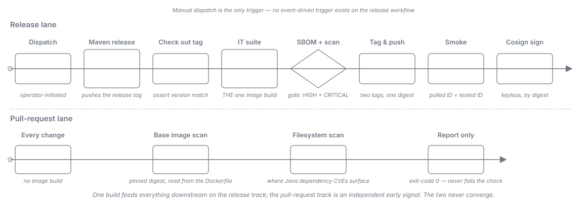

= Release Process
:toc:
:toclevels: 2
:sectnums:

How a release of API Sheriff is cut. A release has two entry points: merging a pull request that
changes the declared version in `.github/project.yml`, which *is* the publishing act once the
centrally-owned version-changed guard lets it through, and a deliberate `workflow_dispatch`, which
publishes unconditionally and is the operator-gated fallback. This page states the process and the
rules that keep it safe.

== Cutting a release

The ordinary path is a single act -- merge the version declaration:

. *Declare the version.* Edit link:../../.github/project.yml[`.github/project.yml`], setting
  `current-version` to the version being released and `next-version` to the following development
  version. Open a pull request with that change.
. *Merge it.* Merging into `main` cuts the release. The Release workflow runs on the merged close,
  and the pinned cuioss-organization workflow's *version-changed guard* decides whether this merge
  is a release. It publishes when the declared version actually moved *and* no tag for that version
  exists yet, and refuses on either condition failing -- see <<guard-refusal-predicates>>.

*The merge is the publishing act, so review the pull request as one.* Approving a version bump is
approving a Maven Central publication, and a published coordinate can be superseded but never
withdrawn.

*`workflow_dispatch` is the fallback, and it is unconditional.* Actions -> Release -> Run workflow
publishes whatever `.github/project.yml` declares at the dispatched ref, including a re-declaration
of a version already published; nothing central refuses it. Reach for it when the merge path did not
fire -- and when a merge cut no release, establish *which* of the guard's two conditions refused it
before dispatching (<<guard-refusal-predicates>>). Only an unmoved version is a reason to dispatch.
An already-existing tag means that version was already released, and dispatching then republishes a
published coordinate.

link:../../.github/workflows/release.yml[`.github/workflows/release.yml`] delegates to the
cuioss-organization reusable Maven release workflow, pinned to a specific commit SHA. Neither the
pin nor the `secrets:` block is part of the release decision -- they are build wiring.

== What a release contains

One release run produces one coherent set of artifacts, all carrying the same version:

* *Maven coordinates on Maven Central* -- `de.cuioss.sheriff.gateway:api-sheriff` and its reactor
  siblings, published by the reusable release workflow.
* *A container image on GHCR* -- `ghcr.io/cuioss/api-sheriff`, built from the released source tree.
* *An SPDX SBOM* for that image, retained as an artifact of the release run.
* *A Cosign signature* over that image's digest, stored in the registry next to the image.

That list is exhaustive. *No Helm chart is published*, and the Compose deployment sample is *not a
release artifact*: it lives in the repository at `deployment/compose-sample/` and is consumed from
the source tree rather than pulled from a registry. Both are named here so their absence from the
artifact list reads as a known boundary rather than an oversight.

=== The image version is the Maven version

The image is a packaging of the same released source tree, not a separately versioned product, so
`ghcr.io/cuioss/api-sheriff:<version>` carries the Maven version verbatim. An operator who knows the
Maven version must be able to derive the image reference without consulting a mapping table, and a
divergence would make "which image contains fix X" unanswerable from the release notes alone.

This is a checked fact rather than a convention. The publish job checks out the release tag the
Maven release pushed, reads `current-version` from link:../../.github/project.yml[`.github/project.yml`]
with the same pinned action the release job used, and asserts that the checked-out `project.version`
equals it. A mismatch fails the release before the image is built or pushed to GHCR.

[#release-not-atomic]
=== The release is NOT atomic

The `publish-image` job declares `needs: [release]`, so *the Maven Central publication has already
happened* by the time any image step runs. This is not an oversight and cannot be reordered away:
the released version does not exist until the release job has cut it, so nothing about the image can
be validated beforehand.

The consequence is worth stating plainly rather than discovering during an incident. A failure in
the integration-test suite, the SBOM step, the Trivy gate, the registry push, the smoke test or the
Cosign signature leaves a *partial release*: the jars are on Maven Central and are irrevocable,
while no image, or an unsigned image, exists in GHCR. Everywhere this document or the workflow says
a step runs "before anything is pushed", read it as *before anything is pushed to GHCR*.

==== If the image lane fails after the Maven release

. *Do not re-trigger the whole workflow.* A second dispatch would attempt another Maven release of a
  version that is already published -- the dispatch path is unconditional and nothing central refuses
  it. The merge path is no remedy either, and *for two reasons rather than one*: re-merging the same
  version declaration moves nothing, so the guard's version condition refuses it; and an edit that
  makes the released version look like it moved again still publishes nothing, because the release
  job pushed that version's tag before this lane failed and tag-absence is the guard's second
  condition (<<guard-refusal-predicates>>). You are in the tag-exists case here by definition.
+
[WARNING]
====
Do not read that silent no-release as "the version didn't move" and reach for the dispatch on the
strength of it. The dispatch refuses nothing, so acting on that diagnosis republishes an
already-published coordinate -- the failure class this whole procedure exists to prevent.
====
. *Classify the failure first -- a re-run cannot pick up a fix.* *Re-run failed jobs* creates a new
  *attempt of the same run*: it reuses the original event context and the original workflow
  definition, and `publish-image` checks out the *release tag*, not `main`. A commit merged to `main`
  after the release run started is therefore invisible to it. "Fix it on `main`, then re-run" does
  not work here and must not be attempted.
+
--
Transient job or runtime failure::
A registry timeout, a runner flake, a Maven Central propagation race. *Re-run the failed
`publish-image` job alone* from the Actions UI. It reads its version from `.github/project.yml` at
the triggering SHA and checks out the release tag, so it reproduces the same inputs without touching
Maven Central.

Anything carried in the tree or the workflow::
The source, the Dockerfile, the base-image pin, a `.trivyignore`, `release.yml` itself. A re-run
reproduces the same inputs and so fails the same way, every time. Fix the cause on `main` and *cut a
new patch version*. Do not re-run.
--
. If the failure was the Trivy gate on an unfixable base-image CVE, see
  <<unfixable-base-image-cve>>. Note that both remedies there -- re-pinning the base and adding a
  `.trivyignore` -- are *tree* changes, so they fall under the second case above and need a new patch
  version rather than a re-run.
. If a version must be abandoned, *cut a patch version and publish relocation stubs* under the
  abandoned coordinates. Maven Central artifacts are never deleted, so a published coordinate can
  only be superseded, never withdrawn.

=== One build, and why the step order is inverted

link:../../integration-tests/pom.xml[`integration-tests/pom.xml`] binds
`docker compose build api-sheriff` to `pre-integration-test`, so the integration-test harness always
builds the image. The publish lane is therefore ordered *test-which-builds, then
push-that-digest* rather than the more obvious build, test, push: the harness build is the one and
only image build in the lane, and the image it produced is the one that gets tagged, pushed and
signed.

The inversion exists so that "push exactly what was tested" holds *by construction*. There is only
one build, so there is nothing that can drift between the tested artifact and the published one.

[IMPORTANT]
====
Do not "correct" this back. Adding a second `docker build` to the publish lane, or adding a
skip-guard to `integration-tests/pom.xml` so the harness stops building, reintroduces exactly the
drift the inversion removes -- and the drift is silent, because both builds succeed.
====

=== Scan and signature guarantees

* *Trivy gates the release at HIGH and CRITICAL.* A finding at either severity fails the job, and
  the gate runs before the registry login, so nothing has been pushed to GHCR when it fires (the
  Maven artifacts are already out -- see <<release-not-atomic>>). The threshold is
  deliberately stricter than a CRITICAL-only gate: API Sheriff is a security-focused gateway.
* *A Syft SBOM is produced for the same image* the gate scanned, and retained as an artifact of the
  release run.
* *The image is Cosign-signed keylessly, by digest*, under the workflow's GitHub OIDC identity. No
  key material and no new secret is involved. A tag is a mutable pointer, so signing one would sign
  nothing durable.

The image scan is narrower than it looks. The image is the pinned distroless base plus one native
executable and contains no jars, so it is in substance a scan of the base image's OS packages -- and
the SBOM, cataloguing that same image, carries exactly the same scope. Java dependency findings come
from the pull-request supply-chain scan and from the Sonar and Dependabot lanes, not from here.

[#unfixable-base-image-cve]
=== If the scan blocks on an unfixable base-image CVE

The gate runs with `ignore-unfixed: 'false'`, so it fails on HIGH and CRITICAL findings *including
those with no upstream fix available*. Combined with a digest-pinned base image, that means a
release can become blocked by a CVE in a layer this repository does not control and cannot patch.

That is the intended default -- an unfixable CVE in the shipped base is a fact an operator deserves
to know about, not something to route around silently. But it must have a sanctioned escape hatch,
or the first occurrence turns into an ad-hoc threshold relaxation under release pressure.

In order of preference:

. *Re-pin the base image* to a newer digest that carries the fix. This resolves the finding rather
  than hiding it, and is almost always available for a distroless base.
. *If, and only if, no fixed base exists*, add a `.trivyignore` at the repository root with one
  entry per CVE, each carrying a comment recording the CVE id, why it is not exploitable in this
  image, who accepted it and the date. Trivy picks the file up automatically. There is deliberately
  no `.trivyignore` in the tree today: an empty suppression file is an invitation to append to it
  without the accompanying justification.

Never relax `severity` or flip `exit-code` to `'0'` to get a release out. Those change the gate for
every future release; a `.trivyignore` entry is scoped to the specific finding and is visible in
review.

=== One-time action after the first release

A GHCR package created by a `GITHUB_TOKEN` push is *private by default*, and the in-workflow smoke
step pulls with the job's own credentials, so it cannot detect this. The release checklist therefore
carries one manual step:

. After the *first* release, open the organisation's package settings and set the `api-sheriff`
  package to *public*.

Until that is done every check stays green while `docker pull` fails for everyone outside the
organisation.

== Container image tags

Every release publishes exactly *two* tags, both resolving to the same tested digest.

`ghcr.io/cuioss/api-sheriff:<version>`::
The human-facing release reference. `<version>` is the Maven version, verbatim.

`ghcr.io/cuioss/api-sheriff:sha-<commit>`::
*Provenance, not immutability.* `<commit>` is the *full 40-character SHA of the commit the release
tag points at* -- the `release:prepare` commit whose poms carry the released version -- and *not* the
`main` HEAD the release ran from. That is the commit whose source produced the image; naming the
triggering commit would point at a tree that never built it. The tag answers "which source
produced this?" unambiguously, but it remains an ordinary mutable registry tag and is not the image
digest -- which is exactly why Cosign signs the digest rather than either tag.

*Neither tag is a deployment pin.* Only `ghcr.io/cuioss/api-sheriff@sha256:...` is immutable; both
tags above can be repointed at the registry. Operator guidance for resolving and deploying the
digest is in link:../user/container-image.adoc[the container image guide].

*No floating `:latest` tag is published at pre-1.0*, and that is a decision rather than an omission.
A floating tag invites an unpinned production pull whose contents change under the operator, which
is precisely the posture a security-focused gateway should not encourage. Operators pin by version,
or by digest for production.

link:../user/container-image.adoc[The container image guide] covers pulling, running and
cryptographically verifying the published image.

== Trigger rules

Two rules govern how the release workflow may be triggered, and how a trigger may be changed. Both
are normative.

[#guard-refusal-predicates]
=== The version-changed guard is the release decision

link:../../.github/workflows/release.yml[`.github/workflows/release.yml`] declares two triggers: an
unconditional `workflow_dispatch`, and a `pull_request` narrowed by `types: [closed]`,
`branches: [main]` and `paths: ['.github/project.yml']`. On the merge path the question *"is this
merge a release?"* is answered by the pinned cuioss-organization workflow's *version-changed guard*.

*It refuses on either of two conditions, and a refusal announces neither of them:*

. The declared `current-version` did not move against the parent commit.
. A tag for the declared version already exists.

Both must be false for the merge to publish. The guard is named for the first condition because that
is what it was added for, but reading a no-release outcome as "the version didn't move" is a
one-predicate reading of a two-predicate guard -- and it is exactly the misreading that sends an
operator to the unconditional dispatch after a partial release (see <<release-not-atomic>>).

*That guard is consumed, never re-implemented here.* A local copy of a security-relevant decision is
a second answer, and the local copy is the one that drifts out of sync. Do not add a caller-local
version comparison.

*The `paths:` filter is a prefilter, never the decision.* It matches *every* edit to
`.github/project.yml` -- `name`, `description`, `maven-build`, `sonar`, `pages`, `github-automation`,
and whatever key is added tomorrow -- so a merge arriving at the workflow proves nothing about the
version. Its only job is to keep unrelated merges from spending a runner. Reading it as the release
condition is precisely the 2026-07-12 defect: a trigger of exactly that shape fired on merged-ness
and published an unintended GA coordinate that had to be abandoned and relocation-stubbed.

`branches: [main]` filters on the pull request's *base*, so only a pull request merging into `main`
can reach the release job at all, and the job additionally refuses any close that was not a merge.
Both narrow *what may ask*, never *what is answered*.

The scope of all this is *release publication*. A merge to `main` is not otherwise inert:
link:../../.github/workflows/maven.yml[`maven.yml`] runs on `push: branches: [main]`, and its
snapshot deployment runs on that push (it is skipped on pull requests). So a merge can publish a
*snapshot* -- and, when the guard says the declared version moved, a release.

The decision is recorded in
link:../adr/0035-A_release_is_cut_by_a_guarded_version-bump_merge_or_a_deliberate_dispatch_and_the_version-changed_decision_is_centrally_owned.adoc[ADR-0035],
which supersedes ADR-0034.

=== A trigger removal merges on its own

For a `pull_request` event -- including `types: [closed]` -- GitHub evaluates the workflow
definition *from the base branch*, not from the pull request's head. A pull request that both
removes a trigger *and* edits the paths that trigger watches is therefore still evaluated against
the *old* workflow definition on `main` at merge time, and the very merge that deletes the trigger
fires it one last time.

The general rule this leaves behind: *a change that removes or weakens an event-driven workflow
trigger must merge on its own, before any change that would fire that trigger.* Verify the trigger
is gone from `main` before relying on it being gone.

== See also

* link:../../.github/workflows/release.yml[`.github/workflows/release.yml`] -- the release workflow
  and its two triggers.
* link:../../.github/project.yml[`.github/project.yml`] -- where the released version is declared.
* link:../user/container-image.adoc[Container Image] -- the operator layer for the published image.
* link:README.adoc[Contributor Guide] -- the index for this documentation layer.
