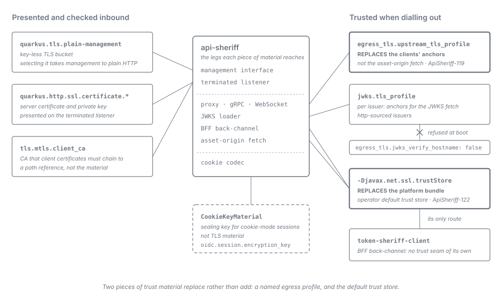

= API Sheriff -- TLS Scenarios: Choosing and Configuring a TLS Posture
:toc:
:toclevels: 2
:sectnums:

An operator guide organised by *what you are trying to achieve*. Each scenario states its goal, what
must exist before you start, the configuration that achieves it, and what you see when it goes
wrong.

*This page composes and links; it is not a source of truth.* What a key means lives in
link:environment-variable-overrides.adoc[Environment-variable overrides], why the mechanism is built
the way it is lives in link:tls-edge.adoc[TLS Edge], and the field contract lives in the
link:../configuration.adoc[Configuration Reference]. Where this page and one of those disagree, that
page is right and this one is wrong.

Every configuration block below is copied from a file this repository ships, named in the block's
title, and never derived. A block whose scenario has no shipped instance says so and names the
documentation section it was copied from instead.

== Choosing a scenario

[cols="3,1", options="header"]
|===
| Goal | Scenario

| Serve HTTPS from the gateway itself
| <<_scenario_terminate_at_gateway>>

| Accept only clients holding a certificate from your CA
| <<_scenario_mtls>>

| Relay selected hostnames to a backend that keeps its own certificate
| <<_scenario_passthrough>>

| Keep health and metrics on HTTPS
| <<_scenario_management_https>>

| Serve health and metrics as plain HTTP behind a trusted boundary
| <<_scenario_management_plain>>

| Validate tokens from an identity provider behind a private CA
| <<_scenario_private_ca_idp>>

| Run the gateway behind an ingress or load balancer that already terminated TLS
| <<_scenario_terminated_upstream>>

| Dial upstreams that present certificates from a corporate CA
| <<_scenario_corporate_ca_upstreams>>

| Dial an upstream or an IdP whose certificate does not name the address you dial
| <<_scenario_relax_hostname_verification>>

| Reach the BFF's identity provider (discovery, code exchange, refresh, revocation) through a private CA or a
  name its certificate does not carry
| <<_scenario_bff_oidc_back_channel>>
|===

The scenarios compose: a typical production gateway is <<_scenario_terminate_at_gateway>> plus
<<_scenario_management_https>>, with <<_scenario_private_ca_idp>> or
<<_scenario_corporate_ca_upstreams>> added when a private CA is involved. Three combinations are
refused at boot rather than composed, all of them with <<_scenario_terminated_upstream>>: it cannot be
combined with <<_scenario_mtls>>, with <<_scenario_passthrough>>, or with declared server key material.

== The material each scenario touches

The left column is inbound: the certificate the gateway presents, the key-less management bucket, and
the CA it checks client certificates against. The right column is outbound, and two of its entries
*replace* the anchors they govern rather than adding to them. `jwks.tls_profile` and
`egress_tls.jwks_verify_hostname: false` cannot be combined. `CookieKeyMaterial` seals cookie-mode
sessions and is not TLS material at all; it appears so it is not mistaken for one.

== Reading a failure mode

Three kinds of signal appear under *Failure mode* below, and they mean different things:

* *A document validation refusal.* `ConfigProducer` logs `ApiSheriff-200` once per violation (file,
  JSON pointer, detail) and then `ApiSheriff-201`, and the process exits non-zero. This is how a
  schema violation or a `ConfigValidator` rule surfaces. See link:../LogMessages.adoc[Log messages].
* *A listener or producer refusal.* `ServerTlsDeclarationGate`, `TlsServerCustomizer`,
  `MtlsServerCustomizer`, `TokenValidatorProducer`, `JwksTrustProfileResolver` and
  `EgressTrustProfileResolver` abort startup by throwing. The message names the offending key and
  the way out, and carries no `ApiSheriff` identifier of its own.
* *A boot WARN reporting a deliberate posture.* The gateway starts and says, once, what it is doing.
  `ManagementPlainHttpAudit` (`ApiSheriff-115`) and `TerminatedListenerTlsAudit` (`ApiSheriff-121`)
  report the state the listener actually resolved rather than a declared key, which is the model the
  other TLS records on this page follow.

[[_scenario_terminate_at_gateway]]
== Terminate TLS at the gateway

=== Goal

The gateway presents its own server certificate and runs the full L7 pipeline on every connection.
This is the default topology: a single terminated listener, with no front listener in front of it.
Pick it whenever clients reach the gateway directly. Do not pick it when something in front of the
gateway already terminates TLS -- that is <<_scenario_terminated_upstream>>.

=== Preconditions

* A server certificate and its private key, in PEM form, naming every hostname clients use to reach
  the gateway.
* Both files mounted read-only into the container at a stable path.
* Nothing else: no `tls` key is required, because `TlsServerCustomizer` skips every absent key and
  leaves the runtime's own protocol and cipher selection in force.

=== Configuration

*Policy* -- optional. Declare a protocol floor, a cipher allowlist or ALPN only when you mean to own
them; what each key does is in link:tls-edge.adoc#_tls_policy_on_the_terminated_listener[TLS policy on
the terminated listener].

[source,yaml]
.deployment/compose-sample/docker/sheriff-config/gateway.yaml
----
tls:
  min_version: "1.2"
  cipher_suites:
    - TLS_AES_256_GCM_SHA384
    - TLS_AES_128_GCM_SHA256
    - TLS_ECDHE_RSA_WITH_AES_256_GCM_SHA384
    - TLS_ECDHE_RSA_WITH_AES_128_GCM_SHA256
  alpn: ["h2", "http/1.1"]
----

*Deployment* -- the certificate, the key and the public port. `QUARKUS_HTTP_SSL_PORT` stays unset:
the terminated listener keeps its shipped `8443`.

[source,yaml]
.deployment/compose-sample/docker-compose.yml (api-sheriff service)
----
ports:
  - "8443:8443"
environment:
  - QUARKUS_HTTP_SSL_CERTIFICATE_FILES=/app/certificates/localhost.crt
  - QUARKUS_HTTP_SSL_CERTIFICATE_KEY_FILES=/app/certificates/localhost.key
volumes:
  - ./docker/certificates:/app/certificates:ro
----

=== Failure mode

* *No key material declared, and no plain-HTTP opt-in.* `ServerTlsDeclarationGate` refuses the boot
  and names both ways out: declare a certificate, or set `QUARKUS_HTTP_INSECURE_REQUESTS=enabled`. It
  never falls back to cleartext.
* *`QUARKUS_HTTP_TLS_CONFIGURATION_NAME` selects a bucket that carries no key material.*
  `ServerTlsDeclarationGate` refuses the boot, naming the bucket.
* *A declared certificate path that resolves to no usable key.* The gate reads declared keys only, so
  it accepts this; `TerminatedListenerTlsAudit` then reports the listener as plain HTTP with
  `WARN ApiSheriff-121`, which is the authoritative record wherever declared and resolved disagree.
* *An unsupported `min_version`, an unknown cipher suite name, or an allowlist that strands one of the
  enabled protocols.* `TlsServerCustomizer` refuses the boot, naming the value or the stranded
  protocol.

[[_scenario_mtls]]
== Terminate and require client certificates

=== Goal

Every terminated connection must present a client certificate that chains to one CA you name, or the
handshake is rejected before any HTTP is exchanged. Pick it for machine-to-machine clients you issue
certificates to. Do not pick it for browsers you do not provision, for passthrough hostnames (the
gateway never takes part in that handshake), or behind a hop that terminates TLS for the gateway.
Revocation is a trust-root rotation with a global blast radius -- read
link:tls-edge.adoc#_operator_consideration_emergency_trust_root_replacement[Emergency trust-root
replacement] before relying on it.

=== Preconditions

* Everything <<_scenario_terminate_at_gateway>> needs: the listener still presents a server
  certificate.
* The CA bundle as a PEM file, mounted read-only at a path that stays the same in every environment
  -- `client_ca` is a path reference, not the material (see
  link:../configuration.adoc#_client_ca_carve_out[the `client_ca` carve-out]).
* Client certificates issued under that CA and staged to every client *before* you switch the
  requirement on.
* `QUARKUS_HTTP_INSECURE_REQUESTS` is not `enabled`.

=== Configuration

*Policy* -- the requirement and the anchor's mount path.

[source,yaml]
.integration-tests/src/main/docker/sheriff-config-mtls/gateway.yaml
----
tls:
  alpn: ["h2", "http/1.1"]
  mtls:
    enabled: true
    client_ca: /app/certificates/mtls-client-ca.crt
----

*Deployment* -- the server certificate and the mount that carries both it and the CA bundle.

[source,yaml]
.integration-tests/docker-compose.yml (api-sheriff-mtls service)
----
environment:
  - QUARKUS_HTTP_SSL_CERTIFICATE_FILES=/app/certificates/localhost.crt
  - QUARKUS_HTTP_SSL_CERTIFICATE_KEY_FILES=/app/certificates/localhost.key
volumes:
  - ./src/main/docker/certificates:/app/certificates:ro
----

That service also sets `QUARKUS_HTTP_SSL_PROTOCOLS=TLSv1.2`. It is a test pin so the integration
client observes the rejection at the handshake, not part of the posture; leave it out.

=== Failure mode

* *A client presents no certificate, or one from another CA.* `MtlsServerCustomizer` sets the
  listener to require-and-verify, so the TLS handshake fails. There is no HTTP status and no
  catalogued log record for the rejection.
* *`enabled: true` without `client_ca`.* `MtlsServerCustomizer` refuses the boot:
  `Refusing to start — tls.mtls.enabled requires a client_ca trust anchor`.
* *An `mtls` block without `enabled`.* The schema requires the key, so `ConfigProducer` logs
  `ApiSheriff-200` at the block's pointer and `ApiSheriff-201`.
* *Combined with `QUARKUS_HTTP_INSECURE_REQUESTS=enabled`.* `ServerTlsDeclarationGate` refuses the
  boot: a listener that terminates no TLS could verify no client certificate.

[[_scenario_passthrough]]
== Pass selected hostnames through untouched

=== Goal

Connections whose TLS ClientHello names a listed hostname are relayed undecrypted, at L4, to a
backend that completes the handshake with its own certificate. Every other hostname is terminated on
the same public port. Pick it when a backend must keep end-to-end TLS with the client. Do not pick it
when you need any L7 feature on that hostname -- filtering, authentication, forwarding headers, mTLS
-- because none of them can apply to a connection the gateway never decrypts.

=== Preconditions

* Everything <<_scenario_terminate_at_gateway>> needs, for the hostnames that are *not* passed
  through.
* The backend serves TLS itself, with a certificate naming the passthrough hostname.
* A topology alias for each backend, whose URL carries no base path.
* Clients send SNI, and the passthrough hostname resolves to the gateway.
* The terminated listener moves off the public port: `QUARKUS_HTTP_SSL_PORT` is set to the internal
  port `TlsEdgeProducer` hands unmatched connections to, `SHERIFF_TLS_INTERNAL_HTTPS_PORT` (default
  `8444`).

=== Configuration

*Policy* -- which hostnames pass through, each mapped to a topology alias.

[source,yaml]
.integration-tests/src/main/docker/sheriff-config/gateway.yaml
----
tls:
  passthrough_sni:
    passthrough.test.example: PASSTHROUGH_BACKEND
    fault.test.example: PASSTHROUGH_FAULT
----

[source,properties]
.integration-tests/src/main/docker/sheriff-config/topology.properties
----
PASSTHROUGH_BACKEND=https://passthrough-backend:8443
PASSTHROUGH_FAULT=https://toxiproxy:8666
----

*Deployment* -- the moved terminated listener, alongside the server certificate.

[source,yaml]
.integration-tests/docker-compose.yml (api-sheriff service)
----
environment:
  - QUARKUS_HTTP_SSL_PORT=8444
  - QUARKUS_HTTP_SSL_CERTIFICATE_FILES=/app/certificates/localhost.crt
  - QUARKUS_HTTP_SSL_CERTIFICATE_KEY_FILES=/app/certificates/localhost.key
----

*What the environment can and cannot supply here.* `ConfigLoader` resolves an in-file `${VAR}`
placeholder and then re-types it in `ConfigLoader.coerce` by the type the schema declares at that
pointer. `coerce` has arms for `string`, `boolean`, `integer`/`number` and `array`, and none for an
object. So the boundary is:

* *The whole map cannot come from one variable.* `passthrough_sni` is `type: object` in
  `gateway.schema.json`. A `passthrough_sni: "${VAR}"` falls to shape inference, stays a text node, and
  the schema refuses it -- `ApiSheriff-200` at `/tls/passthrough_sni`, then `ApiSheriff-201`.
* *Each alias value can.* The map's values are `type: string`, so `backend.example.com: ${VAR}` is a
  valid placeholder. The hostname keys are not: `ConfigLoader.substitute` walks values, never field
  names.
* *Each backend's location can move without touching `gateway.yaml`.* Write an in-file placeholder
  into `topology.properties`, as described in
  link:environment-variable-overrides.adoc#_topology_and_endpoint_enablement[Topology and endpoint
  enablement] -- the shipped `PASSTHROUGH_BACKEND` above is a literal, so no
  `TOPOLOGY_PASSTHROUGH_BACKEND` variable reaches it.

=== Failure mode

* *`QUARKUS_HTTP_SSL_PORT` left at `8443`.* The front listener `TlsEdgeProducer` starts and the
  terminated listener both claim the public port, and the boot fails with
  `Port 8443 seems to be in use by another process`. `TlsEdgeProducer` blocks startup on the front
  listener's bind, so the gateway never serves on a half-open edge.
* *A ClientHello with no usable SNI, a malformed one, or one beyond the reassembly bound.*
  `SniFrontListener` fails it closed onto the terminated path and logs `WARN ApiSheriff-107` with the
  disposition only.
* *A terminated request whose `Host` names a passthrough hostname.* `PassthroughHostGuardStage` rejects
  it `404` before route selection, and `GatewayEdgeRoute` logs `WARN ApiSheriff-108` with the
  disposition only.
* *An alias that does not resolve, or resolves to a URL with a base path.*
  `ConfigValidator.validatePassthroughAliasResolvable` refuses it: `ApiSheriff-200`, then
  `ApiSheriff-201`.
* *Combined with `QUARKUS_HTTP_INSECURE_REQUESTS=enabled`.* `ServerTlsDeclarationGate` refuses the
  boot.
* *What a healthy boot shows.* `SniFrontListener` logs `INFO ApiSheriff-7` with the public port and the
  number of mappings; its absence means the front listener was never started.

[[_scenario_management_https]]
== Management interface over HTTPS

=== Goal

Health and metrics are served on their own port, `9000` by default, over HTTPS. This is the shipped
default and it stays the default. Pick it unless you have a specific reason for
<<_scenario_management_plain>>. The management interface has exactly one port, so every consumer of
it -- readiness gates, scrapers, load-balancer checks -- has to speak TLS (see
link:tls-edge.adoc#_the_single_port_constraint[The single-port constraint]).

=== Preconditions

* A certificate and key for the management interface, mounted read-only. It may be the same pair the
  terminated listener uses.
* Consumers of the management port that speak TLS, and trust that certificate or skip verification
  deliberately.
* The port itself stays out of `gateway.yaml`; it is `QUARKUS_MANAGEMENT_PORT` if you move it.

=== Configuration

*Policy* -- none. Omitting the `management` block, or writing `management.tls.enabled: true`, projects
nothing: `NeutralTlsConfigSource` emits a key only for `false`.

*Deployment* -- the management certificate, and a publication that does not expose the
unauthenticated endpoints to every interface.

[source,yaml]
.deployment/compose-sample/docker-compose.yml (api-sheriff service)
----
labels:
  de.cuioss.sheriff.management-scheme: "https"
  de.cuioss.sheriff.management-root-path: "/q"
ports:
  - "127.0.0.1:9000:9000"
environment:
  - QUARKUS_MANAGEMENT_SSL_CERTIFICATE_FILES=/app/certificates/localhost.crt
  - QUARKUS_MANAGEMENT_SSL_CERTIFICATE_KEY_FILES=/app/certificates/localhost.key
----

The two labels are what the sample's readiness gate reads its scheme and root path from; carry them
only if your own tooling reads them.

=== Failure mode

* *No key material reaches the management listener.* `ResolvedServerTlsMaterial` settles this in one
  order, and the first leg that applies decides. A selected named bucket
  (`quarkus.management.tls-configuration-name`) decides alone: a key-bearing bucket serves HTTPS, a
  key-less one serves plain HTTP even with the certificate pair above set. With no bucket selected, a
  default `+quarkus.tls.key-store.*+` bucket that carries key material serves HTTPS. Otherwise the
  `+quarkus.management.ssl.certificate.*+` keys decide, in any spelling -- `files`, `key-files`,
  `key-store-file` or `credentials-provider`. When none of the three supplies key material, the
  listener starts plain, `ManagementPlainHttpAudit` reports it with `WARN ApiSheriff-115`, and HTTPS
  probes against the port fail.
* *`management.port` written in `gateway.yaml`.* The schema declares the key only to refuse it:
  `ApiSheriff-200` at `/management/port`, naming `QUARKUS_MANAGEMENT_PORT`, then `ApiSheriff-201`.
* *`QUARKUS_MANAGEMENT_PORT` moved away from `9000`.* The baked `HEALTHCHECK` probes `9000` as a
  compiled-in constant, so the container never reports healthy; see
  link:compose-sample.adoc#_reading_the_container_health_signal[Reading the container health signal].
* *A key-bearing default `+quarkus.tls.key-store.*+` bucket declared anywhere.* It is the second leg
  above, so it switches the management interface to HTTPS through a path no management setting
  mentions. `ApiSheriff-115` stays truthful, but the posture is no longer the one your management
  settings describe.

[[_scenario_management_plain]]
== Management interface over plain HTTP

=== Goal

Health and metrics are served in cleartext, on the same single port. Pick it only when that port is
reachable exclusively inside a trusted network boundary. The downgrade takes health *and* metrics at
once and breaks every consumer still probing over HTTPS. There are two doors onto one lever; use
exactly one (see link:tls-edge.adoc#_turning_it_off_when_you_must[Turning it off, when you must]).

=== Preconditions

* A network boundary you trust in front of the management port.
* Every consumer of the port switched to `http://` at the same moment.
* Nothing to mount: the shipped `application.properties` already declares the key-less
  `plain-management` bucket (`quarkus.tls.plain-management.reload-period=24H`).

=== Configuration

*Policy door* -- when the posture belongs to the document you ship.

[source,yaml]
.doc/user/tls-edge.adoc (Turning it off, when you must)
----
management: { tls: { enabled: false } }
----

*Deployment door* -- when the posture differs per environment.

[source,yaml]
.integration-tests/docker-compose.yml (api-sheriff-plain-mgmt service)
----
labels:
  de.cuioss.sheriff.management-scheme: "http"
  de.cuioss.sheriff.management-root-path: "/q"
environment:
  - QUARKUS_MANAGEMENT_TLS_CONFIGURATION_NAME=plain-management
----

Both doors land on `quarkus.management.tls-configuration-name`. The policy door reaches it through
`NeutralTlsConfigSource`, whose ordinal (`350`) sits above the environment's, so when both are set the
`gateway.yaml` value wins.

=== Failure mode

* *Every boot in this posture.* `ManagementPlainHttpAudit` logs `WARN ApiSheriff-115`, naming the port.
  That is the expected record, not a fault, and the gateway never refuses to start over it.
* *A bucket name that does not resolve.* The Quarkus TLS registry fails the boot naming the
  `quarkus.tls.<name>` property; it does not fall back.
* *`QUARKUS_MANAGEMENT_ENABLED=false` used instead.* It is build-time fixed and moves health and
  metrics onto the main, TLS-terminated router, so it cannot produce a plain probe endpoint.
* *The management certificate pair left set.* It is not what disables TLS -- the selected key-less
  bucket is -- so it changes nothing, but it misleads the next reader.

[[_scenario_private_ca_idp]]
== Validate tokens against an identity provider behind a private CA

=== Goal

The gateway fetches the identity provider's signing keys (JWKS) over a TLS connection it verifies
against *your* CA, and, when the BFF is enabled, reaches the same provider for discovery, the code
exchange, refresh and refresh-token revocation. Those are two independent legs with two different trust levers, and a private-CA
provider needs both. Do not pick the JWKS lever when you also need `egress_tls.jwks_verify_hostname:
false` -- the two are mutually exclusive
(link:../adr/0041-The_JWKS_hostname-verification_knob_is_the_librarys_own_passthrough_and_its_sslContext_collision_is_refused_at_boot.adoc[ADR-0041]);
see <<_scenario_relax_hostname_verification>>.

=== Preconditions

* A PKCS12 trust store holding the provider's CA, mounted read-only.
* A logical profile name for it, used in `gateway.yaml` and bound by the deployment. How the name maps
  to an environment spelling is in
  link:environment-variable-overrides.adoc#_env_encoding_rule[Deriving the variable name].
* Nothing extra when the provider sits on a private address: with `allowed_egress_hosts` omitted, the
  host of `jwks.url` is the derived egress allowance. Declare the list only to pin that allowance --
  a declared list is authoritative and never merged with the `jwks.url` host (see
  link:../configuration.adoc#_token_validation[`allowed_egress_hosts`]). The shipped block below
  declares it on purpose, as the explicit form.
* For the BFF back-channel, either a trust profile of its own -- `egress_tls.oidc_tls_profile`, see
  <<_scenario_bff_oidc_back_channel>> -- or a store the JVM default trust manager can use. The default
  store *replaces* the platform bundle, so build it to keep the public roots you still need -- see
  link:../configuration.adoc#_default_trust_store_replaces[Supplying a default trust store REPLACES
  the platform bundle].

=== Configuration

*Policy* -- the JWKS leg names a trust profile, never material.

[source,yaml]
.integration-tests/src/main/docker/sheriff-config/gateway.yaml
----
token_validation:
  issuers:
    - name: benchmark-keycloak
      issuer: https://keycloak:8443/realms/benchmark
      jwks:
        source: http
        url: https://keycloak:8443/realms/benchmark/protocol/openid-connect/certs
        allowed_egress_hosts: ["keycloak"]
        tls_profile: benchmark-idp
----

*Deployment, JWKS leg* -- bind the profile name to the store. The integration stack loads the binding
from a mounted properties file.

[source,properties]
.integration-tests/src/main/docker/certificates/benchmark-idp-trust.properties
----
quarkus.tls.benchmark-idp.trust-store.p12.path=/app/certificates/localhost-truststore.p12
quarkus.tls.benchmark-idp.trust-store.p12.password=localhost-trust
----

[source,yaml]
.integration-tests/docker-compose.yml (api-sheriff service)
----
environment:
  - QUARKUS_CONFIG_LOCATIONS=/app/certificates/benchmark-idp-trust.properties
----

*Deployment, BFF back-channel leg* -- two levers reach this leg. A named
`egress_tls.oidc_tls_profile` keeps the provider's CA off every other leg and is described in
<<_scenario_bff_oidc_back_channel>>. The integration stack uses the other one, the JVM default trust
store, which reaches every leg that names no profile of its own; on the native image it has to arrive
as command-line `-D` arguments.

[source,yaml]
.integration-tests/docker-compose.yml (api-sheriff service)
----
command:
  - -Djavax.net.ssl.trustStore=/app/certificates/localhost-truststore.p12
  - -Djavax.net.ssl.trustStorePassword=localhost-trust
  - -Djavax.net.ssl.trustStoreType=PKCS12
----

=== Failure mode

* *The profile is named but not bound.* `JwksTrustProfileResolver` refuses the boot, naming the issuer,
  the profile and the `+quarkus.tls.<name>.trust-store.*+` key to set. It never falls back to default
  trust.
* *The bound profile carries no anchors, or sets `trust-all`.* `JwksTrustProfileResolver` refuses it
  for the same reason (see link:../configuration.adoc#_jwks_trust_profiles[Trust profiles]).
* *`tls_profile` on an `http` issuer while `egress_tls.jwks_verify_hostname` is `false`.*
  `TokenValidatorProducer` refuses the boot, naming both keys and the issuer.
* *A declared `allowed_egress_hosts` that does not name the `jwks.url` host of a private-address
  provider.* The list is authoritative, so the egress guard keeps refusing that host: readiness stays
  `DOWN`, `WARN ApiSheriff-129` reports each scheduled retry, and every bearer request is rejected
  `401`. Name the host in the list, or omit the list to take the derived allowance.
* *No profile, and a JVM default trust store that does not hold the provider's CA.* The JWKS loader
  `TokenValidatorProducer` configured verifies against the default store, the fetch fails PKIX path
  building, the key set never loads, and every bearer request is rejected `401` -- a trust problem that
  looks like a token problem.
* *The BFF back-channel store is missing, or supplied through `JAVA_TOOL_OPTIONS`.* A native executable
  ignores that variable, so discovery and the code exchange fail PKIX and login answers `500`.
* *Which store is actually in force.* `DefaultTrustSourceAudit` logs `INFO ApiSheriff-17` on every boot,
  naming the raw-`TrustManager` tier and the Quarkus TLS registry tier separately, and
  `WARN ApiSheriff-122` whenever an operator-supplied store replaces the platform bundle on either tier.

[[_scenario_terminated_upstream]]
== TLS terminated in front of the gateway

=== Goal

An ingress controller, a service-mesh sidecar or a load balancer terminates TLS, and the gateway
serves plain HTTP on its internal port behind it. Pick it when TLS termination already lives in that
hop. Do not pick it when browsers could reach the plain port directly: the BFF's `Secure` and
`+__Host-+` cookies only work behind a hop the browser reaches over HTTPS (see
link:tls-edge.adoc#_interactions_with_the_rest_of_the_edge[What this mode does to the rest of the
edge]).

=== Preconditions

* A terminating hop at a stable, exact address, so the gateway can trust it as a `/32`.
* No declared server key material on the gateway, no `tls.mtls`, and no non-empty
  `tls.passthrough_sni`.
* The terminating hop carries the TLS posture, because the `tls` policy keys no longer govern
  anything: `TlsServerCustomizer` customizes the HTTPS listener only. The compose sample mirrors the
  gateway's floor in the hop's own configuration.
* For the compose sample's override file, Docker Compose `2.24.4` or newer.

=== Configuration

*Policy* -- whose forwarding headers the gateway believes, supplied whole from one variable.

[source,yaml]
.deployment/compose-sample/docker/sheriff-config/gateway.yaml
----
forwarded:
  trusted_proxies: "${SHERIFF_TRUSTED_PROXIES}"
----

*Deployment* -- the opt-in, the certificate variables cleared rather than omitted, and the hop's exact
address.

[source,yaml]
.deployment/compose-sample/docker-compose.plain-http.yml (api-sheriff service)
----
ports: !override
  - "127.0.0.1:9000:9000"
environment:
  - QUARKUS_HTTP_INSECURE_REQUESTS=enabled
  - QUARKUS_HTTP_SSL_CERTIFICATE_FILES=
  - QUARKUS_HTTP_SSL_CERTIFICATE_KEY_FILES=
  - SHERIFF_TRUSTED_PROXIES=10.89.0.10/32
----

The variables are cleared because Compose merges an override into the base file: omitting them would
inherit the base file's certificate paths. `ServerTlsDeclarationGate` reads a blank value as absent.

[source,nginx]
.deployment/compose-sample/docker/nginx/tls-terminator.conf
----
server {
    listen 8443 ssl;
    ssl_protocols TLSv1.2 TLSv1.3;

    location / {
        proxy_pass http://api-sheriff:8080;
        proxy_set_header Host              $http_host;
        proxy_set_header X-Forwarded-For   $proxy_add_x_forwarded_for;
        proxy_set_header X-Forwarded-Proto https;
    }
}
----

The excerpt omits the certificate directives and the cipher list; the file carries both.

=== Failure mode

* *Every boot in this posture.* `TerminatedListenerTlsAudit` logs `WARN ApiSheriff-121`, naming the
  plain port and the live edge topology. That is the expected record, not a fault.
* *The opt-in combined with declared server key material, `tls.mtls.enabled`, or a non-empty
  `tls.passthrough_sni`.* `ServerTlsDeclarationGate` refuses the boot, naming the contradicting key and
  both ways out.
* *No certificate and no opt-in.* `ServerTlsDeclarationGate` refuses the boot; plain HTTP is never
  inferred from a missing certificate.
* *`SHERIFF_TRUSTED_PROXIES` unset or empty.* The bare placeholder has no default, and
  `ConfigLoader.substituteChild` refuses both an unset variable and an empty resolution at a list-typed
  field, so the boot fails (`ApiSheriff-200`, then `ApiSheriff-201`).
* *`trusted_proxies` naming something other than the hop.* `TcpPeerGate` does not trust the hop, so
  the `X-Forwarded-For` it sends is ignored and `ForwardPolicyStage` has no client address to
  regenerate. What the upstream then sees, and why that matters, is verdict 3 in
  link:tls-edge.adoc#_interactions_with_the_rest_of_the_edge[What this mode does to the rest of the
  edge].

[[_scenario_corporate_ca_upstreams]]
== Dial upstreams through a corporate CA

=== Goal

The gateway verifies terminated upstreams against anchors you choose instead of the platform bundle.
Two levers exist, and both *replace* the anchors they govern rather than adding to them:

* `egress_tls.upstream_tls_profile` governs the proxy, gRPC and WebSocket egress clients
  (link:../adr/0040-Upstream_hostname_verification_is_a_global_egress-TLS_knob_bound_at_client_construction.adoc[ADR-0040]).
* An operator-supplied default trust store governs every leg that uses the JVM default trust manager
  -- including the asset-origin fetch, which the profile does not reach.

Pick the profile when only proxied upstreams use the corporate CA. Pick the default trust store when an
asset origin does too. The BFF back-channel to the identity provider has a profile key of its own
(<<_scenario_bff_oidc_back_channel>>), and the default store reaches it only when that key is omitted. Do not name a profile holding only the corporate CA
while a proxied upstream still needs a public CA (see
link:../configuration.adoc#_upstream_trust_profile_replaces[A named profile replaces the client's
anchors]).

=== Preconditions

* A PKCS12 trust store holding the corporate CA -- plus every public root the same leg still needs,
  because the store is used instead of the platform bundle, never alongside it.
* For the default trust store on the native, distroless image: the store built on a host JDK, then
  mounted, because the image carries no `update-ca-trust`.

=== Configuration

*Policy* -- the egress profile name.

[source,yaml]
.integration-tests/src/main/docker/sheriff-config-egress-verify-on/gateway.yaml
----
egress_tls:
  upstream_tls_profile: it-upstream
----

*Deployment, profile* -- bind the name, loaded next to any other bindings the gateway needs.

[source,properties]
.integration-tests/src/main/docker/certificates/it-upstream-trust.properties
----
quarkus.tls.it-upstream.trust-store.p12.path=/app/certificates/upstream-truststore.p12
quarkus.tls.it-upstream.trust-store.p12.password=upstream-trust
----

[source,yaml]
.integration-tests/docker-compose.yml (api-sheriff-egress-verify-on service)
----
environment:
  - QUARKUS_CONFIG_LOCATIONS=/app/certificates/benchmark-idp-trust.properties,/app/certificates/it-upstream-trust.properties
----

*Deployment, default trust store* -- no shipped descriptor supplies a store for this purpose. The
minimal key set below is copied from
link:../configuration.adoc#_default_trust_store_replaces[Supplying a default trust store REPLACES the
platform bundle], which also has the recipe for a store that keeps the public roots. The Quarkus TLS
registry's `<default>` bucket is a second, independent lever with its own spelling,
`QUARKUS_TLS_TRUST_STORE_P12_PATH`; that section explains when you need it.

[source,yaml]
.doc/configuration.adoc (Supplying a default trust store REPLACES the platform bundle)
----
command:
  - -Djavax.net.ssl.trustStore=/app/certificates/gateway-truststore.p12
  - -Djavax.net.ssl.trustStorePassword=<password>
  - -Djavax.net.ssl.trustStoreType=PKCS12
----

=== Failure mode

* *Every boot with a named profile.* `GatewayEdgeRoute` logs `WARN ApiSheriff-119` with the logical
  profile name, restating that its anchors replace the default trust store on three clients and not
  the asset-origin fetch. That is the expected record.
* *The profile is not bound, carries no anchors, or sets `trust-all`.* `EgressTrustProfileResolver`
  refuses the boot, naming the `+quarkus.tls.<name>.trust-store.*+` key to set.
* *A proxied upstream with a public certificate stops working after you name a profile.* The profile
  replaced the public roots on that leg, so the handshake fails and `UpstreamFailureMapper` answers
  `502`; add the roots to the profile's store, or omit the profile.
* *An asset origin behind the corporate CA.* The asset fetch runs on a JDK `java.net.http.HttpClient`
  the profile does not reach, so it fails closed with a `502`; put the anchor into the default trust
  store instead.
* *Which store is actually in force.* `DefaultTrustSourceAudit` logs `INFO ApiSheriff-17` on every boot
  and `WARN ApiSheriff-122` whenever an operator-supplied store is in effect, naming which tier was
  left behind when the two disagree.

[[_scenario_relax_hostname_verification]]
== Relax outbound hostname verification

=== Goal

The gateway stops comparing the dialled name against the names in the peer's certificate, while still
requiring the chain to be trusted. Pick it for an upstream or an identity provider reached through a
cluster-internal service name, a container alias or a load-balancer address its certificate does not
name. Never pick it to reach a self-signed or private-CA peer -- the chain is still verified, so that
is <<_scenario_corporate_ca_upstreams>> or <<_scenario_private_ca_idp>>. Fixing the certificate's
names is always the better answer. Both keys are gateway-wide: there is no per-route or per-issuer
override (see link:../configuration.adoc#_egress_tls_hostname_scope[What disabling hostname
verification does and does not do]).

The two keys below cover proxied upstreams and the JWKS fetch. The BFF's own back-channel to the
identity provider -- discovery, the code exchange, refresh and refresh-token revocation -- is a separate leg with a separate key,
`egress_tls.oidc_verify_hostname`, and relaxing the JWKS leg does not relax it. It is covered next,
in <<_scenario_bff_oidc_back_channel>>.

=== Preconditions

* A peer whose certificate chains to an anchor the gateway already trusts on that leg.
* For the JWKS key: no `http`-sourced issuer names `jwks.tls_profile`.

=== Configuration

*Policy* -- the upstream leg. The shipped instance keeps its trust profile alongside, which is what
makes the relaxation hostname-only.

[source,yaml]
.integration-tests/src/main/docker/sheriff-config-egress-verify-off/gateway.yaml
----
egress_tls:
  upstream_verify_hostname: false
  upstream_tls_profile: it-upstream
----

*Policy* -- the JWKS leg. No shipped descriptor sets this key; the key is copied from
link:../configuration.adoc#_egress_tls[`egress_tls`], whose field table documents `false`.

[source,yaml]
.doc/configuration.adoc (egress_tls)
----
egress_tls:
  jwks_verify_hostname: false
----

*Deployment* -- none. Both keys are policy and live in `gateway.yaml` alone.

=== Failure mode

* *Every boot with `upstream_verify_hostname: false`.* `GatewayEdgeRoute` logs `WARN ApiSheriff-118`,
  stating the scope: proxy, gRPC and WebSocket clients, chain trust untouched, asset-origin fetch not
  governed. That is the expected record.
* *Every boot with `jwks_verify_hostname: false`.* `TokenValidatorProducer` logs `WARN ApiSheriff-120`
  once, not once per issuer. That is the expected record.
* *`jwks_verify_hostname: false` and an `http` issuer naming `jwks.tls_profile`.*
  `TokenValidatorProducer` refuses the boot, naming both keys and the issuer. The flag is global and the
  profile is per issuer, so this refuses every such issuer, not only the one you meant to relax.
* *An upstream whose chain is not trusted.* The egress client still refuses the handshake, and
  `UpstreamFailureMapper` answers the request `502`.

[[_scenario_bff_oidc_back_channel]]
== Reach the BFF identity provider: relax its hostname check or name its trust

=== Goal

A gateway running a BFF variant dials its identity provider for discovery, the authorization-code
exchange, refresh and refresh-token revocation. That leg carries the client secret and the authorization codes, and it has two
keys of its own in `egress_tls`
(link:../adr/0045-The_BFF_OIDC_back-channel_posture_is_pinned_through_the_librarys_own_passthrough_under_peer_egress-TLS_keys.adoc[ADR-0045]),
each answering a different problem:

* `egress_tls.oidc_verify_hostname: false` -- the provider is reached through a name its certificate
  does not carry. It turns off hostname matching on this leg only; the chain is still verified, so it
  does not admit a self-signed or untrusted provider. The default is `true`.
* `egress_tls.oidc_tls_profile` -- the provider presents a certificate from a private CA. The named
  profile *replaces* the JVM default trust store on discovery, the code exchange, refresh and refresh-token revocation: public
  certificate authorities stop being trusted for the provider unless the profile carries them too. It
  is the same replacement semantic `ApiSheriff-119` states for `upstream_tls_profile`, applied to this
  leg.

Pick exactly one. The pair -- `oidc_verify_hostname: false` together with a named `oidc_tls_profile`
-- is refused at boot. A provider that needs both a private CA and a relaxed name check has no
supported combination: fix the certificate's names, or put the CA into the JVM default trust store and
omit the profile (see
link:../configuration.adoc#_oidc_profile_collision[The relaxation and a profile are refused together]).

Neither key reaches the JWKS fetch. The same provider's signing keys keep their own per-issuer
`jwks.tls_profile` (<<_scenario_private_ca_idp>>) and `jwks_verify_hostname`
(<<_scenario_relax_hostname_verification>>), so a deployment that relaxes or re-anchors both legs sets
both. A bearer-only gateway builds no identity-provider client, and on it both keys are inert.

=== Preconditions

* An active BFF: an `oidc` block and at least one `require: session` route.
* For the hostname relaxation: a provider whose certificate chains to an anchor the gateway already
  trusts on this leg, and no `oidc_tls_profile` named.
* For the trust profile: a PKCS12 trust store holding the provider's CA -- plus any public root the leg
  still needs -- a logical profile name for it, and `oidc_verify_hostname` left at its default.

=== Configuration

No shipped descriptor sets either key: the default posture is the shipped one. Both blocks are copied
from link:../configuration.adoc#_oidc_back_channel_posture[The BFF OIDC back-channel], and a
deployment uses one of them, not both.

*Policy* -- the hostname relaxation.

[source,yaml]
.doc/configuration.adoc (The BFF OIDC back-channel)
----
egress_tls:
  oidc_verify_hostname: false
----

*Policy* -- the trust profile, by logical name only.

[source,yaml]
.doc/configuration.adoc (The BFF OIDC back-channel)
----
egress_tls:
  oidc_tls_profile: corporate-idp   # logical name only; anchors supplied by the deployment
----

*Deployment* -- the relaxation needs none. The profile is bound like every other trust profile,
through `+quarkus.tls.<name>.trust-store.*+`, copied from
link:bff-session.adoc#_private_ca_self_signed_idp[the server-session operator guide].

[source,properties]
.doc/user/bff-session.adoc (Private-CA / self-signed IdP)
----
quarkus.tls.corporate-idp.trust-store.p12.path=/etc/sheriff/corporate-ca.p12
quarkus.tls.corporate-idp.trust-store.p12.password=${TRUSTSTORE_PASSWORD}
----

=== Failure mode

* *Every boot with `oidc_verify_hostname: false`.* The BFF runtime logs `WARN ApiSheriff-125` once,
  stating the scope: this leg only, chain trust untouched. That is the expected record.
* *Every boot with a named `oidc_tls_profile`.* The BFF runtime logs `WARN ApiSheriff-126` once with
  the logical profile name, restating that its anchors replace the JVM default trust store on this
  leg. That is the expected record.
* *Both keys set.* The boot fails with a configuration error naming `egress_tls.oidc_verify_hostname`
  and `egress_tls.oidc_tls_profile`, before the identity-provider client is built.
* *The profile is not bound, carries no anchors, sets `trust-all`, or its material cannot be loaded.*
  The boot fails, naming `egress_tls.oidc_tls_profile`. It never falls back to default trust.
* *Login stops working against a publicly trusted provider after you name a profile.* The profile
  replaced the public roots on this leg, so discovery and the code exchange fail PKIX and login answers
  `500`; add the roots to the profile's store, or omit the profile.
* *Tokens validate but login fails.* The JWKS leg and this leg are configured separately: a
  `jwks.tls_profile` or `jwks_verify_hostname` does not reach discovery, the code exchange, refresh or refresh-token revocation.
