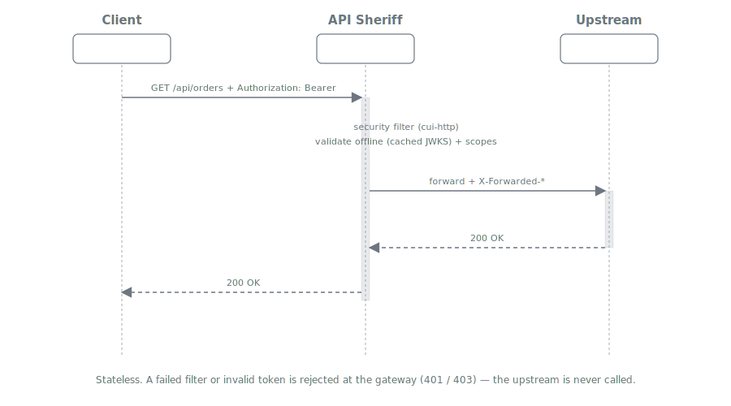

= Variant 1 -- Base Security Gateway
:toc:
:toclevels: 3
:sectnums:

== Summary

The base gateway is a *stateless reverse proxy* with two security responsibilities:
inbound HTTP security filtering and *offline bearer-token validation* on `/api`. It has no
browser session, runs no OIDC login flow, and keeps no server-side state. It is the shared
foundation on which the two link:../README.adoc#_deployment_variants[BFF variants] add
session mediation.

Use this variant when the caller is a service or a client that already holds its own access
token (machine-to-machine, or an SPA that manages tokens elsewhere) and simply needs a
hardened, validating entry point in front of the upstream.

== Request Flow

The client presents its own `Authorization: Bearer` token. API Sheriff applies the
`cui-http` security filter, validates the token offline against cached JWKS (no synchronous
call to the identity provider), enforces the route's required scopes, and forwards the
permitted request to the upstream with the configured forwarding header (`X-Forwarded-*` by
default; see link:../adr/0003-forwarded-headers.adoc[ADR-0003]).

A request that fails filtering is rejected with `400`; a missing or invalid token yields
`401`; a valid token lacking a required scope yields `403`. In every rejection case the
upstream is never called.

== Responsibilities

[cols="1,3"]
|===
| Concern | Behaviour

| Inbound filtering
| `cui-http` pipelines (path, parameter, header) + `RequestCollectionValidator` for counts,
  driven by the route's `security_filter` block. See
  link:../configuration.adoc#_security_filtering[Security Filtering].

| Path whitelisting
| The route's `allowed_paths` list -- the manifest's "WAF via path white-listing". A validated,
  normalized path that matches no entry is rejected.

| Token validation
| `token-sheriff-validation` `TokenValidator.createAccessToken(...)`, offline, cache-backed,
  thread-safe. A single validator is created at startup from the configured issuer(s).

| Scope enforcement
| `AccessTokenContent.providesScopes(required)`; a missing scope maps to `403` and a
  `SCOPE_MISSING` event.

| Forwarding
| Zero-trust: only allow-listed headers/params reach the upstream. The gateway normalizes inbound
  `Forwarded` / `X-Forwarded-*` behind a trusted-proxy allowlist and injects the configured output
  (`X-Forwarded-*` by default). See link:../adr/0003-forwarded-headers.adoc[ADR-0003].

| Observability
| Every outcome increments the link:../architecture.adoc#_event_system[event counter] and is
  surfaced as link:../architecture.adoc#_metrics[metrics].
|===

== Configuration

[source,yaml]
----
# endpoints/app1.yaml  (portable; the host lives in topology.properties)
endpoint:
  id: app1
  base_url: APP1
  routes:
    - id: orders-api
      match: { path_prefix: /api/orders, methods: [GET, POST] }
      auth: { require: bearer, required_scopes: [orders.read] }
      security_filter:
        profile: strict
        allowed_paths: [/api/orders, /api/orders/{id}]
        max_query_params: 20
        max_body_bytes: 1048576
      forward:
        headers_allow: [accept, content-type]
        query_allow: [page, size]
      upstream:
        path: /orders          # appended to resolved APP1 base_url
        read_timeout_ms: 5000
----

[source,properties]
----
# topology.properties   (APP1 relocatable via env: TOPOLOGY_APP1=...)
APP1=https://orders-svc.internal:8443
----

No `oidc` block is required for this variant. See the full schema (gateway / endpoint / topology
layout) in link:../configuration.adoc[Configuration Model].

== Offline Validation Wiring

`token-sheriff-validation` is used directly; the gateway does not reimplement signature or
claim checks:

[source,text]
----
Startup (once, shared):
  IssuerConfig  -> issuerIdentifier, expectedAudience, JWKS source (file / in-memory / HTTP-cached)
  TokenValidator.builder().issuerConfig(...).build()

Per request on /api:
  AccessTokenRequest.of(bearerToken, requestHeaders)   // headers enable DPoP checks
  AccessTokenContent token = validator.createAccessToken(request)   // offline, cached JWKS
  token.providesScopes(route.requiredScopes)           // 403 if missing
  -> forward upstream

On failure:
  TokenValidationException carries EventType + EventCategory
  edge maps category -> HTTP status (401), renders application/problem+json (RFC 9457)
----

For a fully air-gapped deployment, the issuer's JWKS is supplied in-memory or from a file
rather than fetched over HTTP.

== Properties

* *Stateless* -- no session, no store, horizontally scalable with no coordination.
* *Self-contained* -- no database, no Redis, no etcd.
* *Fail-secure* -- deny-by-default routing, filtering, and scope enforcement.

== Relationship to the BFF Variants

The base gateway's filter, routing, forward policy, metrics, and event system are reused
unchanged by the link:02-bff-session.adoc[session-based] and link:03-bff-cookie.adoc[cookie-based]
BFF variants. Those variants replace the "client presents its own bearer" assumption with a
gateway-mediated OIDC session, but the rest of the pipeline is identical.
