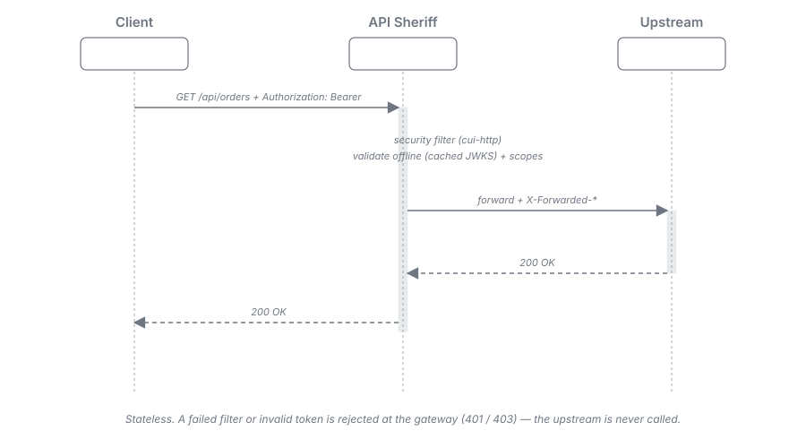

= Variant 1 -- Base Security Gateway
:toc:
:toclevels: 3
:sectnums:

== Summary

The base gateway is a *stateless reverse proxy* with two security responsibilities:
inbound HTTP security filtering and *offline bearer-token validation* on every route whose
effective auth is `require: bearer`. It has no
browser session, runs no OIDC login flow, and keeps no server-side state. It is the shared
foundation on which the two link:../README.adoc#_deployment_variants[BFF variants] add
session mediation.

Use this variant when the caller is a service or a client that already holds its own access
token (machine-to-machine, or an SPA that manages tokens elsewhere) and simply needs a
hardened, validating entry point in front of the upstream.

NOTE: *Protocol scope complete.* With the protocol-processor work delivered,
the base gateway serves all four initial-scope protocols -- HTTP/1.1 and HTTP/2,
GraphQL (over HTTP), *WebSocket* (full pipeline on the handshake, `Origin` allowlist validation,
then opaque bidirectional relay bounded by a per-route idle timeout), and *gRPC* (forced-h2
upstream, trailer relay, trailers-only rejection mapping). This closes the
link:../adr/0002-initial-scope.adoc[ADR-0002] protocol promise for Variant 1; HTTP/3 remains
deferred.

== Request Flow

The client presents its own `Authorization: Bearer` token. API Sheriff applies the
`cui-http` security filter, validates the token offline against cached JWKS (no synchronous
call to the identity provider), enforces the route's required scopes, and forwards the
permitted request to the upstream with the configured forwarding header (`X-Forwarded-*` by
default; see link:../adr/0003-forwarded-headers.adoc[ADR-0003]).

A request that fails filtering is rejected with `400`; a missing or invalid token yields
`401`; a valid token lacking a required scope yields `403`. In every rejection case the
upstream is never called.

== Responsibilities

[cols="1,3"]
|===
| Concern | Behaviour

| Inbound filtering
| `cui-http` pipelines (path, parameter, header) + `RequestCollectionValidator` for counts,
  driven by the route's `security_filter` block. See
  link:../configuration.adoc#_security_filtering[Security Filtering].

| Path whitelisting
| The route's `allowed_paths` list -- the manifest's "WAF via path white-listing". A validated,
  normalized path that matches no entry is rejected.

| Token validation
| `token-sheriff-validation` `TokenValidator.createAccessToken(...)`, offline, cache-backed,
  thread-safe. A single validator is created at startup from the configured issuer(s).

| Scope enforcement
| `AccessTokenContent.providesScopes(required)`; a missing scope maps to `403` and a
  `SCOPE_MISSING` event.

| Forwarding
| Zero-trust: only allow-listed headers/params reach the upstream. Inbound
  `Forwarded` / `X-Forwarded-*` are resolved behind a trusted-proxy allowlist by `cui-http`'s
  forwarded resolver, and the gateway emits regenerated canonical output
  (`X-Forwarded-*` by default). See link:../adr/0003-forwarded-headers.adoc[ADR-0003].

| Observability
| Every outcome increments the link:../architecture.adoc#_event_system[event counter] and is
  surfaced as link:../architecture.adoc#_metrics[metrics].
|===

== Configuration

[source,yaml]
----
# endpoints/app1.yaml  (portable; the host lives in topology.properties)
endpoint:
  id: app1
  base_url: APP1
  auth: { require: bearer, required_scopes: [orders.read] }   # default for all routes here
  routes:
    - id: orders-api
      match: { path_prefix: /api/orders, methods: [GET, POST] }
      security_filter:
        profile: strict
        allowed_paths: ["/api/orders", "/api/orders/{id}"]
        max_query_params: 20
        max_body_bytes: 1048576
      forward:
        headers_allow: [accept, content-type]
        query_allow: [page, size]
      upstream:
        path: /orders          # replaces the matched prefix; request-path remainder appended
        read_timeout_ms: 5000
----

[source,properties]
----
# topology.properties   (APP1 relocatable via env: TOPOLOGY_APP1=...)
APP1=https://orders-svc.internal:8443
----

Bearer routes require the issuers to validate against, configured in `gateway.yaml`:

[source,yaml]
----
# gateway.yaml (excerpt)
token_validation:
  issuers:
    - name: main
      issuer: https://idp.example.com/realms/main
      audience: api-sheriff
      jwks: { source: http, url: https://idp.example.com/realms/main/protocol/openid-connect/certs }
----

No `oidc` block is required for this variant -- that block belongs to the BFF variants. See the
full schema (gateway / endpoint / topology layout) in
link:../configuration.adoc[Configuration Model].

== Offline Validation Wiring

`token-sheriff-validation` is used directly; the gateway does not reimplement signature or
claim checks:

[source,text]
----
Startup (once, shared):
  IssuerConfig  -> issuerIdentifier, expectedAudience, JWKS source (file / in-memory / HTTP-cached)
                   (materialized from the token_validation.issuers configuration)
  TokenValidator.builder().issuerConfig(...).build()

Per request on a bearer route:
  new AccessTokenRequest(bearerToken, requestHeaders, requestUri, requestMethod)
      // the 4-component record constructor (the of(..) factories exist only in 1- and
      // 2-arg forms and omit URI/method). URI + method are REQUIRED when a DPoP proof is
      // present: DpopProofValidator hard-fails htu/htm validation without them
  AccessTokenContent token = validator.createAccessToken(request)   // offline, cached JWKS
  token.providesScopes(route.requiredScopes)           // 403 if missing
  -> forward upstream

On failure:
  TokenValidationException carries EventType + EventCategory
  edge maps event -> HTTP status (401; the category names the RFC 9457 problem type)
  and renders application/problem+json
----

For a fully air-gapped deployment, the issuer's JWKS is supplied in-memory or from a file
rather than fetched over HTTP.

== Properties

* *Stateless* -- no session, no store, horizontally scalable with no coordination.
* *Self-contained* -- no database, no Redis, no etcd.
* *Fail-secure* -- deny-by-default routing, filtering, and scope enforcement.

== Performance baseline

The shared measurement contract, the load parameters and the regression thresholds are stated once
in link:README.adoc#benchmark-baselines[Deployment Variants -- Benchmark baselines]. This section
records only what is specific to Variant 1.

*Variant 1 is the reference posture for the whole suite.* Every cross-gateway matrix aspect is
measured against a bearer or unauthenticated route, so the base gateway's numbers are the
denominator the two BFF variants are read against -- a BFF figure is only interesting as a *delta*
from the equivalent Variant 1 figure.

What the suite exercises on this variant:

[cols="1,3", options="header"]
|===
| Aspect | What it isolates

| `unauth` | The pipeline with *no* token validation -- filter, route, forward. The floor cost of proxying.
| `bearer` | The same path *plus* offline validation and scope enforcement. Against `unauth`, the delta is the true cost of token validation.
| `passthrough` | The opaque relay lane (`passthroughRelay`, `passthroughRelayEmpty`), in its `mapped` and `empty` selector modes. It is the aspect the measurement-window band is tuned against -- see the threshold table in link:README.adoc#benchmark-baselines[the shared section].
| `http2` | HTTP/2 upstream forwarding.
| `graphql` | GraphQL over HTTP.
| `ws` | The WebSocket handshake (full pipeline) and the opaque relay that follows it.
| `grpc` | Forced-h2 upstream with trailer relay.
| `upload-1MB` / `upload-50MB` | Body streaming. `upload-50MB` runs at *5* VUs, not 50 -- it is transfer-bound, so its figure is not comparable with a request-rate aspect.
|===

The `bearer` − `unauth` delta is the single most useful number this variant produces: validation is
offline and cache-backed, so that delta should stay small and *stable*. A widening delta points at
JWKS cache behaviour, not at the proxy path.

[NOTE]
====
*Passthrough SNI is measured as its own arm.* A dedicated gateway instance runs with the
`tls.passthrough_sni` block removed, so the empty-passthrough arm genuinely exercises an instance
that creates no SNI front listener. Both arms otherwise face the same upstream. Comparing a
passthrough figure against a non-passthrough instance's is not a like-for-like comparison.
====

*No figures are published at 0.1.0* -- see the status note in
link:README.adoc#benchmark-baselines[the shared section] for why, and for what would establish them.

== Relationship to the BFF Variants

The base gateway's filter, routing, forward policy, metrics, and event system are reused
unchanged by the link:02-bff-session.adoc[session-based] and link:03-bff-cookie.adoc[cookie-based]
BFF variants. Those variants replace the "client presents its own bearer" assumption with a
gateway-mediated OIDC session, but the rest of the pipeline is identical.
