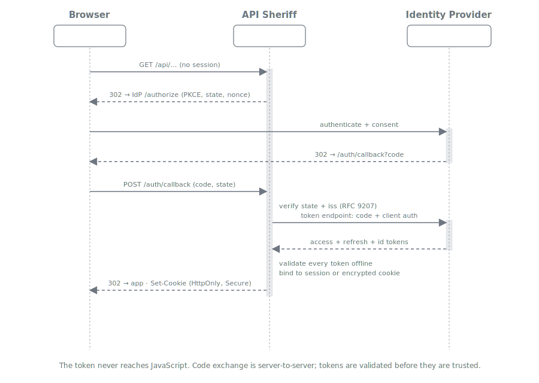
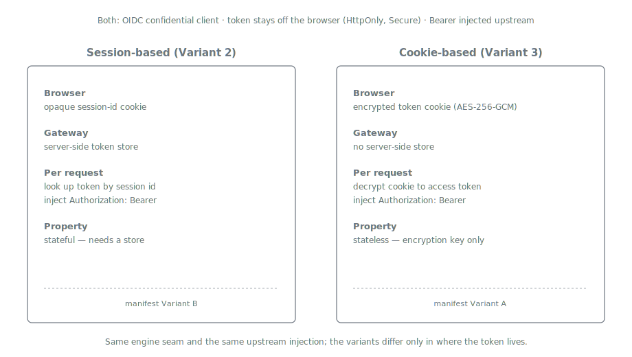

= Variant 2 -- BFF, Session-based
:toc:
:toclevels: 3
:sectnums:

== Summary

In the session-based Backend-For-Frontend variant, API Sheriff is a full *OIDC confidential
client (Relying Party)*. It runs the authorization-code + PKCE login flow on behalf of a
browser-based SPA, holds the resulting tokens *server-side*, and gives the browser only an
opaque *session-id cookie*. On each API call the gateway looks up the stored token by session
id and injects it as `Authorization: Bearer` into the upstream request.

This is manifest *Variant B*. It is *stateful* -- it requires a server-side session/token
store -- but provides strong isolation: the token never leaves the server, not even in
encrypted form. This is the variant to start with; the link:03-bff-cookie.adoc[cookie-based
variant] is the stateless evolution.

[IMPORTANT]
====
*The authoritative specification for this variant is `TokenSheriff/doc/client` (the
`CLIENT-1..22` contract). Where it and `doc/manifest.adoc` differ, `doc/client` governs.*

This variant is the *stateful BFF* shape of `CLIENT-19` (opaque session-id cookie + server-side
token store, backend proxies resource calls). The confidential-client engine
(`token-sheriff-client`) is currently an unbuilt skeleton, so API Sheriff implements the flow
itself against `CLIENT-1..22` and reuses `token-sheriff-validation` to validate every retrieved
token (`CLIENT-15` / `CLIENT-16`) before it is stored. See
link:../architecture.adoc#_authentication_layer[Architecture].
====

== Login Flow

The login handshake is shared with the link:03-bff-cookie.adoc[cookie-based variant]; only
the final binding step differs. The gateway redirects the unauthenticated browser to the IdP
with PKCE, `state`, and `nonce`; after the user authenticates, the IdP posts an authorization
code back to the gateway callback; the gateway verifies `state` and issuer, exchanges the
code server-to-server, validates the tokens offline, and -- in this variant -- *stores them
server-side* and sets an opaque session-id cookie.

== Steady-State API Call

Once the session exists, an API call carries only the session-id cookie. The gateway:

. Validates the session cookie and resolves the session id.
. Looks up the stored access token in the server-side store.
. If the token is near expiry, transparently refreshes it (see below).
. Injects `Authorization: Bearer <token>` and forwards, applying the same
  link:01-base-gateway.adoc[base-gateway] filtering and zero-trust forward policy.

The left-hand column above is this variant; the token lives in a server-side store keyed by
the session id.

== Token Storage

[cols="1,3"]
|===
| Aspect | Design

| Store
| A server-side store keyed by session id, holding the access token, refresh token, and token
  metadata (expiry, `acr`, `auth_time`). For a single-node or sticky-session deployment an
  in-memory store suffices; a multi-node non-sticky deployment needs a shared store.

| Trade-off
| A shared store (e.g. Redis) reintroduces an external dependency -- exactly what the
  link:../features-analysis.adoc#_features_to_avoid[feature analysis] warns against. The
  link:03-bff-cookie.adoc[cookie-based variant] exists to avoid this: it is stateless and needs
  no store. Choose session-based only where server-side-only token custody is a hard requirement.

| Session cookie
| `HttpOnly`, `Secure`, `SameSite`, `__Host-` prefix; carries only the opaque id, never token
  material. CSRF defense on state-changing calls is the BFF's responsibility.
|===

== Transparent Token Refresh

When the stored access token is within the configured leeway of expiry, the gateway refreshes
it using the stored refresh token (with rotation), transparently during a normal API request.
On refresh-token reuse detection the token family is revoked; on refresh failure the session
is destroyed and the browser is re-driven through the login flow. See
link:../configuration.adoc[`oidc.session.refresh`].

== Step-Up Authentication (RFC 9470)

Because the gateway holds the session, it can honour an upstream `401` carrying
`insufficient_user_authentication`: it parses the required `acr_values` / `max_age` / `scope`,
attempts a silent refresh, and -- if that cannot satisfy the challenge -- re-drives the
authorization-code flow with the elevated parameters, then replays the request. This is a
link:../features-analysis.adoc#_differentiators[differentiator] no competitor covers.

== Configuration

[source,yaml]
----
# gateway.yaml
oidc:
  issuer: https://idp.example.com/realms/main
  client_id: api-sheriff
  client_secret: ${SHERIFF_CLIENT_SECRET}
  redirect_uri: https://gw.example.com/auth/callback
  scopes: [openid, profile]
  session:
    mode: server                 # server-side token store (this variant)
    cookie_name: __Host-sheriff
    ttl_seconds: 3600
    refresh: { enabled: true, leeway_seconds: 30, on_failure: reauthenticate }
----

[source,yaml]
----
# endpoints/app1.yaml           (base_url APP1 lives in topology.properties)
endpoint:
  id: app1
  base_url: APP1
  routes:
    - id: orders-api
      match: { path_prefix: /api/orders }
      auth: { require: session, required_scopes: [orders.read] }
      forward:
        headers_allow: [accept, content-type]
        set_headers: { authorization: "Bearer ${auth.access_token}" }
      upstream: { path: /orders }
----

== Properties

* *Stateful* -- requires a server-side token store.
* *Strong isolation* -- the token never leaves the server in any form.
* *Full OIDC RP* -- confidential-client login, transparent refresh, RFC 9470 step-up.
