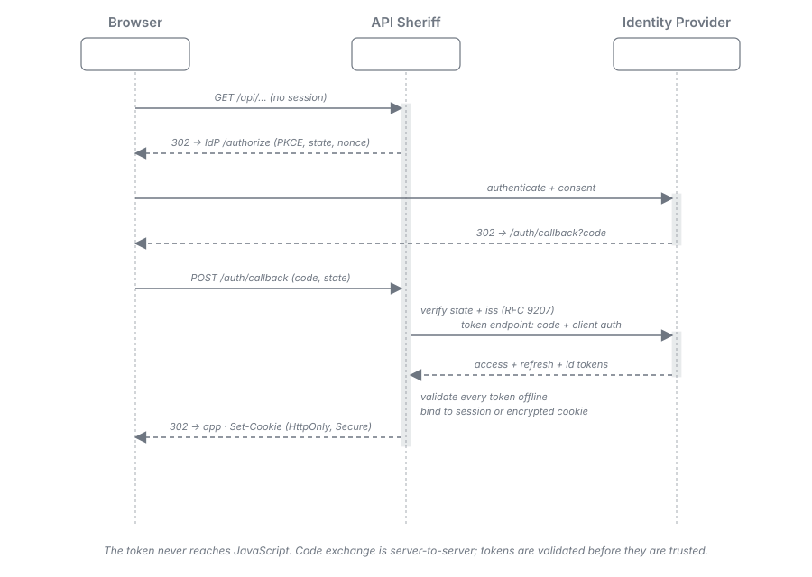
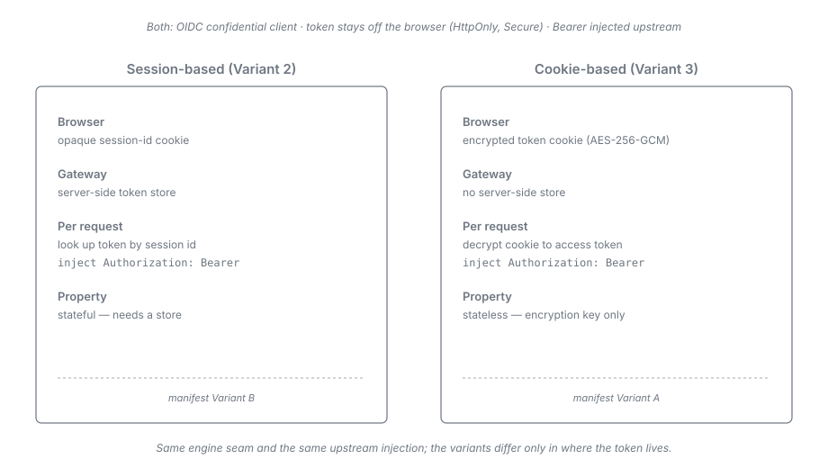

= Variant 3 -- BFF, Cookie-based (non-session)
:toc:
:toclevels: 3
:sectnums:

== Summary

The cookie-based Backend-For-Frontend variant is the *stateless* evolution of the
link:02-bff-session.adoc[session-based variant]. API Sheriff is still a full OIDC confidential
client running the authorization-code + PKCE login flow, but instead of holding tokens in a
server-side store it *encrypts the tokens (AES-256-GCM) into an `HttpOnly` cookie* and
decrypts them per request. There is *no server-side store* -- the encrypted cookie carries the
session state, so all gateway instances need only share the encryption key.

This is manifest *Variant A* (the "token-mediating backend"), and it is the *preferred* target
because it preserves the gateway's stateless, self-contained posture. It is planned to follow
the session-based variant.

NOTE: This variant is the *stateless BFF* shape of `CLIENT-19` (tokens returned to the browser
only inside an `HttpOnly` cookie encrypted with a server-side symmetric key). The authoritative
specification, its precedence over the archived manifest, and the current
`token-sheriff-client` engine dependency (the engine performs the OAuth legs; API Sheriff
owns the browser-facing BFF side) are stated canonically in
link:../architecture.adoc#_authentication_layer[Architecture -- Authentication Layer].

== Login Flow

The login handshake is identical to the link:02-bff-session.adoc[session-based variant] up to
the final binding step. The gateway redirects the browser to the IdP with PKCE / `state` /
`nonce`, exchanges the code server-to-server, and validates the tokens offline (all through
the `token-sheriff-client` engine) -- then, in this
variant, *encrypts them into an `HttpOnly` cookie* rather than storing them server-side.

== Steady-State API Call

An API call carries the encrypted token cookie. The gateway:

. Reads and *decrypts* the cookie (AES-256-GCM) to recover the tokens -- no store lookup.
. If the token is near expiry, transparently refreshes it and re-seals the cookie.
. Injects `Authorization: Bearer <token>` and forwards, applying the same
  link:01-base-gateway.adoc[base-gateway] filtering and zero-trust forward policy.

The right-hand column above is this variant; the token lives only inside the encrypted cookie,
and the gateway holds no per-user state.

== Cookie Design

[cols="1,3"]
|===
| Aspect | Design

| Encryption
| AES-256-GCM (authenticated encryption). The plaintext is the token set: access token,
  refresh token, the raw ID token (needed as `id_token_hint` at logout -- without it in the
  cookie, the stateless gateway could not drive RP-initiated logout), and minimal metadata;
  the ciphertext plus nonce and auth tag form the cookie value. A tampered cookie fails
  authentication and is rejected.

| Cookie attributes
| `HttpOnly` (JavaScript can never *read* the token -- direct exfiltration is prevented, but
  an XSS payload running on the page can still *issue* authenticated requests, and encryption
  does not prevent *replay* of a stolen cookie before it expires), `Secure`, `SameSite=Lax`,
  `__Host-` prefix.

| Key management
| A single server-side symmetric key. `session.encryption_key` is *optional*: declared as an
  environment indirection (`${SHERIFF_SESSION_KEY}`) it is shared across all gateway instances and
  survives a restart; omitted, the gateway mints a key at boot, so sessions are dropped on every
  restart and the key cannot be shared with another replica. There is no decrypt-only companion
  key and no rotation window: replacing the key is a clean break, and every cookie sealed under
  the withdrawn key is refused as "no session" so its owner logs in again.

| Size
| The cookie must stay within browser limits (~4 KB), enforced as a seal-time budget: an
  over-budget seal *fails* rather than being silently truncated. Splitting the token set across
  several cookies is a deliberate non-goal, so the two available remedies are to reduce the token
  set (fewer scopes, a leaner IdP token shape) or to run the
  link:02-bff-session.adoc[session-based variant]. Oversized IdP tokens are a deployment
  consideration.
|===

== Statelessness

Because the encrypted cookie carries all session state:

* No session store, no Redis, no database -- the manifest's self-contained requirement holds
  fully.
* Any gateway instance can serve any request *of an established session* as long as it has the
  encryption key -- no sticky sessions, no coordination. The login leg is the one exception: it
  holds per-instance pending state and requires affinity until the callback lands (see
  <<_stateless_after_login_not_during_it,Stateless after login, not during it>>).
* Horizontal scaling is linear; a node can be added or removed with no session migration.

This is the property that distinguishes Variant A from Variant B and the reason it is the
preferred target.

== Transparent Refresh and Step-Up

Both work exactly as in the link:02-bff-session.adoc#_transparent_token_refresh[session-based
variant] -- refresh with rotation on near-expiry, family revocation on reuse detection, and
RFC 9470 step-up on upstream challenge -- with one difference: the refreshed token is re-sealed
into a *new cookie* (`Set-Cookie` on the response) rather than written to a store.

*The concurrent-refresh race (accepted trade-off of statelessness).* Two parallel requests
carrying the same cookie can both cross the refresh leeway and present the *same* refresh token;
with rotation plus reuse detection, the IdP may read the second attempt as theft and revoke the
token family, logging the user out. Mitigations, in order: each instance *single-flights*
refreshes per session (the second in-instance request waits and reuses the result); where the
IdP offers reuse tolerance -- a permitted-reuse *count* (Keycloak's "Refresh Token Max Reuse")
or a short time-window grace (Auth0/Okta style) -- enabling it avoids the false positive, but
at a real cost: reuse tolerance blunts exactly the theft-detection signal rotation exists to
provide (RFC 9700 §4.14), so this is a deliberate availability-versus-detection trade, not a
free fix. Finally, a refresh rejected as reuse is treated as an ordinary refresh failure -- the
session ends and `on_failure` drives re-authentication. Cross-instance duplicate refresh cannot
be fully prevented without shared state; with reuse tolerance left off, the residual effect is
a rare forced re-login.

== Logout

Gateway-triggered logout works as in the
link:02-bff-session.adoc[session-based variant]: `oidc.logout.path` revokes the held tokens at
the IdP (RFC 7009), expires the cookie, and redirects to the `end_session_endpoint` with
`id_token_hint`, the pre-registered gateway-owned `post_logout_redirect_uri`, and a
session-bound `state` verified on return (carried across the round-trip in the short-lived
logout cookie described in link:../configuration.adoc#_oidc[`logout.path`] -- stateless, so
identical in this variant).

The *back-channel* differs fundamentally: with no server-side session there is nothing a logout
token can destroy, so in `mode: cookie` the `backchannel_path` endpoint is *disabled* (`404`) --
accepting IdP posts it cannot act on would be dead attack surface. IdP-side session termination
still takes effect on its own: the revoked refresh token fails at the next transparent refresh
and the session ends. Until then, already-issued cookies stay decryptable -- immediate
termination cannot be guaranteed. Mitigate with a short `ttl_seconds` and short access-token
lifetimes; where instant revocation is a hard requirement, choose the
link:02-bff-session.adoc[session-based variant].

== CSRF Defence

Identical to the link:02-bff-session.adoc#_csrf_defence[session-based variant]: `Origin`
verification against `session.csrf.trusted_origins` on unsafe methods plus a `SameSite=Lax`
cookie, fixed behaviour on every `auth.require: session` route.

== Configuration

[source,yaml]
----
# gateway.yaml
oidc:
  issuer: https://idp.example.com/realms/main
  client_id: api-sheriff
  client_secret: ${SHERIFF_CLIENT_SECRET}
  redirect_uri: https://gw.example.com/auth/callback
  scopes: [openid, profile, orders.read]   # must include every scope a route requires
  session:
    mode: cookie                 # encrypted cookie, no store (this variant)
    cookie_name: __Host-sheriff
    encryption_key: ${SHERIFF_SESSION_KEY}   # AES-256-GCM key; optional -- omit to generate on startup
    ttl_seconds: 3600
    refresh: { enabled: true, leeway_seconds: 30, on_failure: reauthenticate }
----

[source,yaml]
----
# endpoints/app1.yaml           (base_url APP1 lives in topology.properties)
endpoint:
  id: app1
  base_url: APP1
  auth: { require: session, required_scopes: [orders.read] }  # default for all routes here
  routes:
    - id: orders-api
      match: { path_prefix: /api/orders }
      forward:
        headers_allow: [accept, content-type]
        # the mediated "Authorization: Bearer" is injected automatically on session routes
      upstream: { path: /orders }
----

The only material difference from the link:02-bff-session.adoc[session-based] configuration is
`session.mode: cookie`.

`session.encryption_key` is *optional*. Declare it when sessions must be shared across replicas
and survive a restart -- that is the only thing it buys. Omitting it selects the
generate-on-startup key mode: the gateway mints a key at boot, so sessions are dropped on every
restart and the key cannot be shared with another replica. There is no second, decrypt-only key --
replacing `encryption_key` invalidates every outstanding cookie. See
link:../configuration.adoc[the configuration reference] for the authoritative validation rules.

== Properties

* *Stateless* -- no server-side store; encrypted cookie carries the state.
* *No token exfiltration via script* -- `HttpOnly` cookie; the token is never readable by
  JavaScript (XSS on the page can still drive authenticated requests -- hence the fixed CSRF
  defence and short token lifetimes).
* *Self-contained* -- instances share only the encryption key.
* *Full OIDC RP* -- confidential-client login, transparent refresh, RFC 9470 step-up.

[#_stateless_after_login_not_during_it]
=== Stateless after login, not during it

The variant is stateless once a session is *established*, not for the whole login exchange. The
pending authorization -- the state the gateway holds between issuing the login redirect and
receiving the OIDC callback -- lives in an in-memory `PendingAuthorizationStore`, which is
per-instance and never shared. A login *begun* on one instance must therefore *complete* on that
same instance; a callback landing on a different replica finds no pending authorization and the
login fails.

An *established* session is fully portable: any replica holding the sealing key can unseal the
cookie and serve the request. That is exactly the boundary the cookie-statelessness integration
test documents -- it logs in only against the first instance, then exercises the second instance
with the resulting cookie.

*Deployment consequence*: session affinity is required for the *login leg only* (the redirect
through to the callback). Once the session cookie is issued, requests may be balanced freely
across replicas with no affinity at all.

=== Sealed-cookie format version

The sealed-cookie format version is bound into the cookie's authenticated data, so a cookie
carrying a retired version fails to unseal rather than being mis-parsed. The version was bumped
when the per-session identity nonce was added to the sealed payload.

*Upgrade consequence*: existing cookie-mode sessions are invalidated on deploy and users must log
in again. There is deliberately no backward-compatible acceptance path for the previous format --
accepting it would mean synthesizing the missing nonce, which would silently change the derived
session identity. See
link:../adr/0018-BFF_session_mode_is_one_SessionBinding_seam_behind_a_fixed_reserved-path_and_CSRF_model.adoc[ADR-0018]
for the architectural
decision behind the identity model.
